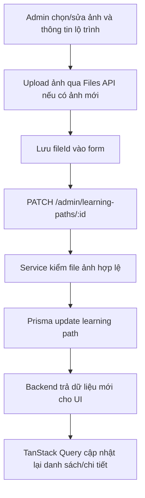

# Admin Course Management

## Tính năng này giải quyết gì?

Admin dùng màn quản lý lộ trình để tạo/sửa lộ trình học, nhập thông tin cơ bản như tên, slug, môn, lớp, giá, ảnh đại diện và mô tả. `M3.4` hiện đã được nối với API thật cho lộ trình/chương/buổi học; upload ảnh đại diện đi qua Files API và lưu object bằng adapter S3-compatible local MinIO.

## Sơ đồ luồng dễ hiểu



## Front-end

Modal lộ trình được compose từ `PathEditor`. Các field nhỏ tách thành component riêng trong `apps/web/features/admin/courses/screens/admin-courses-manager/components/` để tránh dồn logic upload, textarea và form state vào một file lớn.

Luồng đọc dữ liệu của admin course nên đi qua 4 lớp:

```txt
api/admin-courses-api.ts
-> hooks/use-admin-course-queries.ts
-> hooks/use-admin-courses-manager.ts hoặc use-admin-course-detail-manager.ts
-> screens/components
```

`api/` là boundary gọi REST thật và map response DTO về UI type. TanStack Query nằm ở hook query riêng để giữ cache/loading/error/refetch và invalidate sau mutation. Manager hook chỉ giữ orchestration của màn: form state, selection, modal state và action pending/error. Screen component chỉ compose sidebar, header, stats, content và dialog.

Các helper thuần như filter/sort/thống kê/detail lookup đặt ở `utils/admin-courses-utils.ts`. Không để helper so sánh, tính stats hoặc tìm lesson nằm cuối hook/screen vì hook sẽ phình nhanh và khó test.

Field số trong admin form không dùng `type="number"` native. Dùng input text styled theo form chuẩn, `inputMode` phù hợp và normalize bằng React Hook Form trước khi schema Zod validate.

Với upload ảnh thật, UI upload file trước qua `POST /files/upload` với purpose `EDITOR_IMAGE`, nhận `fileId`, lấy URL đọc qua `GET /files/:fileId/signed-url` khi cần, rồi lưu `thumbnailFileId` vào learning path. Preview trong modal vẫn có thể dùng object URL tạm khi upload đang pending, nhưng dữ liệu bền phải là `fileId`/signed URL từ backend, không phải `blob:` URL hoặc data URL local.

## Luồng lỗi thường gặp

- Lỗi: chọn ảnh trong modal, lưu, đóng modal, bấm edit lại thì ảnh đại diện hiển thị broken image.
- Nguyên nhân: state form/mock giữ `blob:` URL tạo bằng `URL.createObjectURL`, nhưng component upload đã revoke URL khi unmount.
- Cách tránh khi còn mock UI: dùng `FileReader.readAsDataURL` để lưu data URL ổn định trong state local, và thêm fallback placeholder khi ảnh hiện tại không load được. Khi đã nối API thật, phải upload lên Files API trước và lưu `thumbnailFileId`; không lưu URL tạm vào dữ liệu production-connected.
- Lỗi: mở modal tạo chương học đã thấy lỗi required dù người dùng chưa nhập gì.
- Nguyên nhân: gọi validate toàn form ngay sau `reset()` để tính `isValid`, hoặc gọi `trigger()` ngay sau khi thêm một dòng field-array còn trống, rồi truyền thẳng `formState.errors` vào field. Validation state và error visibility bị trộn làm một nên form pristine đã hiện lỗi.
- Cách tránh trong modal form: bám pattern form chuẩn đã duyệt hoặc form tương tự đang chạy ổn; dùng `mode: "onChange"` và truyền thẳng `formState.errors.<field>` vào primitive field; không gọi `trigger()` ngay sau `reset()` hoặc ngay sau `append()` một dòng động. Để validation bắt đầu khi người dùng sửa field hoặc submit form. Không tự bọc bằng `dirtyFields/touchedFields` trong component, vì nhập rồi xóa về default có thể làm `dirty` quay về false và mất validate realtime.
- Với rich editor như Tiptap, extension có thể phát transaction chuẩn hóa khi editor vừa mount dù nội dung không đổi về ý nghĩa, ví dụ tự thêm `attrs.textAlign = null` vào paragraph rỗng. Adapter nối Tiptap với React Hook Form phải so sánh JSON theo ngữ nghĩa (bỏ thuộc tính mặc định `null`, object rỗng và không phụ thuộc thứ tự key), rồi chỉ gọi `field.onChange` khi tài liệu thật sự đổi; so sánh `JSON.stringify` trực tiếp vẫn có thể hiểu nhầm bước khởi tạo là thao tác nhập liệu và làm modal pristine hiện lỗi required.
- Lỗi: modal edit đang có 0 dòng trong một `useFieldArray`, nhưng bấm thêm một lần lại xuất hiện 2 dòng; dòng thừa thiếu field bắt buộc nên khi validate hiện thông báo kỹ thuật kiểu `expected string, received undefined`.
- Nguyên nhân: `useForm.defaultValues` chứa sẵn dòng dành riêng cho form create trong lúc editor dùng chung vẫn mount ở mode edit. Dù effect sau đó `reset()` mảng về rỗng, state nội bộ của `useFieldArray` có thể còn lệch và làm dòng mặc định sống lại ở lần `append()` kế tiếp.
- Cách tránh: `defaultValues` nền của editor dùng chung phải để các mảng động ở trạng thái rỗng. Chỉ tạo dòng mặc định trong bước hydrate/reset sau khi biết chính xác mode và dữ liệu của lần mở modal. Mỗi dòng append phải có đủ shape; schema cũng phải map lỗi sai kiểu của field người dùng chọn sang thông báo nghiệp vụ, không để lộ thông báo Zod kỹ thuật.
- Lỗi: giá trị dẫn xuất trong form như gợi ý khoảng trang không đổi khi admin đang gõ tên bài học.
- Nguyên nhân: component đọc tên bằng `getValues()` bên trong `useMemo`; `getValues()` chỉ lấy snapshot hiện tại và không đăng ký render lại khi field thay đổi.
- Cách tránh: dùng `watch()`/`useWatch()` cho field ảnh hưởng trực tiếp tới UI, rồi đưa giá trị đã theo dõi vào dependency của `useMemo`. `getValues()` chỉ phù hợp khi cần đọc tức thời trong handler hoặc lúc submit mà không cần UI phản ứng realtime.
- Lỗi: validation giới hạn khoảng trang chỉ báo lỗi cho `Đến trang in`, còn `Từ trang in` vẫn nhận giá trị vượt trang in lớn nhất.
- Nguyên nhân: rule giới hạn được viết riêng cho `pageEnd` thay vì áp dụng đối xứng cho hai đầu khoảng.
- Cách tránh: với cặp field cùng chịu một giới hạn, duyệt chung qua cấu hình field/label để dùng một rule duy nhất và phải có test biên riêng cho từng đầu khoảng.
- Lỗi: hai buổi học trong cùng một chương có thể lưu trùng tên, hoặc backend trả `409` nhưng UI lại báo nhầm vào ô thứ tự.
- Nguyên nhân: frontend chỉ bắt trùng thứ tự và gom mọi lỗi conflict vào cùng một mã; backend chưa áp dụng quy tắc tên duy nhất trong chapter.
- Cách tránh: frontend có thể kiểm tra nhanh lesson của chapter đang mở để phản hồi ngay, nhưng backend vẫn phải chuẩn hóa tên, khóa transaction theo chapter và kiểm tra lại trước khi ghi. Hai chapter khác nhau được phép dùng cùng tên lesson. Mỗi rule conflict cần một `error.code` ổn định để modal đặt lỗi đúng field; không suy ra field chỉ từ HTTP status `409`.
- Lỗi: Prisma báo không deserialize được cột kiểu PostgreSQL `void` khi lấy advisory lock trước bước kiểm tra trùng tên.
- Nguyên nhân: `pg_advisory_xact_lock(...)` là hàm tạo side effect và trả `void`, nhưng `$queryRaw` yêu cầu Prisma đọc và chuyển đổi mọi cột trong result set.
- Cách tránh: dùng `$executeRaw` cho câu SQL chỉ cần side effect mà không cần đọc dữ liệu trả về; giữ `$queryRaw` cho truy vấn có cột kết quả thuộc kiểu Prisma hỗ trợ. Test của service phải mock đúng raw API để bắt sai khác này.
- Lỗi: trên điện thoại hiện hydration mismatch ở input dù HTML/app state không đổi.
- Nguyên nhân: một số trình duyệt, autofill hoặc extension có thể chèn attribute riêng vào input trước khi React hydrate, ví dụ `__gcruniqueid`; React thấy DOM client khác HTML server nên báo overlay đỏ trong dev.
- Cách tránh: với input primitive dùng chung, đặt `suppressHydrationWarning` trên chính element input để bỏ qua attribute ngoài ý muốn từ browser. Không dùng cách này để che mismatch do app tự tạo bằng `Date.now()`, `Math.random()` hoặc format ngày/tiền khác giữa server và client.
- Lỗi: bật giao diện tối ở trang danh sách, chuyển sang trang chi tiết thì giao diện quay về sáng hoặc card vẫn trắng.
- Nguyên nhân: theme là state cục bộ trong từng manager hook, nên route mới mount lại với default `false`; một số panel detail, modal shell, footer form, textarea/upload và checkbox native còn hard-code `bg-white`, `bg-slate-50`, `text-slate-950` hoặc dùng browser style mặc định.
- Cách tránh: theme phải là state chung của app, lưu bền bằng `localStorage` và được hydrate ở provider/root layout; component admin nhận `isDarkTheme` từ cùng store và mọi surface chính phải có variant dark hoặc dùng semantic token. Modal cần xử lý cả shell/header/body/footer, form primitive cần nhận `isDarkTheme`, còn checkbox native nên có class style riêng để không phụ thuộc nền trắng mặc định của trình duyệt.
- Lỗi: reload khi đang ở giao diện tối bị nháy sáng trước khi chuyển về tối.
- Nguyên nhân: theme được hydrate sau paint hoặc script khởi tạo theme đặt sai chỗ; nếu client store đọc `localStorage` ngay khi module load thì server render light còn client render dark, gây hydration mismatch.
- Cách tránh: lưu theme vào cookie cùng key với `localStorage` để admin layout và admin pages server đọc theme ngay từ request đầu tiên. Screen/hook nhận `initialThemeMode` từ server để render frame đầu đúng theme, sau đó Zustand hydrate bằng `useLayoutEffect` và tiếp quản trạng thái. Vẫn dùng `next/script` với `strategy="beforeInteractive"` để đồng bộ localStorage/cookie/system preference trước hydrate. Các vùng admin cần CSS bridge theo `.dark [data-admin-theme]` để HTML render sáng từ server vẫn hiển thị tối trước khi store hydrate. Nếu server layout bọc một wrapper `.dark`, client theme store phải cập nhật cả wrapper `[data-theme-root]`; nếu chỉ gỡ `dark` trên `<html>`, CSS bridge vẫn ép giao diện ở theme tối khi người dùng bấm chuyển sáng.
- Lỗi: edit lộ trình kèm `thumbnailFileId` trả `500 INTERNAL_SERVER_ERROR`.
- Nguyên nhân: service đưa trực tiếp foreign key scalar như `thumbnailFileId` hoặc `updatedById` vào Prisma checked update input. Với relation trong Prisma, update chuẩn phải đi qua relation field, ví dụ `thumbnailFile.connect/disconnect` hoặc `updatedBy.connect`.
- Cách tránh: khi API nhận một id quan hệ từ UI, service vẫn validate id trước, nhưng lúc ghi DB phải map sang relation operation. Dùng `connect` khi gắn file/user mới và `disconnect` khi muốn bỏ ảnh đại diện; không đưa trực tiếp scalar foreign key vào `LearningPathUpdateInput` nếu Prisma không cho phép.
- Lỗi: tạo khóa học xong tự có học thử ở buổi đầu dù admin chưa bật checkbox buổi học.
- Nguyên nhân: code cũ còn default `learning_paths.trial_enabled = true` và migration có thể backfill trạng thái đó sang lesson đầu tiên. Điều này sai rule sản phẩm vì học thử thuộc từng buổi học, không thuộc lộ trình.
- Cách tránh: khóa học phải default không học thử; chỉ `lessons.trial_enabled` mới quyết định quyền học thử. UI admin chỉ đặt checkbox trong modal thêm/sửa buổi học, API create/update lesson lưu field này, public/student serializer chọn `trialLessonId` từ lesson được bật flag.
- Lỗi: bấm `Sửa` buổi học rồi đóng modal ngay làm card buổi học vẫn có nền xanh như đang focus.
- Nguyên nhân: hook dùng `selectedLessonId` vừa để chọn lesson đưa vào modal edit, vừa để tô selected state trên card. Khi đóng modal không lưu, state này không được dọn nên card vẫn nhận class nền primary.
- Cách tránh: state dùng tạm cho editor phải được dọn khi cancel/close modal. Chỉ giữ selected/highlight sau các thao tác có chủ ý như tạo mới, lưu thành công hoặc reorder nếu UI thật sự cần báo item vừa tác động.
- Lỗi: form hiển thị chapters hợp lệ nhưng PATCH lesson trả `400 VALIDATION_ERROR` với message chung "Dữ liệu không hợp lệ".
- Nguyên nhân: frontend đã thêm `customVideoSettings.chapters` vào payload nhưng DTO nested của backend chưa khai báo field này; global `ValidationPipe` dùng `forbidNonWhitelisted` nên từ chối field lạ trước khi service chạy.
- Cách tránh: khi thêm field persisted vào JSON/form, phải cập nhật đồng thời type/schema frontend, DTO nested backend, API contract và test validation bằng payload thật. Không nới global whitelist để chữa triệu chứng; khai báo đúng field được phép và validation tối thiểu theo nghiệp vụ.
- Lỗi round-trip JSON: dữ liệu cũ trong database có thể còn field đã bỏ như `transcriptTimeline`; nếu frontend trải nguyên `customVideoSettings` đọc từ API vào payload PATCH, global whitelist vẫn từ chối dù các field transcript đang hiển thị đều hợp lệ.
- Cách tránh: API client phải tạo payload bằng allowlist serializer, chỉ lấy từng field thuộc contract hiện tại và clone rõ các item nested. Không dùng spread toàn bộ JSON persisted cho request ghi; cách này đồng thời loại field legacy/obsolete mà không cần nới validation backend.
- Lỗi: bấm bắt đầu video rồi màn hình loading giữ rất lâu dù nút đã nhận click.
- Nguyên nhân: UI cho phép gọi YouTube `playVideo()` khi object player đã có method nhưng provider chưa phát `onReady`; đồng thời gọi `seekTo()` ngay trước lần phát đầu tạo thêm một vòng buffer dù `playerVars.start` đã định vị sẵn.
- Cách tránh: phân biệt trạng thái provider `ready`, ý định người dùng `start requested` và xác nhận `playing`. Chỉ nhận cú bấm sau `onReady`, không dùng việc method tồn tại làm bằng chứng player đã sẵn sàng và tránh seek dư trước lần phát đầu. Trong khoảng `start requested -> playing`, giữ một loading state liên tục trên màn bắt đầu; chỉ hiện controls khi provider xác nhận `PLAYING` để UI không mô tả sai trạng thái thực tế.
- Lỗi: transcript hiển thị `0:05` ở đầu bài dù custom player đã cắt 5 giây đầu và đang đứng tại `0:00`.
- Nguyên nhân: caption được lọc đúng bằng timestamp video YouTube gốc nhưng chưa đổi sang trục phát của custom player; action phát lại nhận cùng timestamp nguồn nên UI và player dùng hai hệ quy chiếu khác nhau.
- Cách tránh: phân biệt rõ `source time` và `playback time`. Dùng source time làm dữ liệu lưu ổn định; API bản nháp và form hiển thị `playbackTime = sourceTime - startCut`, còn khi lưu/phát thì đổi ngược `sourceTime = startCut + playbackTime`. Cách này vẫn đúng nếu admin đổi cấu hình cắt đầu về sau và không cần migration transcript cũ.
- Lỗi: transcript theo cue YouTube có thể chồng thời gian, làm quy tắc chọn ô active khó dự đoán và UI chuyển ô không đúng kỳ vọng của owner.
- Quyết định cuối cùng: để action phát khớp tốt nhất với lời thoại hiện có, transcript lấy mới phải giữ nguyên từng cue `offset`/`duration` mà YouTube trả về; không ép thành bucket 5 giây và không tự phân phối từ.
- Lỗi triển khai cần tránh: làm tròn `offset` thập phân thành giây nguyên trên form rồi dùng giá trị đã làm tròn để seek sẽ làm mất độ chính xác dù backend đã giữ đúng cue.
- Cách tránh: giữ số thực tối đa 3 chữ số thập phân xuyên suốt provider → API draft → form → JSON lưu → `seekTo`; chỉ format phần hiển thị mà không làm mất giá trị thời gian. Khi đổi giữa `source time` và `playback time`, phép trừ/cộng JavaScript có thể tạo đuôi IEEE-754 như `5.1370000000000005`, vì vậy phải chuẩn hóa lại tối đa 3 chữ số thập phân ngay trước khi tạo payload PATCH; không dùng giá trị đã format trên UI để thay thế timestamp chính xác.
- Lỗi UI cần tránh: đặt chapter header chứa action ở chế độ `sticky` ngay trong container transcript cuộn có thể làm header phủ lên label/input của row đầu khi người dùng cuộn.
- Cách tránh: giữ header/action trong luồng layout bình thường nếu chưa có thiết kế sticky hoàn chỉnh với vùng chiếm chỗ, nền opaque và offset cuộn tương ứng; không thêm `sticky` chỉ để giữ một nút luôn nhìn thấy.
- Lỗi focus transcript chậm một cue: caption YouTube có thể có các khoảng `offset + duration` chồng nhau; nếu tìm từ đầu danh sách và trả cue đầu tiên còn hiệu lực, cue cũ sẽ giữ focus dù cue mới đã bắt đầu.
- Cách tránh: trong các cue đang chứa thời gian player, chọn cue có `time` lớn nhất. Không cộng offset giả vào player và không sửa nội dung/timestamp chỉ để che lỗi thứ tự ưu tiên active.
- Lỗi nhập chapter/transcript bị khựng: `useWatch()` ở cấp panel theo dõi toàn bộ mảng transcript và Zod resolver kiểm tra lại hàng trăm đoạn sau mỗi ký tự; preview chapter còn làm component player nặng render liên tục.
- Cách tránh: chỉ subscribe form state ở đúng hàng/field đang nhập, dùng validation Zod cấp field khi `onChange` và parse toàn schema một lần trước khi lưu. Tách hàng dài thành component `memo` để đổi active/error của một hàng không render lại mọi hàng; với preview nặng nhưng không gọi API, debounce ngắn để ưu tiên phản hồi bàn phím. `useWatch()` vẫn đúng cho giá trị dẫn xuất cần realtime, nhưng phải watch phạm vi nhỏ thay vì cả field array lớn.
- Lỗi: dòng phương án trong `useFieldArray` đã hiện dấu chọn đáp án đúng nhưng Zod vẫn báo “Hãy chọn một phương án đúng”.
- Nguyên nhân: UI so sánh với ID nằm trên snapshot `fields`, còn `optionId` không được đăng ký vào React Hook Form nên resolver có thể nhận shape khác với trạng thái đang hiển thị; rule chọn đáp án đúng còn phụ thuộc nhầm vào việc phương án đã có nội dung.
- Cách tránh: đăng ký cả ID ổn định của mỗi dòng bằng hidden input, lưu đáp án đúng bằng ID đó và validate hai việc độc lập: từng phương án phải có nội dung, còn đáp án đúng chỉ cần trỏ tới một ID đang tồn tại. Không gọi `trigger()` cho toàn bộ field array ở mỗi ký tự vì sẽ làm các dòng chưa chạm vào hiện lỗi; để `mode/reValidateMode: onChange` xử lý field đang nhập, validate field phụ thuộc khi action chọn thay đổi và dùng `handleSubmit` để kiểm tra toàn form lúc lưu.

## File quan trọng

- `apps/web/features/admin/courses/api/admin-courses-api.ts`
- `apps/web/features/admin/courses/hooks/use-admin-course-queries.ts`
- `apps/web/features/admin/courses/hooks/use-admin-courses-manager.ts`
- `apps/web/features/admin/courses/hooks/use-admin-course-detail-manager.ts`
- `apps/api/src/modules/files`
- `apps/api/src/modules/learning-paths/services/learning-paths.service.ts`
- `apps/api/src/modules/learning-paths/controllers/admin-chapters.controller.ts`
- `apps/api/src/modules/learning-paths/services/chapters.service.ts`
- `apps/web/lib/theme-store.ts`
- `apps/web/components/admin/courses/editor-dialog-shell.tsx`
- `apps/web/components/admin/courses/delete-confirm-dialog.tsx`
- `apps/web/features/admin/courses/screens/admin-course-detail-manager/components/chapter-editor.tsx`
- `apps/web/features/admin/courses/screens/admin-course-detail-manager/components/chapter-lesson-panel.tsx`
- `apps/web/features/admin/courses/screens/admin-course-detail-manager/components/learning-path-summary-panel.tsx`
- `apps/web/features/admin/courses/screens/admin-courses-manager/components/learning-path-row.tsx`
- `apps/web/features/admin/courses/screens/admin-courses-manager/components/learning-paths-table.tsx`
- `apps/web/features/admin/courses/screens/admin-courses-manager/components/path-cover-upload.tsx`
- `apps/web/features/admin/courses/screens/admin-courses-manager/components/path-editor.tsx`
- `apps/web/features/admin/courses/admin-courses-schemas.ts`
- `apps/web/components/common/forms/text-field.tsx`
- `apps/web/features/admin/lessons/components/lesson-video-transcript-row.tsx`
- `apps/web/features/admin/lessons/schemas/lesson-video-transcript-schema.ts`

## Task liên quan

- `M3.4`: Admin learning path/chapter/lesson UI cơ bản và `/task-connect` sang API thật.
- `M4.1`: Storage service thật cho upload file, local MinIO dev và S3-compatible adapter.
