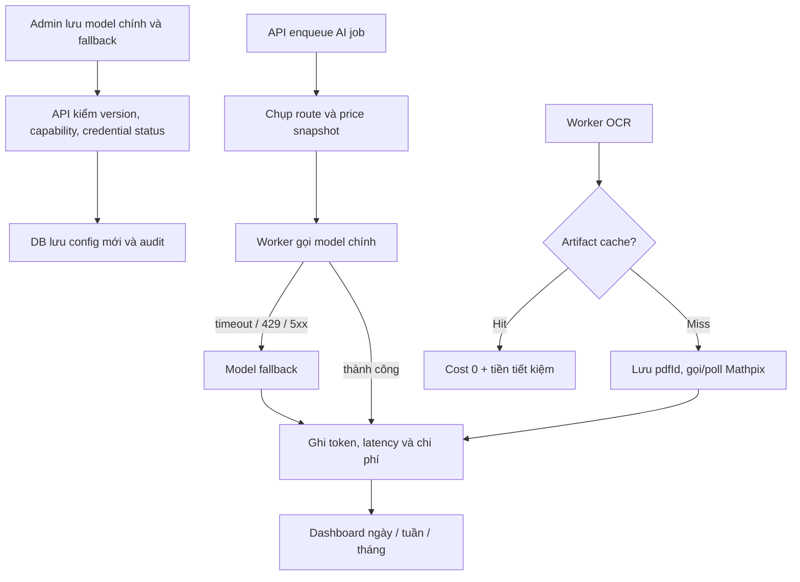

# Cài đặt AI, OCR và kiểm soát chi phí provider

## Tính năng này giải quyết gì?

Admin có một nơi để chọn model cho từng chức năng, biết OCR có sẵn sàng không, xem giá/chi phí thực tế và đặt ngân sách. API key vẫn nằm trong env; màn hình chỉ thấy trạng thái đã cấu hình hay chưa.

## Sơ đồ luồng dễ hiểu

## Luồng code end-to-end

- UI `/admin/ai-settings` dùng TanStack Query gọi `admin/provider-operations`.
- Controller chỉ cho role ADMIN. Service validate optimistic `expectedVersion`, ghi audit và aggregate usage.
- `AiGenerationJobService` chụp route snapshot lúc enqueue. `AiProviderCallService` gọi provider, fallback có kiểm soát và ghi usage event.
- OCR cache hit ghi saving; cache miss lưu `pdfId` ngay. Retry đọc lại ID này để tiếp tục thay vì submit file lần nữa.
- Mỗi usage event giữ price version và tỷ giá lúc gọi, nên đổi bảng giá mới không làm lịch sử thay đổi.

## File quan trọng

- `apps/api/src/modules/provider-operations/`
- `apps/api/src/modules/ai/services/ai-provider-call.service.ts`
- `apps/api/src/workers/processors/document-processing.processor.ts`
- `apps/api/prisma/schema.prisma`
- `apps/web/features/admin/ai-settings/`

## Kiến thức cần nhớ

- Routing config và credential là hai thứ khác nhau: chọn model trong DB không đồng nghĩa key đã tồn tại.
- Cost lịch sử phải snapshot, không tính lại bằng bảng giá hiện tại.
- Fallback không dùng cho output sai schema vì gọi thêm model vừa tốn tiền vừa che lỗi nghiệp vụ.
- Idempotency của paid OCR cần lưu provider request ID ngay sau submit.

## Task liên quan

- `M9.9-M9.11`
- `M4.6`
