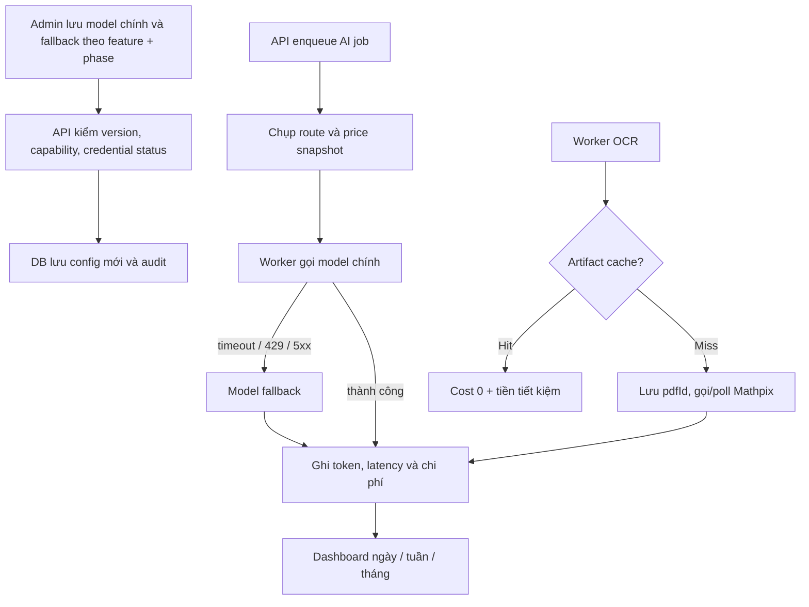

# Cài đặt AI, OCR và kiểm soát chi phí provider

## Tính năng này giải quyết gì?

Admin có một nơi để chọn model cho từng chức năng, biết OCR có sẵn sàng không, xem giá/chi phí thực tế và đặt ngân sách. API key vẫn nằm trong env; màn hình chỉ thấy trạng thái đã cấu hình hay chưa.

## Sơ đồ luồng dễ hiểu

## Luồng code end-to-end

- UI `/admin/ai-settings` dùng TanStack Query gọi `admin/provider-operations`.
- Controller chỉ cho role ADMIN. Service validate optimistic `expectedVersion`, ghi audit và aggregate usage.
- `AiGenerationJobService` chụp route snapshot lúc enqueue. `AiProviderCallService` gọi provider, fallback có kiểm soát và ghi usage event.
- Mỗi tính năng có route `TEXT` và `IMAGE` độc lập. Job Summary/Quiz giữ route
  text ở `providerRouteSnapshot` để tương thích dữ liệu cũ và route hình ở
  `imageRouteSnapshot`; figure worker ưu tiên route hình rồi mới fallback snapshot
  legacy. Usage event lưu `purpose` để chi phí hai phase không bị trộn khi audit.
- OCR cache hit ghi saving; cache miss lưu `pdfId` ngay. Retry đọc lại ID này để tiếp tục thay vì submit file lần nữa.
- Mỗi usage event giữ price version và tỷ giá lúc gọi, nên đổi bảng giá mới không làm lịch sử thay đổi.
- Một lần sinh nội dung có thể tạo nhiều usage event, ví dụ một lượt sinh kiến thức
  và nhiều lượt tạo hình minh họa. Màn chi tiết bài hiển thị tổng của cả lần sinh;
  bảng provider vẫn giữ từng lượt gọi để audit, đồng thời hiện tổng lần sinh làm
  mốc đối chiếu. Không đặt cùng nhãn “chi phí” cho hai phạm vi khác nhau.

## File quan trọng

- `apps/api/src/modules/provider-operations/`
- `apps/api/src/modules/ai/services/ai-provider-call.service.ts`
- `apps/api/src/workers/processors/document-processing.processor.ts`
- `apps/api/prisma/schema.prisma`
- `apps/web/features/admin/ai-settings/`

## Kiến thức cần nhớ

- Routing config và credential là hai thứ khác nhau: chọn model trong DB không đồng nghĩa key đã tồn tại.
- Cost lịch sử phải snapshot, không tính lại bằng bảng giá hiện tại.
- Fallback không dùng cho output sai schema vì gọi thêm model vừa tốn tiền vừa che lỗi nghiệp vụ.
- Idempotency của paid OCR cần lưu provider request ID ngay sau submit.
- Khi hiển thị cost phải luôn ghi rõ phạm vi: `chi phí lượt gọi` hay `tổng lần sinh`;
  formatter giống nhau không thể sửa được lỗi ngữ nghĩa do aggregate khác nhau.
- Usage chuẩn hóa phục vụ tính phí và provider usage nguyên bản phục vụ audit là
  hai lớp dữ liệu khác nhau. Metadata upload/xóa file của backend phải nằm ở nhánh
  riêng; nếu trộn vào provider usage thì UI không được gọi object đó là `raw usage`.
- Giới hạn input/output dùng cho budget reservation là policy của từng tính năng,
  nên phải đặt cạnh model routing trong `Thiết lập mặc định`. Không đưa context
  window kỹ thuật hoặc trần token vào `Quản lý model`: admin không cần duy trì
  metadata provider chỉ để vận hành feature.
- Catalog model chỉ nên sở hữu identity, capability, trạng thái và bảng giá. Khi
  một giới hạn thay đổi theo use case thay vì theo model, đặt nó ở feature config
  giúp UI rõ nghĩa và route snapshot tự chứa đủ dữ liệu để worker chạy ổn định.
- Khi request cho phép override model, snapshot phải cập nhật đồng thời model cấp
  route và candidate list. Nếu chỉ thay candidate, UI có thể hiển thị model mặc định
  trong khi worker thực thi model được chọn.
- Với flow có immutable request draft, mọi đường dựng payload — preview tự động,
  preview thủ công và preview ngay trước submit — phải dùng cùng capability của
  model. Nếu một đường không biết model dùng `TEMPERATURE` hay `REASONING_EFFORT`,
  nó có thể lén giữ field đang bị ẩn trên UI và tạo snapshot khác payload generate;
  backend phải tiếp tục từ chối mismatch thay vì nới lỏng kiểm tra.
- Tách route theo phase phải dùng khóa `(feature, purpose)`, không suy purpose từ
  tên model hoặc loại job. Snapshot phải được chụp lúc preview/enqueue để một lần
  admin đổi mặc định sau đó không làm worker đang chạy đổi model giữa chừng.
- Khi thêm metadata route mới vào `inputMeta` của durable job, schema Zod strict ở
  worker phải nhận đúng key đó trong cùng thay đổi. Snapshot phase mới nên là field
  tùy chọn để job cũ vẫn chạy bằng route legacy; key lạ khác vẫn phải bị từ chối.

## Task liên quan

- `M9.9-M9.12`, `M9.19`, `M9.20`
- `M4.6`
