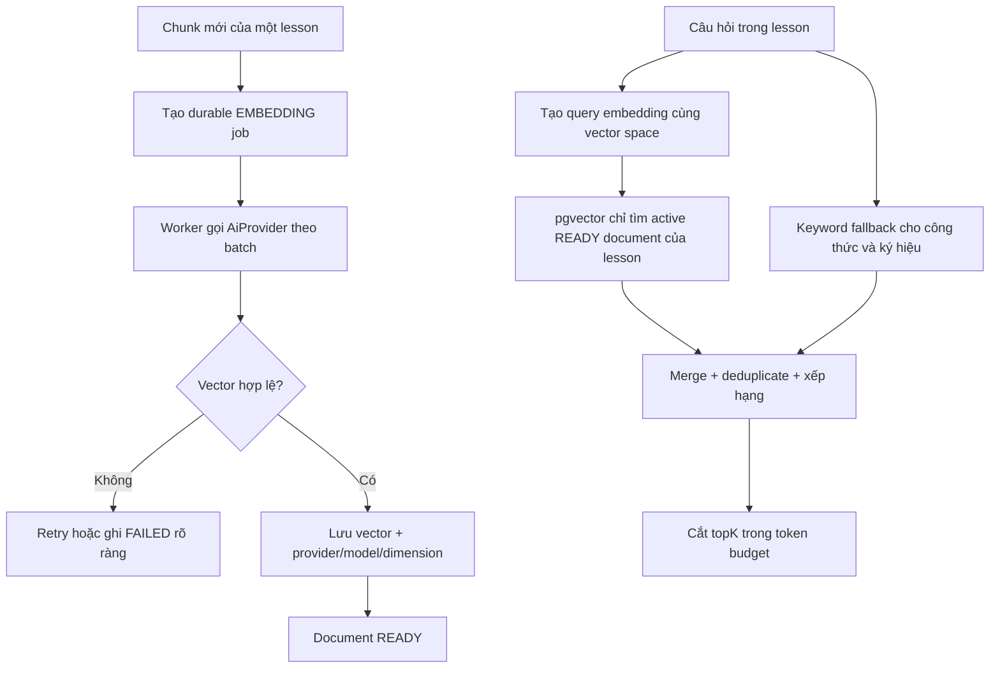

# Embedding Và Retrieval Theo Lesson

## Tính năng này giải quyết gì?

`M5.1-M5.4` biến các chunk tài liệu từ `M4` thành vector tìm kiếm và lấy đúng context cho một lesson. Mục tiêu quan trọng nhất không chỉ là tìm đoạn “gần nghĩa”, mà còn phải ngăn tài liệu của lesson khác, tài liệu đã bị thay thế hoặc vector từ model khác lọt vào prompt AI.

## Bức tranh tổng thể

Worker tạo embedding bằng OpenAI qua một abstraction chung, lưu vector cùng provider/model/dimension và trạng thái job bền vững. Khi cần context, `RetrievalService` tạo vector cho query trong đúng vector space, tìm bằng pgvector, tìm thêm công thức/ký hiệu bằng keyword, merge kết quả và cắt theo token budget.

## Sơ đồ luồng dễ hiểu

## Luồng code end-to-end

1. Document processor tạo chunk rồi enqueue embedding thay vì đánh dấu document `READY` quá sớm.
2. `EmbeddingJobEnqueuer` tạo hoặc tái sử dụng `background_jobs` bằng khóa idempotency theo document version, đồng thời tạo `ai_generations`.
3. `EmbeddingProcessor` load đúng chunk chưa có vector hoặc sai provider/model/dimension, strip LaTeX cho input embedding, gọi OpenAI theo batch và kiểm toàn bộ output trước khi ghi.
4. Prisma không ghi trực tiếp được field `Unsupported("vector(1536)")`, nên processor dùng parameterized raw SQL cho vector và metadata.
5. Khi thành công, job + AI generation + lesson document chuyển sang trạng thái hoàn tất; lỗi tạm thời quay lại `QUEUED`, lỗi cuối chuyển `FAILED`.
6. `RetrievalService` embed query, dùng cosine distance qua pgvector và join `lesson_documents` để chỉ lấy document active, `READY`, đúng lesson và đúng vector space.
7. Keyword fallback bắt LaTeX, ký hiệu, đơn vị, công thức hóa học và từ khóa có nghĩa trong cùng lesson.
8. Hai nguồn được merge theo `chunkId`; chunk khớp cả hai được boost, sau đó kết quả được cắt sao cho tổng token không vượt budget.

## Database

- `document_chunks.embedding` là `vector(1536)`.
- Mỗi vector đi kèm `embedding_provider`, `embedding_model`, `embedding_dimensions`.
- HNSW cosine index `idx_document_chunks_embedding_hnsw` tăng tốc nearest-neighbor search.
- Retrieval còn kiểm `lesson_documents.replaced_at IS NULL` và `status = READY`; chỉ filter `document_chunks.lesson_id` là chưa đủ để loại lịch sử cũ.

## Worker/AI/Integration

- OpenAI là embedding provider duy nhất trong MVP.
- Env dimension phải đúng 1.536; đổi dimension cần migration thay vì chỉ đổi config.
- Provider response bị reject nếu sai model, dimension, số lượng vector, thứ tự index hoặc chứa số không hữu hạn.
- Personal learning-path clone sao chép vector hợp lệ bằng raw SQL trong cùng transaction. Sau clone, processor chỉ enqueue các document còn thiếu/sai vector space, nên không trả phí lại khi artifact hiện có dùng được.
- OpenAI live smoke là opt-in bằng `RUN_OPENAI_LIVE_TESTS=1`; test mặc định dùng mock hoặc vector xác định để không phát sinh chi phí.

## Luồng lỗi thường gặp

- Redis enqueue lỗi: durable job, AI generation và document đều ghi `FAILED`; caller nhận lại lỗi thay vì tưởng đã enqueue.
- OpenAI lỗi tạm thời: BullMQ retry có backoff; trạng thái DB quay lại `QUEUED`.
- OpenAI thiếu/sai vector: validation chặn trước khi ghi bất kỳ vector nào của batch.
- Không có chunk đúng vector space: retrieval trả rỗng, tuyệt đối không fallback sang model/provider khác.
- Chunk đầu tiên lớn hơn token budget: chunk đó cũng bị bỏ, nên tổng context luôn nhỏ hơn hoặc bằng budget.

## File quan trọng

- `apps/api/src/modules/ai/providers/openai.provider.ts`
- `apps/api/src/modules/ai/services/ai.service.ts`
- `apps/api/src/modules/ai/services/retrieval.service.ts`
- `apps/api/src/modules/ai/utils/embedding-validation.ts`
- `apps/api/src/modules/ai/utils/keyword-extractor.ts`
- `apps/api/src/workers/services/embedding-job-enqueuer.service.ts`
- `apps/api/src/workers/processors/embedding.processor.ts`
- `apps/api/prisma/migrations/20260727001000_restore_embedding_hnsw_index/migration.sql`

## Kiến thức cần nhớ

- “Đúng lesson” là boundary bảo mật/nghiệp vụ của RAG, không chỉ là điều kiện tối ưu query.
- Provider/model/dimension tạo thành một vector space; vector ở hai space khác nhau không được so sánh.
- DB job row là nguồn trạng thái bền vững, BullMQ là kênh thực thi, `ai_generations` là log riêng cho AI usage/lifecycle.
- Hybrid search cần thiết cho công thức vì semantic embedding có thể xếp hạng kém một chuỗi LaTeX hoặc ký hiệu chính xác.
- Token budget phải là invariant cuối cùng sau merge/sort, không phải ước lượng “best effort”.

## Task liên quan

- `M5.1`: AiProvider abstraction cho embedding.
- `M5.2`: Embedding worker và lưu pgvector.
- `M5.3`: RetrievalService vector search theo lesson.
- `M5.4`: Hybrid search cho công thức/ký hiệu.
