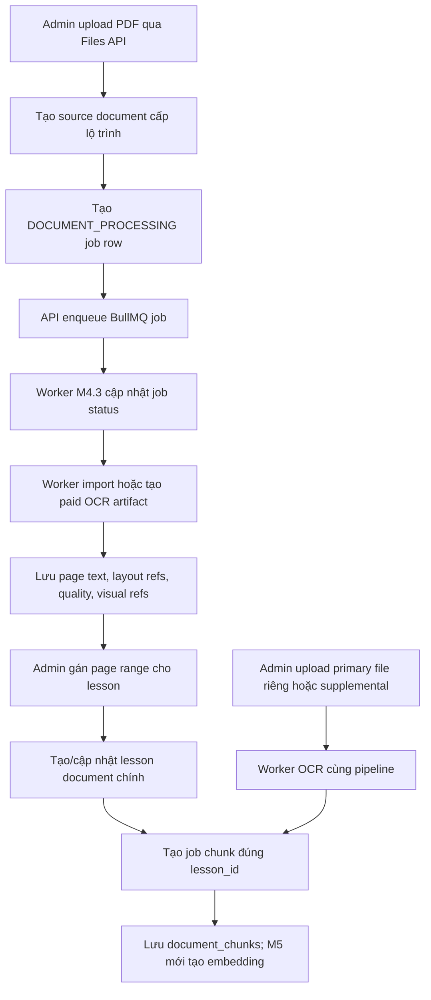

# Lesson Document Processing

## Tính năng này giải quyết gì?

MVP không upload từng file rời rạc cho từng chương. Admin tạo sẵn lesson metadata, upload một PDF/tài liệu nguồn dài ở cấp lộ trình, rồi gán khoảng trang cho từng lesson. Lesson vẫn có thể có tài liệu bổ sung riêng, nhưng mọi chunk/embedding về sau phải gắn với `lesson_id`.

## Bức tranh tổng thể

`M4.2` tạo lớp API và database mapping. API biết tài liệu nguồn, trang, page range và lesson document nào cần xử lý. `M4.3` nối BullMQ worker foundation: API enqueue durable job row vào Redis/BullMQ, worker chạy tách API nhận job và cập nhật `background_jobs`. `M4.4` thay processor foundation bằng paid OCR artifact import và chunk thật.

## Sơ đồ luồng dễ hiểu

## Luồng code end-to-end

1. Admin upload PDF bằng `POST /files/upload` với `purpose = LESSON_DOCUMENT`.
2. Admin tạo source document bằng `POST /admin/learning-paths/:learningPathId/source-documents`.
3. API lưu `source_documents`, set status processing và tạo `background_jobs` queue `DOCUMENT_PROCESSING`.
4. Sau khi transaction commit, `BackgroundJobQueueService` enqueue job vào BullMQ và lưu `bullmq_job_id`.
5. Worker document-processing nhận job, set `RUNNING`, ghi `attempts/started_at`, rồi xử lý theo `input_meta.action`.
6. Với `SOURCE_PAGE_EXTRACTION`, worker tạo `source_document_pages` khi biết số trang, kiểm tra OCR artifact cache theo `content_hash + provider/options`, gọi/import paid OCR artifact nếu cần, rồi lưu text/Markdown/layout/visual refs và quality từng trang.
7. Admin gọi `PUT /admin/source-documents/:sourceDocumentId/lesson-page-ranges`.
8. API validate lesson cùng lộ trình, page range hợp lệ, cảnh báo overlap/gap, rồi tạo `lesson_document_page_ranges`.
9. API tạo hoặc cập nhật `lesson_documents` loại `PRIMARY_FROM_SOURCE` và tạo job chunking theo `lesson_id`.
10. Worker chunk từ source pages bằng `lessonId` trong `inputMeta`, không dùng nhầm `lessonDocument.id` làm lesson id.
11. Nếu admin thay tài liệu chính bằng file riêng, API tạo `PRIMARY_REPLACEMENT`; worker chạy cùng pipeline OCR artifact rồi chunk vào đúng lesson.
12. Nếu admin thêm tài liệu bổ sung, API tạo `SUPPLEMENT`; worker OCR/chunk như một lesson document độc lập nhưng chunks vẫn gắn cùng `lesson_id`.

## Back-end/API

- Source document APIs nằm trong `LearningPathsModule`, controller `admin-source-documents`.
- Lesson document APIs nằm trong controller `admin-lesson-documents`.
- Job status nằm trong `JobsModule` qua `GET /jobs/:jobId`.
- Từ `M4.3`, document services vẫn tạo durable row trong DB trước, rồi gọi `BackgroundJobQueueService` sau transaction để enqueue BullMQ. Cách này giữ DB là nguồn trạng thái bền vững, còn Redis/BullMQ là kênh thực thi.

## Database

- `source_documents`: file nguồn dài cấp lộ trình.
- `source_document_pages`: text/status/quality từng trang, do worker tạo.
- `lesson_document_page_ranges`: mapping `lesson -> page_start/page_end`.
- `lesson_documents`: tài liệu học thật gắn với lesson, có `kind`.
- `replaced_at`: đánh dấu tài liệu chính cũ, giúp mỗi lesson chỉ có một tài liệu chính active mà không xóa lịch sử ngay.

## Worker/AI/Integration

`M4.3` đã nối BullMQ worker foundation. API và worker dùng chung queue name mapping, Redis connection parser và durable `background_jobs`.

Worker `M4.4` hiện làm các việc chính:

- Nhận job từ Redis/BullMQ bằng `backgroundJobId`.
- Cập nhật DB status `QUEUED -> RUNNING -> SUCCEEDED/FAILED`, kèm `attempts`, `error_message`, `started_at`, `finished_at`.
- Với Mathpix, `.mmd` và `lines.json` là output mặc định; request conversion cho `.mmd.zip`, `.md`, `.html.zip`, rồi download đủ `.mmd`, `.md`, `.mmd.zip`, `lines.json`, `.html.zip`.
- Lưu artifact vào object storage theo key có `options_hash`, kèm `manifest.json`, `metadata.json`, `pages.json`, `image-manifest.json` và `artifact-audit.json`.
- Lưu `image-manifest.json` normalized cho crop/ảnh provider trả về, gồm page/order, object key, bbox raw/normalized, page dimensions, nearby text/caption, kind heuristic, `qualityFlags` và `isUsableForAi` để visual Q&A, viewer, quiz hình/bảng dùng lại. Với Mathpix `.mmd.zip`, crop filename có dạng `{pdfId}-{page}_{height}_{width}_{topLeftY}_{topLeftX}.jpg`; parser phải đổi về bbox chuẩn `{ x: topLeftX, y: topLeftY, w: width, h: height }`.
- Lưu `printedPage` trong `pages.json`, `image-manifest.json`, source page metadata và chunk metadata: `pdfPageNumber`, `printedPageNumber`, `printedPageLabel`, source/confidence/evidence/warning. M4.4 infer từ boundary lines và có offset rule toàn tài liệu để bù trang thiếu chắc chắn. Nhờ vậy câu hỏi kiểu "hình ở trang 35 sách toán" có thể map số trang học sinh thấy sang đúng PDF page/crop trước khi gọi AI.
- Tạo audit artifact để biết page count, trang rỗng, printed-page missing/ambiguous/duplicate, bbox/object key/text visual lỗi, chất lượng crop và smoke-test resolver. Khi resolver không có crop usable, chat AI/viewer fallback về render trang PDF gốc.
- Normalize artifact thành page text/Markdown/confidence/layout refs/quality flags để DB và RAG dùng được mà không phụ thuộc raw provider shape.
- Copy ảnh/crop provider trả trong `.mmd.zip` về object storage nội bộ dưới `document-images/...`.
- Tạo `document_chunks` không embedding; `M5.x` mới tạo embedding bằng pgvector.
- Nếu job fail hết retry, cập nhật document/page sang `FAILED` và ghi lỗi rõ cho UI.

## File quan trọng

- `apps/api/prisma/schema.prisma`
- `apps/api/src/modules/learning-paths/services/source-documents.service.ts`
- `apps/api/src/modules/learning-paths/services/lesson-documents.service.ts`
- `apps/api/src/modules/jobs/services/background-job-queue.service.ts`
- `apps/api/src/modules/jobs/services/jobs.service.ts`
- `apps/api/src/jobs/background-job-queues.ts`
- `apps/api/src/workers/processors/document-processing.processor.ts`
- `apps/api/src/workers/services/mathpix-ocr.service.ts`
- `apps/api/src/workers/services/ocr-artifact-cache.service.ts`
- `apps/api/src/workers/services/image-extraction.service.ts`
- `apps/api/src/workers/services/document-processing-worker.service.ts`
- `apps/api/src/workers/utils/ocr-artifact-normalizer.ts`
- `docs/database/files-documents.md`
- `docs/api/learning-paths-lessons.md`

## Kiến thức cần nhớ

- Source document là nguồn để tạo/import paid OCR artifact theo trang, không dùng trực tiếp cho student retrieval.
- OCR artifact là tài sản lâu dài của hệ thống: cần giữ plain text, Markdown/MMD, LaTeX, layout/bbox/region, confidence và visual refs nếu provider trả để dùng lại cho Q&A, quiz, flashcard, bài thi, search và visual Q&A.
- `artifact-audit.json` không thay thế artifact gốc; nó là bảng kiểm chất lượng để các bước sau quyết định dùng crop, dùng whole-page fallback hay báo admin cần kiểm tra.
- File PDF gốc vẫn được giữ để học sinh xem đúng tài liệu và để backend render/crop page image fallback khi visual refs của provider chưa đủ.
- Retrieval/RAG sau này phải filter theo `lesson_id`, nên chunk cuối cùng luôn gắn với lesson.
- Tài liệu chính và tài liệu bổ sung là hai luồng khác nhau; thay tài liệu chính không được xóa supplemental.
- `background_jobs.id` là `jobId` cho UI poll và cũng được dùng làm BullMQ `jobId` để enqueue idempotent hơn.
- DB giữ trạng thái durable để UI xem được kể cả khi worker/Redis restart; BullMQ chỉ là nơi xếp hàng và chạy job.

## Task liên quan

- `M4.1`: FilesModule và storage service.
- `M4.2`: Source document và lesson page mapping API.
- `M4.3`: BullMQ worker foundation.
- `M4.4`: Paid OCR artifact và chunking.
- `M4.5`: Lesson document upload UI/status.
