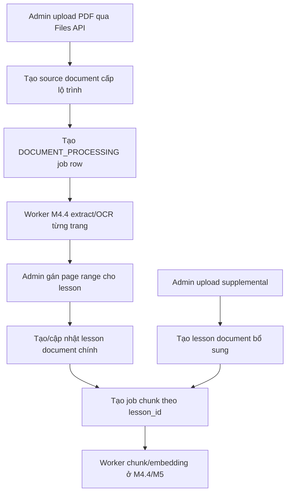

# Lesson Document Processing

## Tính năng này giải quyết gì?

MVP không upload từng file rời rạc cho từng chương. Admin tạo sẵn lesson metadata, upload một PDF/tài liệu nguồn dài ở cấp lộ trình, rồi gán khoảng trang cho từng lesson. Lesson vẫn có thể có tài liệu bổ sung riêng, nhưng mọi chunk/embedding về sau phải gắn với `lesson_id`.

## Bức tranh tổng thể

`M4.2` tạo lớp API và database mapping. API biết tài liệu nguồn, trang, page range và lesson document nào cần xử lý. Worker thật chưa chạy ở task này; API chỉ tạo `background_jobs` durable rows để `M4.3`/`M4.4` nối BullMQ, extract/OCR và chunk sau.

## Sơ đồ luồng dễ hiểu

## Luồng code end-to-end

1. Admin upload PDF bằng `POST /files/upload` với `purpose = LESSON_DOCUMENT`.
2. Admin tạo source document bằng `POST /admin/learning-paths/:learningPathId/source-documents`.
3. API lưu `source_documents`, set status processing và tạo `background_jobs` queue `DOCUMENT_PROCESSING`.
4. Worker sau này tạo `source_document_pages` khi biết số trang và text/thumbnail từng trang.
5. Admin gọi `PUT /admin/source-documents/:sourceDocumentId/lesson-page-ranges`.
6. API validate lesson cùng lộ trình, page range hợp lệ, cảnh báo overlap/gap, rồi tạo `lesson_document_page_ranges`.
7. API tạo hoặc cập nhật `lesson_documents` loại `PRIMARY_FROM_SOURCE` và tạo job chunking theo `lesson_id`.
8. Nếu admin thay tài liệu chính bằng file riêng, API tạo `PRIMARY_REPLACEMENT` và đánh dấu tài liệu chính cũ bằng `replaced_at`.
9. Nếu admin thêm tài liệu bổ sung, API tạo `SUPPLEMENT`; tài liệu bổ sung không làm mất tài liệu chính.

## Back-end/API

- Source document APIs nằm trong `LearningPathsModule`, controller `admin-source-documents`.
- Lesson document APIs nằm trong controller `admin-lesson-documents`.
- Job status nằm trong `JobsModule` qua `GET /jobs/:jobId`.
- Service không gọi BullMQ trực tiếp ở `M4.2`; chỉ tạo `background_jobs` để UI có trạng thái và worker sau này có nguồn dữ liệu nối tiếp.

## Database

- `source_documents`: file nguồn dài cấp lộ trình.
- `source_document_pages`: text/status/quality từng trang, do worker tạo.
- `lesson_document_page_ranges`: mapping `lesson -> page_start/page_end`.
- `lesson_documents`: tài liệu học thật gắn với lesson, có `kind`.
- `replaced_at`: đánh dấu tài liệu chính cũ, giúp mỗi lesson chỉ có một tài liệu chính active mà không xóa lịch sử ngay.

## Worker/AI/Integration

`M4.3` sẽ nối BullMQ worker foundation. `M4.4` sẽ extract/OCR và chunk. `M5.x` mới tạo embedding bằng pgvector. Vì vậy `M4.2` không parse PDF và không gọi AI.

## File quan trọng

- `apps/api/prisma/schema.prisma`
- `apps/api/src/modules/learning-paths/services/source-documents.service.ts`
- `apps/api/src/modules/learning-paths/services/lesson-documents.service.ts`
- `apps/api/src/modules/jobs/services/jobs.service.ts`
- `docs/database/files-documents.md`
- `docs/api/learning-paths-lessons.md`

## Kiến thức cần nhớ

- Source document là nguồn để extract/OCR theo trang, không dùng trực tiếp cho student retrieval.
- Retrieval/RAG sau này phải filter theo `lesson_id`, nên chunk cuối cùng luôn gắn với lesson.
- Tài liệu chính và tài liệu bổ sung là hai luồng khác nhau; thay tài liệu chính không được xóa supplemental.
- `background_jobs.id` là `jobId` cho UI poll, còn BullMQ job id là phần worker nối sau.

## Task liên quan

- `M4.1`: FilesModule và storage service.
- `M4.2`: Source document và lesson page mapping API.
- `M4.3`: BullMQ worker foundation.
- `M4.4`: PDF extract và chunking.
- `M4.5`: Lesson document upload UI/status.
