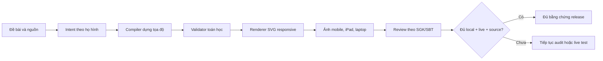

# Các dạng hình Toán 3-9 đã làm và còn thiếu

## Tài liệu này dùng để làm gì?

Tài liệu này ghi lại năng lực hiện tại của hệ thống dựng hình cho phần kiến thức
buổi học, trong phạm vi Toán lớp 3 đến lớp 9, bộ **Kết nối tri thức với cuộc
sống**. Mục tiêu là phân biệt rõ:

- dạng hình đã có bộ dựng deterministic trong code;
- dạng đã được model sinh thật và chụp giao diện;
- dạng đã có đối chiếu đúng trang SGK/SBT;
- dạng chưa đủ bằng chứng để công bố hỗ trợ;
- dạng chưa có bộ dựng chuyên biệt hoặc đang nằm ngoài phạm vi.

Snapshot trong tài liệu này lấy tại ngày **2026-08-10** từ
`coverage-report-v51.json`. Khi báo cáo coverage mới được tạo, các con số và danh
sách dưới đây phải được cập nhật theo báo cáo mới, không suy ra từ số lượng ảnh.

## Cách hiểu trạng thái

| Trạng thái | Ý nghĩa |
| --- | --- |
| Có compiler local | Backend có intent/schema và bộ dựng tọa độ deterministic; fixture local đã render được. |
| Có live evidence | Đã có output từ provider thật, render bằng component thật và qua review ảnh đại diện. |
| Có exact-page source | Đã gắn được trang/figure cụ thể từ SGK hoặc SBT làm căn cứ. |
| Đủ ba gate | Đồng thời có compiler local, live evidence và exact-page source. |
| Supported chính thức | Chỉ được dùng sau khi inventory được khóa và release gate toàn wave đạt. Hiện chưa có ô nào được công bố trạng thái này. |

Vì vậy, câu “đã vẽ được” có hai mức:

1. **Đã làm về kỹ thuật:** `50/50` ô inventory có compiler và golden local.
2. **Đã đủ bằng chứng để phát hành:** mới có `11/50` ô qua đủ ba gate.

Không được dùng `50/50 compiler` để tuyên bố đã phủ 100% chương trình.

## Bức tranh tổng thể

## Tổng quan theo họ hình

| Họ hình | Dạng trong inventory | Local đạt | Live đạt | Trang nguồn xác minh | Đủ ba gate |
| --- | ---: | ---: | ---: | ---: | ---: |
| Hình học nâng cao | 8 | 8 | 3 | 6 | 2 |
| Đại số và đồ thị | 5 | 5 | 5 | 0 | 0 |
| Bảng, biểu đồ và dữ liệu | 7 | 7 | 6 | 3 | 2 |
| Mô hình toán tiểu học | 5 | 5 | 5 | 0 | 0 |
| Trục số và tọa độ | 4 | 4 | 4 | 0 | 0 |
| Hình học phẳng | 10 | 10 | 7 | 7 | 5 |
| Tập hợp và sơ đồ | 4 | 4 | 3 | 0 | 0 |
| Hình không gian và ứng dụng | 7 | 7 | 6 | 3 | 2 |
| **Tổng** | **50** | **50** | **39** | **19** | **11** |

Ngoài 50 ô trên, bộ test semantic còn có `86` fixture đã được duyệt local và
`688` ảnh chụp qua bốn nhóm thiết bị × hai theme. Đây là dữ liệu hồi quy, không
phải 688 dạng hình khác nhau.

## Những dạng đã có bộ dựng kỹ thuật

### 1. Mô hình toán tiểu học

- Mảng phép nhân theo hàng và cột.
- Sơ đồ thanh so sánh, phần–toàn thể và hơn–kém.
- Mô hình phân số dạng thanh và hình tròn.
- Hình ghép vuông góc, hình chữ L, bài chu vi/diện tích có phần khuyết.
- Thước đo và nhiệt kế có vạch chia, số đo và đơn vị.

### 2. Trục số và mặt phẳng tọa độ

- Trục số nguyên, thập phân và phân số, có vạch chia và điểm đánh dấu.
- Khoảng, đoạn và nửa khoảng với đầu mút đóng/mở.
- Các điểm trên Oxy có tên và đường dóng về hai trục.
- Miền nghiệm của bất phương trình tuyến tính đơn giản.

### 3. Đại số và đồ thị

- Hàm số bậc nhất/đường thẳng dựng từ các điểm chuẩn.
- Parabol có đỉnh, các cặp điểm dựng đối xứng và điểm lấy mẫu làm mượt.
- Hệ hai đường thẳng và giao điểm.
- Giao giữa đường thẳng và parabol.
- Hàm tỉ lệ nghịch với hai nhánh và các điểm dựng có tên.

### 4. Bảng, biểu đồ và dữ liệu

- Bảng giá trị với nội dung căn giữa ô.
- Biểu đồ tranh và chú giải.
- Biểu đồ cột đơn/cột kép.
- Biểu đồ đoạn thẳng có điểm dữ liệu và nhãn giá trị.
- Histogram.
- Biểu đồ hình quạt tròn.
- Đồng hồ kim có tâm, kim, vạch giờ và các số 12, 3, 6, 9.

### 5. Hình học phẳng

- Điểm, đoạn thẳng, đường thẳng, tia, trung điểm và đường vuông góc.
- Góc nhọn, vuông, tù và bẹt.
- Tam giác thường, cân, đều và vuông.
- Hình chữ nhật, hình vuông, bình hành, thang, thoi và cánh diều.
- Lục giác đều và ký hiệu các cạnh bằng nhau.
- Hai đường song song với cát tuyến và các góc liên quan.
- Đường tròn, bán kính, đường kính, dây, cung và hình quạt.
- Đối xứng trục và đối xứng tâm.
- Các trường hợp bằng nhau đặc biệt của tam giác vuông.

### 6. Hình học nâng cao

- Ba đường trung tuyến và trọng tâm.
- Ba đường phân giác, ba đường trung trực hoặc ba đường cao đồng quy.
- Định lý Thales trong tam giác.
- Đường cao từ góc vuông xuống cạnh huyền.
- Tam giác đồng dạng theo góc–góc, cạnh–góc–cạnh và cạnh–cạnh–cạnh.
- Tiếp tuyến, dây cung, góc ở tâm/góc nội tiếp, tứ giác nội tiếp.
- Đường tròn nội tiếp/ngoại tiếp và cấu hình tối đa hai đường tròn.

### 7. Hình không gian và bài toán ứng dụng

- Hình hộp chữ nhật và khối lập phương, có cạnh thấy/khuất và kích thước.
- Lăng trụ tam giác.
- Chóp tam giác và chóp tứ giác.
- Hình trụ có bán kính và chiều cao.
- Hình nón và hình cầu có tâm/bán kính phù hợp.
- Hình khai triển của khối lập phương và hình hộp chữ nhật.
- Bài toán tam giác vuông ứng dụng: thang–tường, bóng nắng, chiều cao và khoảng cách.

### 8. Tập hợp và sơ đồ

- Venn một đến ba tập, có thể có tập vũ trụ.
- Sơ đồ cây cho đếm và xác suất hữu hạn.
- Sơ đồ luồng hữu hạn.
- Sơ đồ mạng/đường đi và kết nối.

## 11 dạng đã đủ local + live + exact-page source

Các ô dưới đây hiện có bằng chứng đầy đủ nhất trong báo cáo v51:

1. `data-bar-medium`: biểu đồ cột đơn/cột kép.
2. `data-clock-simple`: đồng hồ kim.
3. `plane-quadrilateral-medium`: các tứ giác cơ bản.
4. `plane-basic-construction-simple`: điểm, đoạn, đường, tia, trung điểm, vuông góc.
5. `plane-regular-polygon-medium`: lục giác đều.
6. `plane-circle-hard`: các thành phần cơ bản của đường tròn.
7. `plane-right-triangle-congruence-medium`: bằng nhau của tam giác vuông.
8. `advanced-circle-hard`: các quan hệ đường tròn nâng cao lớp 9.
9. `advanced-similarity-hard`: tam giác đồng dạng.
10. `spatial-triangular-prism-medium`: lăng trụ tam giác.
11. `spatial-pyramid-hard`: chóp tam giác/tứ giác.

Ngay cả 11 ô này vẫn chưa được gắn `SUPPORTED` chính thức vì inventory toàn
chương trình và release gate chung đang ở trạng thái `IN_PROGRESS`.

## 28 dạng đã live nhưng còn thiếu exact-page source

Những dạng này đã có compiler local và provider thật đã sinh được, nhưng chưa có
đủ audit trang SGK/SBT cụ thể:

- `elementary-array-simple`: mảng phép nhân.
- `elementary-tape-medium`: sơ đồ thanh.
- `elementary-fraction-medium`: mô hình phân số.
- `elementary-composite-hard`: hình ghép vuông góc.
- `elementary-measurement-simple`: thước đo/nhiệt kế.
- `coordinate-number-line-simple`: trục số.
- `coordinate-interval-medium`: khoảng/đoạn/nửa khoảng.
- `coordinate-points-medium`: điểm và đường dóng trên Oxy.
- `coordinate-region-hard`: miền nghiệm bất phương trình.
- `graph-linear-simple`: hàm bậc nhất.
- `graph-quadratic-medium`: parabol.
- `graph-system-medium`: hệ hai đường thẳng.
- `graph-line-parabola-hard`: giao đường thẳng–parabol.
- `graph-inverse-hard`: hàm tỉ lệ nghịch.
- `data-table-simple`: bảng giá trị.
- `data-line-medium`: biểu đồ đoạn thẳng.
- `data-histogram-hard`: histogram.
- `data-pie-hard`: biểu đồ quạt tròn.
- `plane-triangle-simple`: các loại tam giác.
- `plane-parallel-medium`: hai đường song song và cát tuyến.
- `advanced-thales-medium`: định lý Thales.
- `spatial-cuboid-simple`: hình hộp chữ nhật/lập phương.
- `spatial-cylinder-medium`: hình trụ.
- `spatial-applied-hard`: bài thang, bóng nắng, chiều cao/khoảng cách.
- `spatial-net-medium`: hình khai triển lập phương/hộp chữ nhật.
- `schematic-venn-simple`: sơ đồ Venn.
- `schematic-tree-medium`: sơ đồ cây.
- `schematic-network-hard`: sơ đồ mạng/đường đi.

## 8 dạng có source nhưng còn thiếu live evidence

Các dạng sau đã có compiler, golden local và trang nguồn, nhưng chưa có live case
được nghiệm thu trong báo cáo hiện hành:

- `data-pictogram-simple`: biểu đồ tranh.
- `plane-axial-symmetry-medium`: đối xứng trục.
- `plane-central-symmetry-hard`: đối xứng tâm.
- `advanced-centroid-medium`: ba trung tuyến và trọng tâm.
- `advanced-angle-bisectors-medium`: ba phân giác đồng quy.
- `advanced-perpendicular-bisectors-hard`: ba trung trực đồng quy.
- `advanced-altitudes-hard`: ba đường cao đồng quy.
- `spatial-cone-sphere-medium`: hình nón và hình cầu.

## 3 dạng mới chỉ đạt local

Ba ô này còn thiếu cả live evidence và exact-page source:

- `plane-angle-simple`: góc nhọn, vuông, tù và bẹt.
- `advanced-altitude-hard`: đường cao xuống cạnh huyền trong tam giác vuông.
- `schematic-flow-medium`: sơ đồ luồng hữu hạn.

Đây là nhóm cần ưu tiên khi tiếp tục coverage vì hiện bằng chứng còn yếu nhất.

## Các dạng chưa có bộ dựng chuyên biệt hoặc đang ngoài phạm vi

### Chưa có archetype chuyên biệt

Các dạng dưới đây có thể được biểu diễn một phần bằng primitive/raw fallback,
nhưng hiện chưa có intent + compiler + validator riêng đủ để cam kết ổn định:

- lịch tháng/năm và timeline thời gian;
- bản đồ tỉ lệ, sơ đồ đường đi có thước tỉ lệ chuyên dụng;
- phép tịnh tiến, phép quay và phép vị tự trên Oxy ngoài hai dạng đối xứng đã có;
- bảng không gian mẫu và xác suất có điều kiện với validator xác suất riêng;
- đồ thị hàm trị tuyệt đối, hàm từng đoạn hoặc hàm hữu tỉ tổng quát;
- hình khai triển của lăng trụ, chóp, trụ và nón ngoài lập phương/hộp chữ nhật;
- hình không gian ghép nhiều khối hoặc có thiết diện;
- quy trình dựng hình bằng thước–compa cần thể hiện tuần tự nhiều bước.

Nếu model trả raw spec cho các dạng này, hệ thống chỉ nên giữ làm bản nháp cần
review; không xem đó là coverage deterministic.

### Ngoài phạm vi delivery wave hiện tại

- Hình động hoặc thao tác dựng hình nhiều trạng thái/timeline.
- Tái tạo tùy ý hình scan phức tạp từ ảnh sách.
- Hình không gian có thiết diện dày đặc, nhiều mặt khuất hoặc nhiều hệ quy chiếu.
- Hình có hơn 32 nhãn ngữ nghĩa hoặc hơn 5 cụm đối tượng phụ thuộc nhau khiến
  SVG tĩnh trên điện thoại không còn đọc rõ.
- Raw SVG/TikZ/script do model trả về.
- Image-generation provider dùng để thay thế hình toán deterministic.
- Các bài `VERY_COMPLEX`; giai đoạn hiện tại chỉ tính `SIMPLE`, `MEDIUM`, `HARD`.

## Những việc còn phải làm trước khi công bố 90–100%

1. Khóa inventory SGK + SBT chính thức; hiện classification vẫn `IN_PROGRESS`.
2. Bổ sung live evidence cho 11 ô còn thiếu.
3. Bổ sung exact-page source cho 31 ô còn thiếu.
4. Đảm bảo ít nhất 45/50 ô cùng lúc qua local + live + source để đạt mốc 90%.
5. Chạy lại regression trên điện thoại Chromium, điện thoại WebKit, iPad và
   laptop, cả sáng/tối, sau mọi sửa đổi renderer/compiler.
6. Review ảnh bằng mắt, đối chiếu SGK/SBT và loại ảnh lỗi khỏi thư mục đạt chuẩn.
7. Chỉ đổi `releaseStatus` và `SUPPORTED` sau khi release gate chung đạt; không
   công bố theo cảm giác hoặc theo tổng số screenshot.

## Nguồn kiểm chứng trong repo

- [Kế hoạch coverage 90–100%](../../../.codex/plans/m9-2-math-diagram-coverage-90-plan.md)
- [Inventory 50 ô](../../../apps/api/test/fixtures/math-diagram/curriculum-inventory.json)
- [Coverage report v51](../../../anh-chup-hinh-toan-dat-chuan/coverage-report-v51.json)
- [Audit trang nguồn](../../../apps/api/test/fixtures/math-diagram/source-page-audit.json)
- [Danh sách fixture semantic](../../../apps/api/test/fixtures/math-diagram/semantic-visual-cases.ts)
- [Intent/schema các họ hình](../../../apps/api/src/modules/ai/types/lesson-summary-diagram-intent.types.ts)
- [Registry compiler](../../../apps/api/src/modules/ai/utils/diagram-compilers/compile-diagram-intent.ts)
- [AI/RAG specification](../../06-ai-rag-spec.md)

## Cách cập nhật tài liệu này

Khi có báo cáo coverage mới:

1. thay snapshot v51 bằng report mới;
2. cập nhật bảng tổng quan tám family;
3. di chuyển từng `cellId` giữa bốn nhóm bằng chứng, không sửa theo cảm tính;
4. bổ sung/xóa mục “chưa có archetype chuyên biệt” khi code và inventory đổi;
5. giữ nguyên lịch sử chi phí trong báo cáo nguồn, không cộng chi phí từ số ảnh.

## Task liên quan

- `M9.2` — Lesson summary generation và math diagram coverage.
