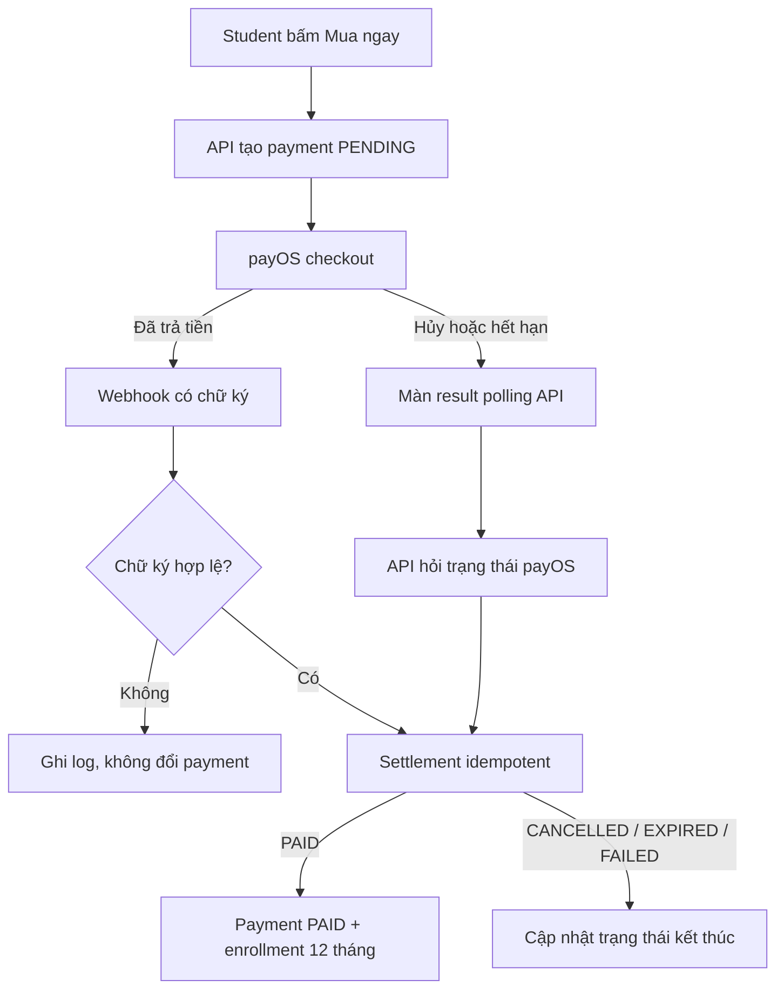

# Payment và enrollment

## Tính năng này giải quyết gì?

Student tạo order payOS để mua khóa học. Khi payOS xác nhận đã nhận tiền, hệ thống chuyển payment sang `PAID` và mở quyền học trong 12 tháng. Luồng phải an toàn khi webhook gọi lặp, đến chậm hoặc người dùng hủy thanh toán.

## Bức tranh tổng thể

- Frontend chỉ gửi `learningPathId`; backend tự tính số tiền.
- payOS giữ trạng thái giao dịch bên ngoài, database giữ trạng thái dùng trong ứng dụng.
- Webhook là đường cập nhật chính. API polling là đường đối soát dự phòng và xử lý hủy/hết hạn.
- Webhook và polling dùng chung logic settlement để không tạo enrollment trùng.

## Sơ đồ luồng dễ hiểu

## Luồng code end-to-end

### Front-end

Course detail gọi mutation tạo payment, ghi lại URL cùng vị trí browser history của ClassHero rồi mở `checkoutUrl`. Màn result dùng TanStack Query polling khi trạng thái còn `PENDING`; khi thành `PAID`, cache danh sách/chi tiết khóa học được invalidate để quyền học cập nhật ngay. Màn thành công cũng đặt một history guard để nút Back bỏ qua các entry payOS và quay thẳng về trang ClassHero trước checkout. Nếu browser khôi phục course detail từ BFCache, màn course phải refetch quyền học trong sự kiện `pageshow` thay vì tiếp tục dùng snapshot `Chưa mua` trước checkout.

### Back-end/API

`StudentPaymentsService` tạo order, reuse payment đang chờ còn hiệu lực và đối soát payOS trước khi reuse. `PayosService` luôn `await` SDK khi verify webhook. `WebhookPaymentsService` nhận dữ liệu đã verify hoặc kết quả Get Payment Link, sau đó áp dụng trạng thái bằng transaction.

### Database

Settlement giữ `paidAt`, cập nhật payment và tạo tối đa một enrollment active. Webhook gọi lại hoặc polling chạy cùng lúc không được tạo thêm enrollment. Enrollment hết hạn cũ được chuyển `EXPIRED` trước khi mở kỳ học mới.

### Worker/AI/Integration

payOS là provider ngoài hệ thống. Không dựa vào query trên Return URL để tự nhận là đã thanh toán; trạng thái phải đến từ webhook đã verify hoặc API payOS có xác thực.

## Luồng lỗi thường gặp

- Quên `await` hàm verify async: Promise là truthy nên chữ ký sai có thể đi qua nhánh kiểm tra.
- Chỉ dựa vào webhook: hủy/hết hạn có thể khiến database kẹt `PENDING`.
- Chỉ dựa vào Return URL: query trình duyệt có thể bị giả mạo.
- Webhook và polling có hai logic PAID riêng: dễ tạo enrollment trùng hoặc lệch thời hạn.
- Chỉ dùng `router.replace` ở Return URL: không xóa được các history entry cross-origin mà payOS đã tạo, nên Back vẫn có thể quay lại trang provider. Cần ghi lại vị trí trước checkout và chủ động bỏ qua đúng số entry sau khi đã xác nhận `PAID`.
- Chỉ invalidate TanStack Query tại màn result: cache của document mới không cập nhật được snapshot course detail đang bị browser đóng băng trong BFCache. Khi `pageshow.persisted = true`, course detail phải refetch API authoritative và invalidate course list.

## File quan trọng

- `apps/api/src/modules/payments/services/payos.service.ts`
- `apps/api/src/modules/payments/services/webhook-payments.service.ts`
- `apps/api/src/modules/payments/services/student-payments.service.ts`
- `apps/api/src/modules/payments/controllers/webhook-payments.controller.ts`
- `apps/web/features/student/payments/hooks/use-student-payment.ts`
- `apps/web/features/student/payments/hooks/use-payment-checkout-back-guard.ts`
- `apps/web/features/student/payments/utils/payment-checkout-history.ts`
- `apps/web/features/student/payments/screens/student-payment-result-screen/index.tsx`

## Kiến thức cần nhớ

- Mọi kết quả xác thực bất đồng bộ phải được `await` trước khi quyết định nghiệp vụ.
- Webhook là push, reconciliation là pull; payment thực tế cần cả hai để tự hồi phục.
- Idempotency phải bảo vệ kết quả nghiệp vụ, không chỉ bảo vệ webhook log.
- Trạng thái từ URL chỉ giúp điều hướng UI, không phải bằng chứng đã thanh toán.
- Ứng dụng không thể xóa tùy ý lịch sử của một domain khác; chỉ có thể ghi nhớ trang xuất phát và điều hướng qua các entry provider khi người dùng Back sau khi trở về ClassHero.

## Task liên quan

- `M8.2`: tạo payment order.
- `M8.3`: webhook, idempotency và enrollment.
- `M8.4`: payment result UI và status polling.
