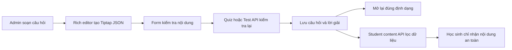
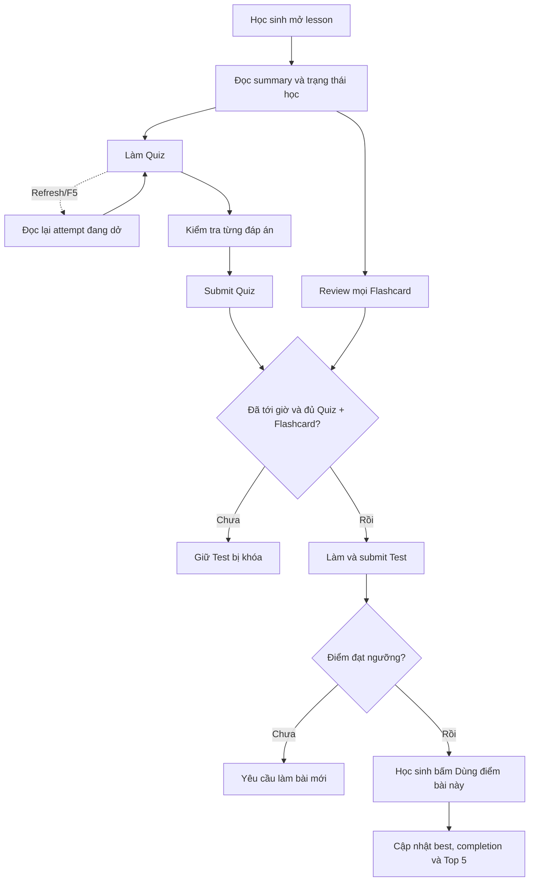

# Quiz, flashcard và test

## Tính năng này giải quyết gì?

Admin tạo nội dung luyện tập theo từng buổi học. Nội dung câu hỏi dùng Tiptap JSON để giữ định dạng văn bản, màu, công thức, ảnh và bảng thay vì chỉ lưu chuỗi thuần.

## Bức tranh tổng thể

Rich editor là điểm nhập nội dung ở front-end. Quiz và Test dùng chung flow soạn
câu hỏi; Test chỉ bổ sung thời gian làm bài ở cấp bộ đề. Form gửi JSON đã validate
qua API tương ứng; backend kiểm tra cấu trúc, lưu dữ liệu và trả lại cùng JSON để
lần mở sau khôi phục đúng nội dung.

## Sơ đồ luồng dễ hiểu

## Luồng code end-to-end

UI editor cập nhật giá trị React Hook Form, API client gửi payload câu hỏi,
controller/service Quiz hoặc Test validate và lưu cấu trúc JSON. Khi đọc lại, dữ
liệu đi ngược về editor để Tiptap render các node và mark tương ứng. Manager Test
tái sử dụng manager Quiz với adapter API riêng, nên hai tab giữ cùng interaction
mà không nhân đôi toàn bộ editor.

`TRUE_FALSE` và `MULTI_STATEMENT_TRUE_FALSE` là hai loại dữ liệu độc lập. Loại
cũ lưu một boolean; loại mới lưu danh sách rich-content statement và một mảng
ánh xạ `{ statementId, value }`. Quiz và Test đều dùng cùng contract bốn loại,
vì vậy select, TypeScript union, Prisma enum và backend validation phải thay đổi
đồng bộ.

## Front-end

- Bảng màu chữ dùng popover riêng, giữ selection của Tiptap khi thao tác toolbar. Màu có sẵn áp dụng ngay; màu tùy chỉnh chỉ là giá trị nháp cho đến khi bấm `OK`.
- Khi bấm đậm/nghiêng/gạch chân tại một con trỏ chưa chọn text, Tiptap chỉ đổi `stored marks` cho ký tự sắp nhập. Toolbar phải nghe transaction này để cập nhật trạng thái active ngay, không chờ document đổi sau lần gõ đầu tiên.
- Khi image node được chọn, cùng nhóm nút căn lề cập nhật
  `image.attrs.alignment` bằng transaction tại đúng vị trí của `NodeSelection`, rồi mới
  trả focus về editor. Không gọi `focus()` trước khi cập nhật vì selection của ảnh có thể
  bị thay bằng text selection. Ảnh hỗ trợ trái/giữa/phải, mặc định giữa để dữ liệu cũ giữ
  nguyên cách hiển thị; `textAlign` của paragraph không tác động tới block node ảnh.
- Popover nằm trong portal ngoài khung editor để không bị `overflow: hidden` cắt mất. Vị trí được tính từ nút mở và giới hạn theo viewport.
- Resize hàng bảng phải lưu tọa độ logic của hàng, rồi tìm lại DOM hiện tại trong mỗi lần kéo. Không giữ lâu tham chiếu `<tr>` vì transaction của ProseMirror có thể thay node DOM ngay giữa interaction.
- ProseMirror dùng `gap cursor` khi con trỏ đứng giữa các block như trước hoặc sau
  ảnh. Kiểu mặc định là một gạch ngang; editor ghi đè phần hiển thị thành caret dọc
  để nhất quán với vị trí sắp nhập chữ, nhưng vẫn giữ nguyên selection và hành vi
  tạo paragraph của ProseMirror.
- Placeholder của rich editor phải dùng decoration của Tiptap trên paragraph rỗng
  để dùng chung line box, padding và caret của `contenteditable`. Không đặt một
  `span` absolute cạnh `EditorContent`: overlay đó bám wrapper bên ngoài nên có
  thể lệch đồng loạt ở câu hỏi, phương án và các trạng thái focus khác nhau.
- Khi upload, editor đọc `sourceWidth/sourceHeight` để dựng viewport theo đúng tỉ
  lệ ảnh gốc. `baseWidthPercent=60` giữ ảnh mới gọn trong editor, còn
  `widthPercent=100` biểu thị ảnh chưa bị người dùng resize. Kích thước khung cơ
  sở, mức resize và aspect ratio là ba khái niệm riêng.
- Câu Đúng/Sai nhiều mệnh đề dùng một field-array riêng. Mỗi row sở hữu nội
  dung rich text, ID ổn định và lựa chọn Đúng/Sai; không tái sử dụng state
  boolean của loại Đúng/Sai cũ.
- Với danh sách tab tạo động, chỉ invalidate query sau mutation là chưa đủ để
  chọn item mới ổn định: effect bảo vệ selection có thể nhìn thấy cache cũ và
  kéo active ID về tab đầu. Mutation create cần chèn response vào cache ngay,
  sau đó screen mới chọn ID vừa tạo; refetch nền tiếp tục đối chiếu dữ liệu server.
  Response create có thể không chứa aggregate `_count` như response list, nên
  hook phải chuẩn hóa `_count` từ `questionCount` trước khi đưa object vào cache;
  component vẫn cần fallback an toàn để dữ liệu tạm không làm sập toàn màn.

## Back-end/API

API Quiz và Test nhận rich content theo schema của `M6.1`, không tin dữ liệu từ
UI và validate lại trước khi service lưu. Test set bắt buộc có `durationSeconds`;
UI nhập phút để thân thiện rồi chuyển sang giây tại API boundary.

Validator của loại nhiều mệnh đề kiểm tra tối thiểu 2 mệnh đề, ID không trùng,
nội dung không rỗng và `correctAnswerJson` ánh xạ đúng một lần cho mọi ID.

Student lesson API dùng một access resolver chung trước khi đọc summary,
quiz/flashcard/test. Resolver phân biệt enrollment và trial, đồng thời chặn truy
cập trực tiếp bản `PERSONALIZED` của học sinh khác. Query student dùng selector
riêng: quiz chỉ lấy nội dung câu, phương án và gợi ý; không select đáp án đúng,
grading config hoặc lời giải. Aggregate lesson/test chỉ trả metadata và số lượng,
không tải nội dung đề thi trước lúc bắt đầu attempt.

Khả năng bắt đầu test được tính từ thời gian server. Enrollment chỉ được mở khi
đã tới `examOpenAt`; trial có thể đọc lesson nhưng luôn bị khóa test. Đây là
policy backend, không phụ thuộc đồng hồ hoặc nút disabled ở trình duyệt.

Mảng object trong DTO NestJS phải khai báo rõ lớp phần tử bằng
`@Type(() => ItemDto)` và `@ValidateNested({ each: true })`. Nếu chỉ ghi type
TypeScript như `QuizOption[]`, `ValidationPipe` bật implicit conversion có thể dựa
vào metadata `Array` chung chung và biến từng object thành array trước khi schema
nghiệp vụ nhận dữ liệu.

## Luồng học sinh M7

Màn lesson dùng một aggregate để dựng header, summary và previous/next; nội dung
runner được lấy qua endpoint riêng để giữ payload nhỏ và không lộ dữ liệu chấm.
Quiz kiểm tra từng câu trước khi submit, còn Test chấm cả attempt một lần. Đây là
hai nhịp nghiệp vụ khác nhau dù dùng chung bộ chấm điểm.

### Quiz: phản hồi từng câu nhưng không tự mở

- `Gợi ý` và lời giải là hai disclosure riêng; UI không tự hiển thị nội dung.
- Nút kiểm tra chỉ bật khi answer đủ shape của loại câu. Server kiểm lại vì
  disabled state ở client không phải validation bảo mật.
- `MULTIPLE_CHOICE` trong student runner là lựa chọn đơn dù payload dùng mảng:
  mỗi lần bấm phải ghi đè thành `[optionId]`, không nối thêm vào mảng hiện tại.
  UI chỉ coi answer hợp lệ khi có đúng một ID; dữ liệu nháp cũ có nhiều ID chỉ
  hiển thị lựa chọn gần nhất để học sinh chọn lại và chuẩn hóa state.
- Student theme chủ động xóa các utility `.border` ở mobile để làm nhẹ card.
  Control học tập vẫn cần đường viền như đáp án, input hoặc lựa chọn Đúng/Sai
  phải thêm escape hatch `student-mobile-border`; chỉ đổi `border-*` color trong
  component không có tác dụng khi `border-width` đang bị CSS mobile ép về `0`.
- Start attempt tạo placeholder theo tập câu server đã chọn. Endpoint check thay
  placeholder bằng answer thật và mới trả answer key/explanation. Submit chỉ
  tổng kết các câu đã check, vì vậy client không thể tráo question ID ở cuối.
- “Đã trả lời” và “đã kiểm tra” là hai trạng thái khác nhau. Nhãn `Đã làm` cùng
  cảnh báo thiếu câu phải dùng validator answer đầy đủ theo từng loại câu; nếu
  dùng feedback đã chấm, UI sẽ báo `0` dù student đã chọn đủ đáp án. Khi bấm
  `Hoàn thành`, frontend tự gọi endpoint check song song cho các answer đầy đủ
  chưa chấm rồi mới submit, còn backend vẫn giữ invariant chỉ submit attempt đã
  được chấm đủ.
- React state không đủ để giữ runner qua F5. URL lesson phải mang
  `learningSurface`, `learningSetId` và `learningAttemptId` để server biết ngay
  request đầu cần render fullscreen runner/result thay vì lesson panel. Sau đó
  frontend gọi endpoint current attempt: server trả lại tập câu, mọi đáp án đã
  autosave, feedback của câu đã kiểm tra và vị trí câu hiện tại. Browser storage
  chỉ là cache tùy chọn; server là nguồn chính để resume chéo thiết bị.
- Response autosave có thể cập nhật `answeredCount` hoặc `checkedCount` trong
  TanStack Query cache, nhưng đây không phải tín hiệu cần resume lại runner.
  Effect khôi phục phải thoát sớm khi `attemptId` trên surface URL/history chính
  là attempt đang hiển thị; nếu phụ thuộc trực tiếp vào toàn bộ object status, mỗi
  lần chọn hoặc kiểm tra đáp án sẽ dựng màn loading fullscreen rồi tải lại
  current attempt, tạo cảm giác nháy màn.
- Copy CTA và vị trí mở runner phải dùng trạng thái đã từng mở lượt. Chưa có
  attempt dùng `Bắt đầu` và luôn mở câu 1; mọi attempt `IN_PROGRESS` dùng
  `Tiếp tục làm` dù chưa kiểm tra câu nào và khôi phục `currentIndex` đã lưu.
  Surface URL quyết định F5 có tự mở runner hay giữ panel; history marker giữ
  semantics Browser Back, và cả hai không quyết định nhãn CTA.
- Attempt `IN_PROGRESS` là trạng thái nghiệp vụ, không phải trạng thái màn hình.
  Chỉ URL/entry riêng của runner mới cho biết F5 cần tự mở lại runner. Nếu entry
  này đã được pop và surface query đã được xóa khi student xác nhận thoát, tab
  Quiz phải giữ ở panel tổng quan; nút bắt đầu sau đó mới chủ động resume
  attempt đang dở.
- URL là nguồn định danh canonical của fullscreen surface. Marker runner/result
  còn sót trong `history.state` hoặc `sessionStorage` không được phép tự mở lại
  surface khi URL chỉ còn tab Quiz thường; panel phải xóa marker stale trước khi
  chạy logic resume. Quy tắc này ngăn chuỗi một frame card Quiz, một frame
  loading rồi mới đổi sang runner hoặc quay lại card.
- Status quyết định CTA `Bắt đầu`/`Tiếp tục làm`/`Xem lại` được prefetch ngay
  khi lesson sẵn sàng. Nếu student bấm Quiz trước khi request đầu hoàn tất,
  navigation giữ panel Bài học hiện tại và đánh dấu tab Quiz pending; chỉ sau
  khi status đã vào cache mới mount panel Quiz. Nhờ vậy thao tác vẫn có feedback
  tức thì nhưng card không đi qua vùng trống hoặc skeleton ngắn.
- Với lesson có nhiều Quiz set, `activeQuizSetId` cũng là state cần sống qua F5.
  Lưu ID này theo `user + lesson`, ưu tiên marker runner/result khi surface vẫn
  mở và luôn đối chiếu với danh sách set mới tải. Khi Back khỏi runner, chỉ xóa
  surface marker; không xóa active set, nếu không lần refetch/F5 tiếp theo sẽ
  rơi về set đầu tiên và hiển thị kết quả cũ thay cho lượt mới đang dở.
- Result cũng là một surface toàn màn hình nằm trên cùng route lesson, nên React
  state một mình không giữ được nó qua F5. Khi submit hoặc bấm `Xem lại`,
  frontend ghi `attemptId` gốc vào surface query và history state; lúc mount, UI
  đối chiếu marker với summary mới nhất từ server rồi mới khôi phục result. Khi
  quay về panel, cả query lẫn marker phải bị xóa. Result được khôi phục không
  phát lại confetti vì đó không còn là khoảnh khắc submit mới. Effect khôi phục
  phải bỏ qua nếu đúng result đó đã đang hiển thị từ submit hiện tại; nếu không,
  cache update ngay sau submit sẽ bị hiểu nhầm là F5 và tắt confetti vừa bật.
- Runner dùng một history entry phụ để chặn Browser Back. Sau submit, entry phụ
  được pop âm thầm; marker result đã ghi trên entry đó phải được chuyển sang
  entry lesson trong callback `popstate`. Nếu chỉ `replaceState` trước
  `history.back()`, marker sẽ bị bỏ cùng entry runner và F5 từ result sẽ quay về
  panel, đặc biệt dễ thấy sau luồng làm lại câu sai.
- Không được ưu tiên `IN_PROGRESS` chỉ vì trạng thái đó tồn tại. Dữ liệu legacy
  hoặc request start cũ có thể để lại nhiều lượt đang dở; backend phải so
  `startedAt` với `submittedAt` gần nhất. Lượt dở cũ hơn kết quả vừa nộp phải bị
  bỏ qua, còn start/submit mới phải chuyển các lượt dở dư sang `CANCELLED`; nếu
  không, F5 sẽ làm kết quả đã lưu biến mất khỏi panel dù row `SUBMITTED` vẫn còn
  trong database.
- CTA `Xem lại` ở panel mở result summary của lượt submit gần nhất. Từ summary,
  student mới chủ động chọn xem lại tất cả hoặc các câu sai; endpoint review chỉ
  được gọi sau lựa chọn này.
- Thoát runner rồi vào Quiz lại cũng là một luồng resume, không phải start mới.
  Frontend phải hỏi endpoint current attempt trước, dựng lại answer/feedback đã
  kiểm tra và vị trí câu; chỉ gọi start khi server trả `null`. Nếu gọi start
  trực tiếp, một lượt `IN_PROGRESS` mới có thể che lượt cũ và làm UI trông như
  mất tiến độ dù dữ liệu cũ vẫn còn trong database.
- Transition che toàn màn hình cần tách `prepare` và `commit`. Request
  start/resume có thể chạy song song lúc rèm đang khép, nhưng kết quả chỉ được
  đưa vào React state khi overlay đã che kín và sắp mở. Nếu hàm prepare tự gọi
  `setAttempt` ngay khi API trả về, runner sẽ render phía sau một lớp rèm còn
  đang khép và học sinh nhìn thấy câu hỏi quá sớm.
- Runner toàn màn hình nhưng cùng route với trang buổi học phải tự tạo một
  history entry. Browser Back trước hết pop entry này và mở xác nhận thoát thay
  vì rời route lesson. Nếu student hủy, frontend push lại entry; nếu xác nhận,
  giữ browser ở entry của trang buổi học và chỉ đóng state runner.
- Retry dùng `sourceAttemptId` trỏ tới attempt cha trực tiếp, không thay thế
  result gốc. Khi submit, server vừa giữ thống kê riêng của lượt phụ vừa cập
  nhật answer đúng mới vào các answer đang sai của attempt gốc rồi đếm lại toàn
  bộ bài. Response vì vậy tách summary của lượt vừa làm và `aggregateResult`
  của toàn bài; không dùng một ID cho cả hai ngữ cảnh.
- UI luôn chọn `aggregateResult` cho màn kết quả, kể cả ngay sau khi hoàn thành
  một lượt con. Vì vậy review/retry tiếp theo dựa trên toàn bộ bài gốc đã cộng
  dồn: xem lại tất cả dùng toàn bộ câu, làm lại câu sai dùng các câu còn sai và
  làm lại tất cả tạo một attempt `ALL` không có `sourceAttemptId` để reset toàn
  bài. Summary riêng của attempt con chỉ là dữ liệu lịch sử backend, không phải
  một màn hình cho student.
- Tập câu retry là subset nhưng số hiển thị phải thuộc không gian câu hỏi gốc.
  API trả `questionNumber` và `originalTotalCount`; runner dùng chúng cho title,
  badge, cảnh báo và nhãn điều hướng, trong khi `currentIndex` chỉ quản lý vị
  trí bên trong subset. Không dùng `currentIndex + 1` làm số câu nghiệp vụ;
  ngược lại, thanh tiến độ và nhãn `Đã xem` phải dùng vị trí trong subset, không
  dùng `questionNumber/originalTotalCount`, vì một bộ con gồm hai câu gốc số 3
  và 7 vẫn phải tiến lần lượt `1/2`, `2/2`.

### Flashcard: “đã học” khác “đã thuộc”

`reviewCount > 0` nghĩa là student đã xem và tự đánh giá thẻ; `isKnown` chỉ nói
kết quả đánh giá hiện tại. Test prerequisite cần student đã review toàn bộ thẻ
của ít nhất một bộ được duyệt, không ép tất cả thẻ phải thuộc. Nhờ vậy student
có thể còn thẻ chưa thuộc nhưng vẫn tiếp tục bài kiểm tra sau khi hoàn thành
vòng học.

Một prerequisite chỉ được hoàn thành khi vừa có nội dung được duyệt vừa có tiến
độ thật của student. Danh sách bộ hợp lệ rỗng không có nghĩa là student đã hoàn
thành; đó là trạng thái content chưa sẵn sàng và phải khóa bài thi. Nếu dùng
biểu thức kiểu `sets.length === 0 || hasProgress`, lesson thiếu Quiz/Flashcard
sẽ bị mở khóa sai dù student chưa học gì.

Runner Flashcard có thể được mở từ panel hoặc từ một action trên màn kết quả.
Điểm quay về khi thoát phải được lưu như state riêng của phiên, không hard-code
mọi runner về panel và cũng không suy đoán từ danh sách thẻ. Ví dụ phiên
`Ôn lại thẻ chưa thuộc` quay về kết quả giống retry câu sai của Quiz, còn phiên
học mới từ panel vẫn quay về panel. Cách này giữ Back nhất quán ngay cả khi hai
phiên dùng chung component runner và history-entry xác nhận thoát.

Surface query/history chỉ trả lời runner/result có đang là surface hiện tại hay
không; nó không thể tự dựng lại một phiên Flashcard. Phiên đang học cần lưu riêng tập
`cardIds` đã chốt, các thẻ đã đánh dấu trong lượt, vị trí hiện tại, mặt trước/sau
và điểm quay về. Sau F5, frontend ghép session state này với progress/favorite
mới đọc từ server: server vẫn là nguồn dữ liệu nghiệp vụ, còn local storage giữ
ngữ cảnh trình bày và vị trí chính xác trên cùng trình duyệt qua cả việc đóng/mở
lại web. Khi student xác nhận thoát, history entry runner bị pop nhưng session
vẫn còn để CTA `Tiếp tục học` resume; khi hoàn thành, session được xóa và result
marker tiếp quản việc khôi phục màn kết quả.

Identity của bộ Flashcard hiện tại cũng phải lưu riêng theo `user + lesson`.
Session lưu vị trí trong một bộ, còn active-set storage cho biết panel cần ghép
session/progress của bộ nào sau refetch hoặc F5. Xác nhận thoát chỉ xóa marker
fullscreen; nếu xóa luôn active set, panel sẽ quay về bộ hoàn thành đầu tiên và
đổi sai CTA `Tiếp tục học` thành `Xem lại`.

Flashcard panel được lazy-load sau khi lesson query hoàn tất, nên custom field
trong `window.history.state` có thể đã bị Next.js chuẩn hóa trước lúc panel đọc
nó. URL query là nguồn surface mà server và client cùng đọc được khi F5;
history entry vẫn phục vụ Browser Back, còn `sessionStorage` chỉ là fallback cho
marker legacy. Các nguồn này phải được set/xóa trong cùng helper để tránh tình
trạng UI đã về panel nhưng reload lại tự bật runner. Cleanup marker stale chỉ
chạy một lần lúc mount; nếu effect cleanup chạy lại theo object query sau
progress refetch, nó sẽ xóa nhầm marker của runner vừa được mở.

Ẩn một panel bằng attribute `hidden` không dừng lifecycle React. Nếu runner
Flashcard vẫn được mount dưới panel ẩn, hook khóa scroll của runner vẫn có thể
đặt `overflow: hidden` lên `html/body` sau hydration: thanh cuộn hiện ở HTML đầu
rồi biến mất ngay sau đó. Tab không hoạt động phải unmount runner; modal,
history và fullscreen surface dùng chung scroll-lock reference-counted để việc
đóng một lớp không vô tình mở khóa hoặc giữ khóa của lớp còn lại.

### Lịch sử là lịch sử lượt làm, không phải danh sách set duy nhất

Tên `Bộ 1`, `Bộ 2`, ... mô tả thứ tự các lượt đầy đủ mà học sinh đã bắt đầu
trong lesson. Vì vậy không được group lịch sử theo `quizSetId` hoặc
`flashcardSetId`: khi chưa có AI sinh thêm bộ và UI quay vòng tái sử dụng cùng
set, lượt mới vẫn phải có attempt/session riêng và có số `Bộ N` mới.

Quiz đã có `quiz_attempts`, nên lịch sử chỉ lấy attempt gốc
`sourceAttemptId=null`; retry câu sai/toàn bộ thuộc chuỗi kết quả hiện tại và
không tạo tên bộ mới. Flashcard trước đây chỉ có progress toàn cục theo card,
không đủ phân biệt hai lượt dùng cùng set, nên cần thêm session cùng item
snapshot. Progress vẫn là nguồn prerequisite và trạng thái mới nhất, còn
session là nguồn resume/lịch sử của từng lượt.

Test cũng phải đánh số `Bộ đề N` theo từng `test_attempt`, không dùng
`test_sets.title` làm tên lịch sử. Một test set có thể được chọn lại nhiều lần,
nên dùng title của set sẽ tạo nhiều mục trùng tên và làm mất ý nghĩa thứ tự lượt
làm; mục chưa bắt đầu dùng số kế tiếp sau tổng attempt đã hoàn thành.

Danh sách chỉ có tối đa một mục `IN_PROGRESS` hiện hành với badge `Đang làm`.
Tạo lượt mới phải hủy lượt đang dở cũ trong cùng lesson để UI không có hai mục
cùng mang ý nghĩa hiện tại. Mục hoàn thành điều hướng bằng ID attempt/session
của chính nó; nếu chỉ truyền set ID, thao tác xem lại rất dễ mở nhầm kết quả gần
nhất của một lượt khác dùng chung set.

Surface xem lại có thể được mở từ nhiều nguồn nên Back không được suy đoán rằng
đích luôn là màn kết quả. Frontend cần lưu `review origin` riêng: xem lại từ
result thì Back về result, còn xem lại từ modal lịch sử thì giữ nguyên modal
mounted bên dưới child surface. Back chỉ bỏ child surface để lộ lại chính modal
cũ, nhờ vậy scroll và state không bị reset. Action xem lại chỉ cần attempt/session
ID, không được đổi active set của panel nguồn; nếu đổi, query trạng thái của set
mới có thể chuyển panel sang loading skeleton và vô tình unmount modal theo một
race condition phụ thuộc cache/tốc độ mạng.

Lịch sử là action có xác suất mở thấp nên không nên prefetch mỗi khi student vào
tab. Query chỉ chạy khi student chọn item lịch sử trong menu. Trong lúc request
chạy, dropdown giữ nguyên và hiển thị pending; dialog chỉ mount sau khi request
kết thúc để tránh nháy do chuyển `loading -> danh sách`. Sau khi cache đã có dữ
liệu, background refetch không được dùng `isFetching` để thay toàn bộ list bằng
loading; chỉ `isLoading` khi chưa có data mới được phép hiển thị loading surface.

### Test: submit và dùng kết quả là hai hành động

Submit chỉ chấm và lưu lịch sử. `Dùng điểm bài này` là quyết định rõ ràng của
student để cập nhật best/completion. Backend từ chối kết quả dưới ngưỡng; với kết
quả đạt, transaction so điểm cao hơn rồi thời gian thấp hơn, đổi cờ best và
upsert lesson progress idempotently. Việc tách hai bước tránh một lượt làm thử
vô tình thay đổi kết quả đang dùng.

Timer tự submit dùng marker unanswered có chủ đích cho câu chưa trả lời. Marker
này khác placeholder nội bộ lúc start: placeholder không bao giờ là một answer
hợp lệ để client tự submit.

## Database

Câu hỏi, phương án, gợi ý và lời giải giữ cấu trúc JSON để bảo toàn rich content;
set và question item vẫn là các entity riêng. Test có tổng điểm mặc định 10. Khi
`test_questions.points` để trống, service tính `effectivePoints` chia đều và phân
bổ phần dư làm tròn theo thứ tự câu để tổng vẫn đúng 10.

Khi chấm câu nhiều mệnh đề, điểm hiệu lực của câu được chia đều cho số mệnh đề.
Mệnh đề đúng nhận phần điểm của mình, mệnh đề sai nhận 0; trạng thái đúng toàn
câu chỉ dùng để đánh dấu đã đúng hết, không biến cách tính thành all-or-nothing.

Thứ tự các bộ Quiz, Flashcard và Test là dữ liệu nghiệp vụ, không nên dựa vào
thứ tự mặc định của database. Khi tạo, service gán `sortOrder` kế tiếp; khi đọc,
query sắp theo `sortOrder` rồi `createdAt` tăng dần để dữ liệu cũ trùng thứ tự
vẫn giữ quy tắc tạo trước đứng trước.

## Worker/AI/Integration

M6 là CRUD thủ công. Nội dung AI ở milestone sau phải đi qua cùng schema và màn review/sửa.

## Luồng lỗi thường gặp

- Tăng `z-index` không sửa được popover bị cắt nếu ancestor có `overflow: hidden`; cần portal ra ancestor không cắt nội dung.
- `instanceof HTMLTableCellElement` có thể không ổn khi DOM đến từ realm/view khác. Với interaction bảng, kiểm tra semantic `TD`/`TH`/`TR` phù hợp hơn.
- Gán style vào `<tr>` cũ không có tác dụng nếu ProseMirror vừa thay DOM. Cần resolve lại hàng hiện tại và ghi chiều cao qua transaction để UI và JSON cùng cập nhật.
- Nếu toolbar chỉ nghe `onUpdate` và `onSelectionUpdate`, định dạng tại con trỏ có thể đã bật trong editor nhưng nút vẫn trông như chưa chọn. `stored marks` thay đổi qua transaction riêng và cần kích hoạt render toolbar.
- Không coi typecheck là bằng chứng interaction đã chạy; thao tác pointer nhạy DOM cần runtime check với một drag thật.
- `GapCursor` là vị trí hợp lệ giữa hai block, không phải lỗi caret. Nếu sản phẩm
  muốn hiển thị giống trình soạn thảo văn bản, chỉ đổi pseudo-element
  `.ProseMirror-gapcursor::after`; không biến image block thành inline node và không
  sửa document chỉ để đổi hình con trỏ.
- Không dùng cùng `widthPercent` để vừa biểu thị phần trăm chiều rộng editor vừa
  biểu thị mức resize cho người dùng. Nếu ảnh mới hiển thị gọn ở 60% nhưng chưa
  được kéo, nhãn vẫn phải là 100%; cần một thuộc tính base riêng và fallback 100%
  cho node cũ để không làm thay đổi nội dung đã lưu.
- Nếu payload trên Network có đúng nhiều phương án nhưng API vẫn báo từng phương
  án không phải object, kiểm tra dữ liệu ngay sau `ValidationPipe`. TypeScript type
  chỉ tồn tại lúc compile; runtime cần item DTO và metadata chuyển đổi rõ ràng.
- Modal edit dùng resolver bất đồng bộ phải khởi tạo React Hook Form bằng dữ liệu
  entity ngay từ lần mount đầu. Nếu luôn mount với giá trị tạo mới rỗng rồi mới
  `reset()` trong effect, lượt validation cũ có thể hoàn tất muộn và gắn lỗi rỗng
  lên form dù rich editor đã hiển thị dữ liệu hợp lệ.
- Chỉ cập nhật tài liệu hoặc label không làm select xuất hiện thêm option. Một
  loại câu hỏi mới phải đi xuyên suốt Prisma enum -> client generate -> DTO/Zod
  validation -> API types -> form schema/default/payload -> card render -> test.
- Trong Tiptap JSON, text node không định dạng thường không có field `marks`.
  Read-only renderer phải dùng `(marks ?? []).reduce(..., text)` để luôn giữ
  `text` làm giá trị ban đầu; dùng `marks?.reduce(...)` sẽ trả về `undefined` và
  làm mất toàn bộ chữ thường, trong khi ảnh hoặc công thức vẫn có thể hiển thị.
- Một số getter của MathLive như `mathfield.macros` cần custom element đã được
  mount, còn MathLive `0.110` không chấp nhận `macros` trong constructor. Thứ tự
  đúng là tạo `new MathfieldElement()`, append vào mount node, rồi gán
  `mathfield.macros = { ...mathfield.macros, ...customMacros }` trước khi set
  value. Truyền macro vào constructor phát warning `Invalid Options`; đọc getter
  trước khi append lại có thể ném lỗi `Mathfield not mounted`.
- Placeholder MathLive là chuỗi LaTeX. Khi truyền trong JSX, không viết
  `placeholder="\\text{...}"` vì thuộc tính chuỗi tĩnh giữ nguyên cả hai dấu
  gạch chéo và MathLive sẽ render chúng như nội dung lỗi. Dùng biểu thức
  JavaScript `placeholder={"\\text{...}"}` để giá trị runtime chỉ còn một dấu
  gạch chéo đúng cú pháp LaTeX.
- Không thay placeholder MathLive bằng một lớp chữ HTML phủ lên field: overlay
  dễ đè caret hoặc buộc phải ẩn khi focus, làm mất hướng dẫn đúng lúc bàn phím
  toán đang mở. Dùng content placeholder native bằng chuỗi LaTeX
  `{"\\text{...}"}`, rồi chỉnh màu/font trong shadow DOM. Placeholder native tự
  đứng sau caret, vẫn hiện khi field rỗng và đang focus, đồng thời tự biến mất
  ngay khi có giá trị.
- Khi gắn custom element vào React bằng DOM API, vùng mount imperative phải là
  một node rỗng riêng. Không gọi `replaceChildren()` trên container còn chứa
  loading/error node do React render, vì React vẫn giữ ownership của node đó và
  sẽ lỗi `removeChild` khi reconciliation hoặc unmount.
- Placeholder của MathLive nằm bên trong custom macro có thể hiển thị nhưng
  không nhận bàn phím như placeholder của cấu trúc native. Cấu trúc cần sửa trực
  tiếp như Vector hoặc công thức Hóa học phải dùng lệnh native có placeholder,
  ví dụ `#@_{#?}#?`, để người dùng gõ rồi dùng `Tab` chuyển giữa từng phần.
  Riêng mẫu Vector dùng `\vec{#?}` để hiện ô placeholder native có màu ngay dưới
  mũi tên; `F` chỉ là nội dung preview trên nút mẫu. Không chèn `F` thật rồi
  chọn atom bằng offset vì selection trong accent có thể bị vẽ sai, và thao tác
  chuột/bàn phím ảo dễ làm mất trạng thái thay thế. Khi người dùng chạm lại đúng
  glyph placeholder đang được chọn, giữ nguyên selection để MathLive không đẩy
  caret ra ngoài Vector trước khi nhận phím nhập.
- Với MathLive `0.110`, placeholder đang được chọn trong phân số được render
  thành glyph `.ML__cmr.ML__selected`, không phải node `.ML__placeholder` và
  không có caret thật. Không thu gọn selection bằng cách gán lại `position`, vì
  caret sẽ nằm sau atom, tức nháy ngoài ô tử số, đồng thời phím tiếp theo không
  còn thay thế đúng placeholder. Preset học sinh phải giữ nguyên selection và
  thêm caret nháy trực quan vào chính glyph đã chọn bên trong shadow DOM. Khi
  căn field cao cố định, để `part(content)` không cắt công thức và kiểm tra
  runtime đồng thời `scrollHeight/clientHeight`, tâm dọc, bounding box của hai
  ô phân số và animation caret; typecheck không phát hiện được các lỗi layout
  shadow DOM này.
- MathLive bọc `part(container)` trong một node nội bộ, nên đặt host
  `display:flex` có thể làm toàn bộ container co theo placeholder dù
  `part(container)` đã có `width:100%`; host full-width phải giữ `display:block`.
  Nút bàn phím nằm trong `.ML__toggles`, vì vậy căn `part(virtual-keyboard-toggle)`
  chưa đủ để căn giữa dọc. Các override bắt buộc như nền placeholder khi focus,
  tâm của toggle và màu active nên được gắn vào shadow root, sau đó E2E đo
  computed background và bounding box thật. Luôn dùng token đang tồn tại
  (`--theme-primary-soft`), vì một `var()` trỏ tới token không tồn tại làm cả
  declaration active trở thành invalid và browser quay về nền trong suốt.
- MathLive mặc định dùng màu caret cho `--contains-highlight-color`, nên dấu căn
  hoặc dấu ngoặc có thể chuyển sang màu nhấn khi caret đang nằm bên trong cấu
  trúc. Preset nhập đáp án của học sinh phải đặt biến này về màu chữ đáp án; chỉ
  caret và focus ring dùng màu nhấn, còn ký hiệu toán đã nhập giữ nguyên màu nội
  dung ở cả light/dark theme.
- Preview KaTeX trong palette chỉ có nhiệm vụ hiển thị nên phải dùng
  `pointer-events: none`; nút semantic bên ngoài mới sở hữu thao tác click/tap.
  Kích thước nút phải theo intrinsic width của công thức và wrap theo hàng,
  không ép mọi công thức dài/ngắn vào các cột bằng nhau rồi để glyph tràn sang
  hit target bên cạnh.
- MathLive dùng `letterShapeStyle = "upright"` để chữ nhập trực tiếp luôn đứng.
  KaTeX preview/editor/viewer cần override cả `.mathnormal` và `.mathit` về
  `KaTeX_Main` với `font-style: normal`; nếu chỉ sửa vùng nhập thì công thức sau
  khi chèn vào Tiptap vẫn quay lại chữ nghiêng.
- KaTeX khai báo shorthand `font: normal ...` trên `.katex`, nên `font-bold` ở
  container rich text không tự làm phân số/công thức đậm theo chữ thường. Khi
  nội dung rich text cần typography đồng nhất, override `font-weight`, màu,
  font-family và cỡ chữ trên `.katex` theo scope role/surface chung thay vì vá
  riêng từng loại câu. Công thức thường giữ `1em` để căn theo chữ bao quanh;
  phân số là ngoại lệ vì KaTeX thu glyph tử/mẫu còn `70%`, nên chỉ `.mfrac` mới
  bù hệ số này. Rule chung phải thuộc rich-content surface dùng cho cả viewer
  student, viewer admin và editor admin; không đặt trong theme của riêng một
  role. Test theo nhóm ký hiệu gồm phân số, căn, số mũ/chỉ số, `lim`, quan hệ,
  tổng, tích phân, ngoặc co giãn, chữ Hy Lạp và font tập hợp. Các font
  `KaTeX_Size*` vẫn cần giữ cho glyph hình học như `√`, `∑`, `∫` không biến dạng;
  phần chữ/biến `.mathnormal` và `.mathit` mới kế thừa font nội dung. Với phân
  số phải đo glyph bên trong thay vì lớp bọc ngoài. Thanh phân số là border riêng
  trên `.frac-line`, không đi theo `font-weight`; surface dùng chữ đậm phải kiểm
  tra và đặt riêng độ dày border để nét toán không bị mảnh. Vì stylesheet KaTeX
  được import trong renderer/editor, override dùng chung cũng phải được import
  sau KaTeX tại các entry đó; đặt rule trong Tailwind `globals.css` có thể bị
  cascade layer hoặc thứ tự chunk CSS ghi đè dù selector nhìn có vẻ đúng.
- Tooltip mặc định của nút bàn phím MathLive nằm trong shadow DOM của
  `math-field`. Nếu để tooltip đó trong vùng nhập có `overflow-x: auto`, pseudo
  element khi hover có thể tăng `scrollWidth`, tạo thanh cuộn và vẫn bị
  container cắt. Flow Quiz/Test phải bỏ tooltip nội bộ này và dùng tooltip chung
  render bằng portal vào `document.body`; tooltip xuất hiện ngay, tự giữ trong
  viewport và không tham gia kích thước layout của editor.
- Khi thay input thường bằng MathLive lazy-loaded, không hiển thị loading box
  chung có spinner, nền hoặc border khác vì một frame ngắn vẫn tạo cảm giác field
  bị render sai rồi đổi lại. Giữ nguyên kích thước/surface/focus ring của field
  cuối trong lúc khởi tạo, preload module từ `pointerdown` và chỉ thay nội dung
  bên trong khi custom element sẵn sàng.
- Không dùng cùng selector admin cho student rồi xóa field sau khi query. Selector
  student phải không lấy answer key/grading/storage key ngay từ database để giảm
  nguy cơ serializer hoặc log vô tình làm lộ dữ liệu.
- Trial là quyền đọc giới hạn, không tương đương enrollment. Mọi action nhạy cảm
  như bắt đầu test phải kiểm tra `access.mode` ở backend dù lesson bật trial.
- Không giữ một flow làm bài dài chỉ bằng `useState`. Sau reload, React mount lại
  từ đầu; dữ liệu Quiz gồm đáp án nháp, trạng thái đã kiểm tra và vị trí câu
  phải resume từ server. Autosave cần phân biệt `is_answered` với `is_checked`
  để lịch sử đếm đúng câu đã làm mà không tự hiển thị feedback trước khi student
  chủ động kiểm tra.
- State phiên Flashcard cần sống qua đổi tab, F5 và đóng/mở lại web. Với session
  đã tạo nhưng chưa đánh dấu thẻ nào, lưu snapshot trình bày vào local storage
  và dùng CTA `Tiếp tục học`; không suy lại CTA chỉ từ progress server cũ.
- API trả `videoUrl` không đồng nghĩa student đã nhìn thấy video. Lesson screen
  phải compose player thật trước thanh tab và truyền `customVideoSettings`; tab
  `Bài học` chỉ thay nội dung summary bên dưới. E2E cần assert vùng player để
  tránh một aggregate field có dữ liệu nhưng không có consumer UI.

## File quan trọng

- `apps/web/features/admin/quiz/components/quiz-rich-content-editor.tsx`
- `apps/web/features/admin/quiz/components/quiz-rich-content-editor.css`
- `apps/web/features/admin/quiz/components/quiz-rich-content-viewer.tsx`
- `apps/web/features/admin/quiz/components/visual-math-input.tsx`
- `apps/web/components/common/ui/immediate-tooltip.tsx`
- `apps/web/components/common/ui/immediate-tooltip-portal.tsx`
- `apps/web/features/admin/quiz/components/quiz-text-color-picker.tsx`
- `apps/web/features/admin/tests/`
- `apps/api/src/modules/quiz/`
- `apps/api/src/modules/tests/`
- `apps/api/src/modules/student-learning/`
- `apps/api/src/modules/learning-paths/services/student-lesson-access.service.ts`

## Kiến thức cần nhớ

Editor dựa trên document model có thể tái tạo DOM bất cứ lúc nào. Interaction tùy biến nên định danh theo vị trí logic trong tài liệu, cập nhật qua transaction và chỉ dùng DOM như lớp hiển thị tạm thời.

## Task liên quan

- `M6.1`
- `M6.2`
- `M6.3`
- `M6.4`
- `M6.5`
- `M7.1`
- `M7.2`
- `M7.3`
- `M7.4`
- `M7.5`
