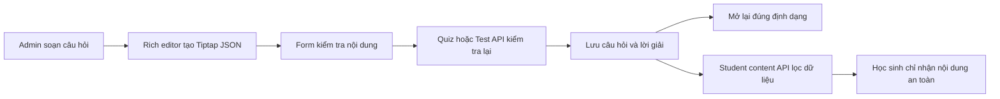
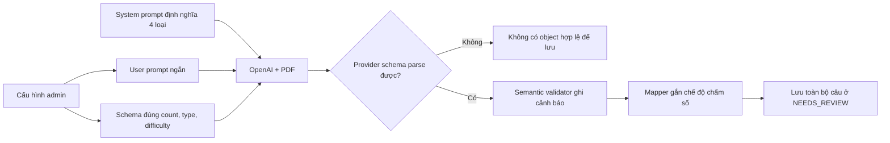
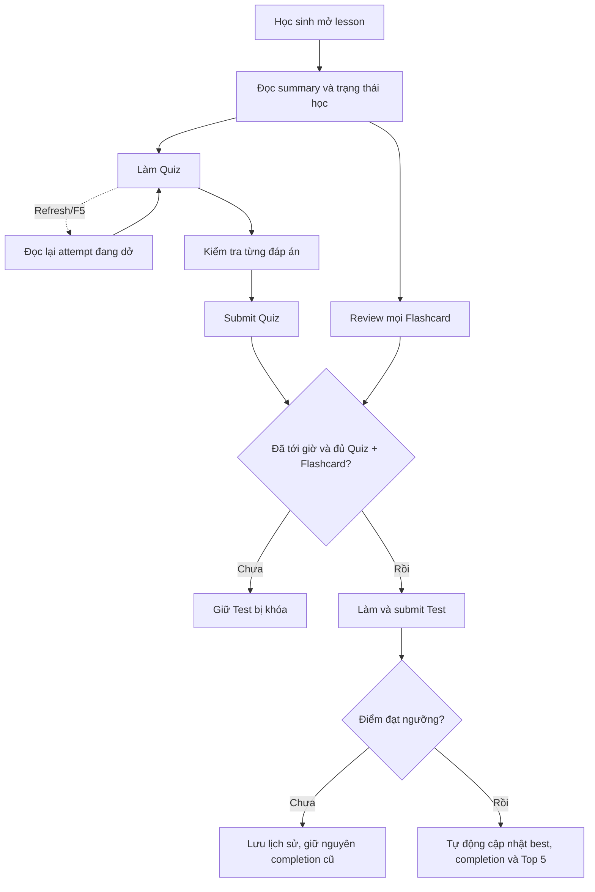

# Quiz, flashcard và test

## Tính năng này giải quyết gì?

Admin tạo nội dung luyện tập theo từng buổi học. Nội dung câu hỏi dùng Tiptap JSON để giữ định dạng văn bản, màu, công thức, ảnh và bảng thay vì chỉ lưu chuỗi thuần.

## Bức tranh tổng thể

Rich editor là điểm nhập nội dung ở front-end. Quiz và Test dùng chung flow soạn
câu hỏi; Test chỉ bổ sung thời gian làm bài ở cấp bộ đề. Form gửi JSON đã validate
qua API tương ứng; backend kiểm tra cấu trúc, lưu dữ liệu và trả lại cùng JSON để
lần mở sau khôi phục đúng nội dung.

## Sơ đồ luồng dễ hiểu

## Luồng code end-to-end

UI editor cập nhật giá trị React Hook Form, API client gửi payload câu hỏi,
controller/service Quiz hoặc Test validate và lưu cấu trúc JSON. Khi đọc lại, dữ
liệu đi ngược về editor để Tiptap render các node và mark tương ứng. Manager Test
tái sử dụng manager Quiz với adapter API riêng, nên hai tab giữ cùng interaction
mà không nhân đôi toàn bộ editor.

`TRUE_FALSE` và `MULTI_STATEMENT_TRUE_FALSE` là hai loại dữ liệu độc lập. Loại
cũ lưu một boolean; loại mới lưu danh sách rich-content statement và một mảng
ánh xạ `{ statementId, value }`. Quiz và Test đều dùng cùng contract bốn loại,
vì vậy select, TypeScript union, Prisma enum và backend validation phải thay đổi
đồng bộ.

## Front-end

- Trong JSON review, `Thu lại toàn bộ` phải giữ root mở và hiển thị các scalar
  cấp trên, nhưng thu object/array lồng trực tiếp thành `{...}`/`[...]`; với
  `react-json-view` đây là depth `1`, không phải đóng root hoặc dùng depth `2`.
  Vì viewer giữ trạng thái riêng ở từng node, action xổ/thu còn phải tạo revision
  render mới để reset cả các nhánh người dùng đã mở thủ công.
- Bảng màu chữ dùng popover riêng, giữ selection của Tiptap khi thao tác toolbar. Màu có sẵn áp dụng ngay; màu tùy chỉnh chỉ là giá trị nháp cho đến khi bấm `OK`.
- Khi bấm đậm/nghiêng/gạch chân tại một con trỏ chưa chọn text, Tiptap chỉ đổi `stored marks` cho ký tự sắp nhập. Toolbar phải nghe transaction này để cập nhật trạng thái active ngay, không chờ document đổi sau lần gõ đầu tiên.
- Khi image node được chọn, cùng nhóm nút căn lề cập nhật
  `image.attrs.alignment` bằng transaction tại đúng vị trí của `NodeSelection`, rồi mới
  trả focus về editor. Không gọi `focus()` trước khi cập nhật vì selection của ảnh có thể
  bị thay bằng text selection. Ảnh hỗ trợ trái/giữa/phải, mặc định giữa để dữ liệu cũ giữ
  nguyên cách hiển thị; `textAlign` của paragraph không tác động tới block node ảnh.
- Popover nằm trong portal ngoài khung editor để không bị `overflow: hidden` cắt mất. Vị trí được tính từ nút mở và giới hạn theo viewport.
- Resize hàng bảng phải lưu tọa độ logic của hàng, rồi tìm lại DOM hiện tại trong mỗi lần kéo. Không giữ lâu tham chiếu `<tr>` vì transaction của ProseMirror có thể thay node DOM ngay giữa interaction.
- ProseMirror dùng `gap cursor` khi con trỏ đứng giữa các block như trước hoặc sau
  ảnh. Kiểu mặc định là một gạch ngang; editor ghi đè phần hiển thị thành caret dọc
  để nhất quán với vị trí sắp nhập chữ, nhưng vẫn giữ nguyên selection và hành vi
  tạo paragraph của ProseMirror.
- Placeholder của rich editor phải dùng decoration của Tiptap trên paragraph rỗng
  để dùng chung line box, padding và caret của `contenteditable`. Không đặt một
  `span` absolute cạnh `EditorContent`: overlay đó bám wrapper bên ngoài nên có
  thể lệch đồng loạt ở câu hỏi, phương án và các trạng thái focus khác nhau.
- Khi upload, editor đọc `sourceWidth/sourceHeight` để dựng viewport theo đúng tỉ
  lệ ảnh gốc. `baseWidthPercent=60` giữ ảnh mới gọn trong editor, còn
  `widthPercent=100` biểu thị ảnh chưa bị người dùng resize. Kích thước khung cơ
  sở, mức resize và aspect ratio là ba khái niệm riêng.
- Câu Đúng/Sai nhiều mệnh đề dùng một field-array riêng. Mỗi row sở hữu nội
  dung rich text, ID ổn định và lựa chọn Đúng/Sai; không tái sử dụng state
  boolean của loại Đúng/Sai cũ.
- Với danh sách tab tạo động, chỉ invalidate query sau mutation là chưa đủ để
  chọn item mới ổn định: effect bảo vệ selection có thể nhìn thấy cache cũ và
  kéo active ID về tab đầu. Mutation create cần chèn response vào cache ngay,
  sau đó screen mới chọn ID vừa tạo; refetch nền tiếp tục đối chiếu dữ liệu server.
  Response create có thể không chứa aggregate `_count` như response list, nên
  hook phải chuẩn hóa `_count` từ `questionCount` trước khi đưa object vào cache;
  component vẫn cần fallback an toàn để dữ liệu tạm không làm sập toàn màn.
- `questionFigure` trong JSON AI chỉ là object rỗng đánh dấu Phase 1 cần hình,
  không phải ảnh và không mang caption hiển thị.
  Ảnh thật đi qua `quiz_figures` và revision có delivery URL sau khi worker dựng
  SVG. Vì vậy card review phải đọc `question.figures`, hiển thị asset terminal và
  chỉ poll query khi còn trạng thái `QUEUED`/`RENDERING`/`REPAIRING`; nếu chỉ
  render JSON câu hỏi thì hình đã tạo thành công vẫn bị “vô hình” trên giao diện.
- Phase 2 chỉ nhận `problem` làm nguồn semantic, tự lập whitelist dữ kiện được cho trực tiếp rồi
  mới dựng source. Hình có thể mang hình dáng thỏa dữ kiện, nhưng marker, nhãn,
  màu nhấn hoặc đường phụ không được xác nhận một tính chất chỉ suy ra trong lời
  giải. Phase 1 và Phase 2 đều không yêu cầu OpenAI sinh caption hình; caption do
  admin nhập và dữ liệu cũ vẫn là metadata revision độc lập.
- “Lời giải tự đủ nghĩa bằng chữ” và “lời giải không cần hình bổ sung” là hai
  quyết định độc lập. Phase 1 phải lấy các đối tượng/quan hệ trực quan thật sự
  được dùng trong solution trừ đi phần đã có ở hình đề. Phần chênh thiết yếu trên
  cùng nền dẫn tới `EXTEND_QUESTION`; đổi hẳn cách biểu diễn dẫn tới
  `REDRAW_AS_MODEL`; delta rỗng hoặc chỉ có thay số/tính toán mới dẫn tới `NONE`.
  Cách so sánh này tránh việc một phép dựng quan trọng bị bỏ hình chỉ vì vẫn có
  thể diễn đạt bằng văn bản.
- Custom system prompt của Quiz vẫn là full override theo chủ đích của sản phẩm;
  backend không âm thầm nối prompt mặc định vào nội dung admin đã nhập. Những
  quy tắc trình bày như cấm marker song song, cấm `AB \\parallel CD`/`AB // CD`
  và cấm tên góc dạng chữ trên canvas phải được hướng dẫn trong prompt mặc định,
  không được nâng thành backend rejection gate. Provider output vẫn đi tiếp tới
  compile/render dù chưa đạt gu trình bày; backend chỉ reject vì policy an toàn,
  cấu trúc TeX hoặc lỗi kỹ thuật thật sự. Mũi tên chỉ hướng của trục, vector, lực,
  tia hoặc luồng truyền vẫn hợp lệ.
- Ký hiệu tên đường tròn `$(O)$` trong văn bản đề và nhãn điểm tâm `$O$` trên
  canvas là hai tầng biểu đạt của cùng một đối tượng, không phải hai nhãn cần vẽ.
  Hình đề/vẽ lại chỉ giữ một điểm và một nhãn tâm `$O$`; lượt
  `EXTEND_QUESTION` dùng lại coordinate tâm trong base và không thêm `$(O)$` hay
  một `$O$` thứ hai. Đây là prompt invariant, không phải backend rejection gate.
- “Đáp án, phương án và lời giải cùng khớp” chỉ là nhất quán nội bộ, chưa phải
  bằng chứng toán học. Prompt Toán cần buộc model giải từ dữ kiện trước khi nhìn
  phương án, kiểm tra đủ giả thiết của định lý, rồi dùng một phép kiểm độc lập
  như thế ngược, kiểm tra miền/đơn vị/cận hoặc biểu diễn hình học khác. Regression
  nên dùng invariant và counterexample tổng quát: một số đỉnh nằm trên đường tròn
  không đủ cho kết luận nội tiếp, trong khi cấu hình đủ mọi giả thiết vẫn phải
  được phép dùng định lý tương ứng.

- System prompt mặc định của Quiz được sở hữu trọn vẹn theo môn. File Toán, Lý,
  Hóa và General tự chứa cả role, contract đầu ra, safety prose và policy chuyên
  môn; không import một core prompt chung. Với figure Phase 2, mode hình đề, mở
  rộng lời giải và vẽ lại mô hình được chọn bên trong subject module đã resolve.
  Dispatcher chỉ định tuyến, còn schema/provider/worker vẫn dùng chung ở tầng kỹ
  thuật. Nhờ vậy sửa prompt Hóa không thể vô tình làm thay đổi prompt Toán.

## Back-end/API

API Quiz và Test nhận rich content theo schema của `M6.1`, không tin dữ liệu từ
UI và validate lại trước khi service lưu. Test set bắt buộc có `durationSeconds`;
UI nhập phút để thân thiện rồi chuyển sang giây tại API boundary.

Validator của loại nhiều mệnh đề kiểm tra tối thiểu 2 mệnh đề, ID không trùng,
nội dung không rỗng và `correctAnswerJson` ánh xạ đúng một lần cho mọi ID.

### AI Quiz: prompt động, schema theo request

Luồng sinh Quiz giữ ba lớp trách nhiệm riêng. System prompt định nghĩa ý nghĩa
bốn loại câu và quy tắc nội dung; user prompt chỉ mang cấu hình động như bài học,
số câu, độ khó và loại đã chọn; JSON Schema biến các lựa chọn đó thành contract
máy kiểm được. Schema chỉ mở các nhánh question type được yêu cầu, ép đúng số câu
và ép difficulty khi không phải `MIXED`. Worker vẫn kiểm tra invariant liên câu
như phân bổ độ khó và ID duy nhất, nhưng semantic validator chỉ ghi cảnh báo
`REVIEWABLE`: không lọc câu, không ném lỗi và không hủy output OpenAI đã parse.
Các câu được lưu ở `NEEDS_REVIEW` để admin quyết định.

Schema reference strategy cũng là một phần của provider conditioning, không chỉ
là tối ưu byte cho validator. Một strategy đã A/B và rollout cho Sinh kiến thức
không tự động được phép áp dụng sang Quiz vì hai feature có schema, prompt và
kiểu nội dung khác nhau. Theo quyết định hiện hành, Quiz khóa `ref_v2` trực tiếp
ở config request; không dùng `auto` để bộ chọn kích thước tự đổi strategy giữa
các schema version. Serializer chung vẫn giữ nhiều strategy cho compatibility,
nhưng mỗi feature phải chốt strategy rõ ràng và kiểm chất lượng output riêng.

Quiz dùng cùng mutable working snapshot với Sinh kiến thức.
`quiz_questions` vẫn là projection chuẩn để app render và chấm điểm; khi admin
lưu một câu AI, backend đồng thời dựng lại object provider-shaped từ projection,
giữ các field provider-only như quyết định figure, ghi nó về đúng vị trí trong
`ai_generations.output_json.questions[]` và tính lại `outputHash`. Panel JSON đọc
trực tiếp object hiện tại này nên luôn khớp UI sau refetch. Không tạo
`currentQuestionJson` hoặc snapshot provider bất biến riêng; vì vậy cơ chế này
không nhân đôi dữ liệu lưu trữ, nhưng chủ động chấp nhận mất bản output AI ban đầu
sau lần edit đầu tiên.

`TEXT_INPUT` do AI sinh có scope hẹp hơn editor thủ công: đây là bài tính chỉ hỏi
một lần và có một kết quả số duy nhất. Model chỉ trả một `correctAnswer` chuẩn:
kết quả hữu tỉ dùng số nguyên hoặc phân số tối giản; kết quả vô tỉ buộc đề yêu
cầu làm tròn đến một chữ số thập phân và dùng số đã làm tròn với dấu `.`. Mapper
lưu đáp án thành mảng một phần tử rồi gắn `numericComparison=true`. Backend và
phản hồi cục bộ trên web dùng cùng phép so sánh phân số chính xác, nên dữ liệu
học sinh nhập như `1/2`, `2/4`, `0.5`, `0.50`, `0,5` và `\frac{1}{2}` tương
đương mà không phát sinh sai số floating-point. Với canonical đã làm tròn `1.4`,
các dạng `1,4`, `1.40` và `14/10` cũng được chấp nhận. Cách phân vai này ngăn
model biến ô điền số thành tự luận, câu ghép hoặc danh sách đáp án đồng nghĩa.

Phần lời giải Quiz chỉ có một tiêu đề do card bên ngoài sở hữu; renderer không
chèn thêm heading cùng tên trong thân nội dung. Solution đi thẳng qua các bước
cần thiết, kết luận rồi dừng, không nối thêm nhận xét tổng quát sau khi đã tìm ra
đáp án. Dòng `Đáp án` là dữ liệu chấm, không phải văn bản kết luận tự do trong
`explanation.answer`: trắc nghiệm lấy `correctOptionId` rồi đổi sang nhãn A/B/C,
Đúng/Sai lấy boolean, nhiều mệnh đề lấy ánh xạ `statementId → boolean`, còn nhập
đáp án lấy chuỗi canonical trong `correctAnswer`. Mapper và renderer cùng dùng
quy tắc này nên preview admin, dữ liệu đã lưu và UI học sinh không thể hiển thị
một câu diễn giải khác với đáp án thực sự dùng để chấm.

Lời giải nhiều thực thể phải có cấu trúc dữ liệu nhiều thực thể ngay từ provider.
Một string `solution` chung không thể bảo đảm từng mệnh đề có lập luận riêng, dù
prompt có yêu cầu “kết luận đủ các ý”. Với `MULTI_STATEMENT_TRUE_FALSE`, schema
vì vậy dùng `statementSolutions[]` keyed theo `statementId`; validator kiểm đủ ID
và đúng thứ tự, còn mapper chỉ chịu trách nhiệm trình bày mỗi phần thành một đoạn
riêng. Cách phân vai này tổng quát cho mọi output mà mỗi phần tử cần một giải
thích độc lập: cấu trúc hóa ở schema trước, kiểm quan hệ ở semantic validator,
rồi mới flatten ở presentation boundary.

Quy tắc trình bày có thể kiểm tra bằng máy không được dừng ở prompt hoặc
`description` của provider schema. Model vẫn có thể tuân thủ ở câu a) nhưng bỏ
qua ở câu b) trong cùng output, trong khi Zod chỉ thấy cả hai đều là string hợp
lệ. Với invariant câu kết luận cuối bắt đầu bằng `Vậy` phải là đoạn riêng,
pipeline chuẩn hóa tổng quát thành đúng `\n\nVậy...` trước semantic validation và
persistence; serializer áp dụng cùng normalizer khi đọc block cũ. Regression
test phải khóa ca thiếu dòng trống, tính idempotent, câu chỉ có kết luận và
counterexample chữ thường `như vậy` hoặc câu hỏi trích dẫn bắt đầu bằng `Vậy`
không phải mở đầu kết luận cuối.

ID kỹ thuật không nên lộ thành nhãn học tập. Với câu đúng/sai nhiều phần, schema
provider chỉ nhận chuỗi liên tiếp `a`, `b`, `c`, ... và loại `S1/S2`; mapper còn
dùng vị trí phần tử làm nhãn trình bày để lời giải luôn khớp danh sách câu. Đáp án
không cần model viết lại bằng câu văn vì `statements[].value` đã là nguồn chấm
điểm: mapper dựng canonical answer `a) Đúng.\nb) Sai.` và renderer tách newline
thành các hàng độc lập. Loại bỏ dữ liệu AI trùng lặp vừa tránh “mệnh đề 1” vừa
ngăn answer hiển thị lệch với answer dùng để chấm.

Tái sử dụng policy giữa hai tính năng phải dựa trên hoàn cảnh tương đương. Quy
tắc SGK, dấu câu chức năng hoặc mỗi ý xuống dòng có thể dùng lại câu chữ từ Sinh
kiến thức khi cùng ngữ nghĩa; contract `statementSolutions`, nhãn a/b và canonical
answer phải được thiết kế riêng cho Quiz. Với bài tính, lời giải lấy công thức và
phép biến đổi làm phần chính; với nhận định lý thuyết không cần tính, lập luận
ngắn bằng lời vẫn hợp lệ. Như vậy hệ thống tránh cả hai cực đoan: văn xuôi hóa
mọi bài toán và ép công thức vào tình huống không cần công thức.

Với hình vector do AI sinh, tên điểm phải bắt đầu từ chính coordinate sở hữu rồi
đổi anchor/quay quanh coordinate khi va chạm; không đặt bằng một tọa độ rời. “Đặt
nhãn đo gần giữa” chỉ nên là preference, không phải một coordinate bắt buộc. Nhãn
đo phải neo trên đúng path sở hữu hoặc coordinate nội suy từ chính hai đầu mút,
với khoảng hở pháp tuyến nhỏ để không trôi vào vùng trắng. Layout cần có chuỗi
fallback giữ nguyên liên thuộc: trượt nhãn dọc chính đối tượng bằng `pos`, đổi
phía pháp tuyến rồi mới tăng nhẹ khoảng hở; midpoint trống vẫn là vị trí hợp lệ.
Nếu không còn vị trí sát path mà không va chạm, model phải dùng leader line thay
vì để nhãn đứng tự do. Marker quan hệ cũng không
được dựng độc lập bằng offset x/y: đường, giao điểm, dấu vuông góc và vạch bằng
nhau phải dùng chung anchor ngữ nghĩa và hệ phương cục bộ. Compile thành công chỉ
chứng minh source hợp lệ; regression prompt còn phải khóa bước kiểm collision và
hình dạng marker trên toàn canvas.

Riêng số đo góc, cung và nhãn không được coi là một marker duy nhất rồi đặt chữ
ngay trên path. Chúng cần anchor/bán kính riêng: cung bám đỉnh/hai tia, nhãn nằm
theo phân giác đúng miền và ngay phía ngoài cung với khe hở nhỏ. Nếu va chạm phải
đổi đồng bộ bán kính cung và vị trí nhãn dọc phân giác, không chỉ đẩy số đo sâu
vào vùng trắng hoặc vá bằng offset cố định. Đây vẫn là prompt-quality rule;
backend không reject output chỉ vì bố cục nhãn chưa đạt.

Ngưỡng token trong regression test chỉ là budget chống prompt phình ngoài chủ
đích, không phải giới hạn nghiệp vụ hay provider. Riêng system prompt vẽ hình
không dùng hard-cap này: vẫn đo token để quan sát chi phí/context, nhưng không rút
gọn contract đến mức mơ hồ; invariant hình học rõ ràng được ưu tiên trước.

Một invariant về nội dung phải được viết trước lựa chọn format của model. Nếu
policy chỉ nói “khi khối `$$...$$` có nhiều dấu bằng thì dùng `aligned`”, model
có thể tránh điều kiện bằng cách đặt cả chuỗi vào `$...$`. Contract đúng phải
nhận diện bản chất chuỗi tính từ hai dấu `=` cấp ngoài cùng trở lên trước, rồi
bắt buộc chuyển nó thành display nhiều dòng. Đồng thời, từ “gọn” chỉ được dùng để
bỏ diễn giải lặp lại; nếu không đóng nghĩa này, model có thể hiểu thành gộp toàn
bộ phép tính vào một câu văn dù schema vẫn hợp lệ.

Dấu `&` trong `aligned` là điểm căn cột, không phải ký hiệu trang trí. Nếu viết
`&\Rightarrow`, `&\Leftrightarrow` hoặc alias tương đương ở đầu dòng, toán tử bị
đẩy tới cột dấu bằng. Prompt/schema phải hướng model đặt toán tử trước điểm căn,
ví dụ `\Rightarrow\quad a &= 2x`; renderer dùng normalizer chung để sửa dữ liệu
cũ. Normalizer nhận diện cả nhóm suy luận/tương đương (dạng thuận, ngược, dài,
`\implies`, `\impliedby`, `\iff`) nhưng cố ý không sửa `\to`/`\mapsto`, vì hai
dấu sau có thể mang nghĩa ánh xạ hoặc chuyển trạng thái hợp lệ. Regression test
phải có cả ca sửa đúng, ca đã đúng giữ nguyên, idempotence và counterexample
không được sửa.

Quy tắc dấu câu cũng là invariant chức năng, không phải sở thích mỹ thuật. Có thể
sao chép nguyên contract đã kiểm chứng từ Sinh kiến thức sang prompt/schema riêng
của Quiz: câu dẫn trực tiếp sang danh sách, hệ, bảng hoặc công thức display ở
dòng sau kết thúc bằng `:`; khi nội dung vẫn tiếp tục cùng dòng thì dùng dấu câu
theo ngữ pháp thay vì thêm `:` máy móc. Riêng câu đúng/sai một mệnh đề phải nối
kết luận với căn cứ bằng “Vì vậy”/“Do đó”, tránh câu đứng riêng kiểu “Mệnh đề
đúng.” khiến mạch giải bị đứt.

Trong system prompt, định nghĩa mỗi loại câu phải đi theo một mạch có chủ ngữ rõ:
loại câu dùng cho việc gì, điều kiện dữ liệu là gì, khi nào không dùng loại đó và
field đáp án chứa gì. Không viết câu phủ định cụt như “Không dùng cho câu văn” vì
model và người đọc không xác định chắc câu đó đang bổ nghĩa cho loại câu hay cho
riêng trường `problem`.

Student lesson API dùng một access resolver chung trước khi đọc summary,
quiz/flashcard/test. Resolver phân biệt enrollment và trial, đồng thời chặn truy
cập trực tiếp bản `PERSONALIZED` của học sinh khác. Query student dùng selector
riêng: quiz chỉ lấy nội dung câu, phương án và gợi ý; không select đáp án đúng,
grading config hoặc lời giải. Aggregate lesson/test chỉ trả metadata và số lượng,
không tải nội dung đề thi trước lúc bắt đầu attempt.

Khả năng bắt đầu test được tính từ thời gian server. Enrollment chỉ được mở khi
đã tới `examOpenAt`; trial có thể đọc lesson nhưng luôn bị khóa test. Đây là
policy backend, không phụ thuộc đồng hồ hoặc nút disabled ở trình duyệt.

Mảng object trong DTO NestJS phải khai báo rõ lớp phần tử bằng
`@Type(() => ItemDto)` và `@ValidateNested({ each: true })`. Nếu chỉ ghi type
TypeScript như `QuizOption[]`, `ValidationPipe` bật implicit conversion có thể dựa
vào metadata `Array` chung chung và biến từng object thành array trước khi schema
nghiệp vụ nhận dữ liệu.

## Luồng học sinh M7

Màn lesson dùng một aggregate để dựng header, summary và previous/next; nội dung
runner được lấy qua endpoint riêng để giữ payload nhỏ và không lộ dữ liệu chấm.
Quiz kiểm tra từng câu trước khi submit, còn Test chấm cả attempt một lần. Đây là
hai nhịp nghiệp vụ khác nhau dù dùng chung bộ chấm điểm.

### Quiz: phản hồi từng câu nhưng không tự mở

- `Gợi ý` và lời giải là hai disclosure riêng; UI không tự hiển thị nội dung.
- Nút kiểm tra chỉ bật khi answer đủ shape của loại câu. Server kiểm lại vì
  disabled state ở client không phải validation bảo mật.
- `MULTIPLE_CHOICE` trong student runner là lựa chọn đơn dù payload dùng mảng:
  mỗi lần bấm phải ghi đè thành `[optionId]`, không nối thêm vào mảng hiện tại.
  UI chỉ coi answer hợp lệ khi có đúng một ID; dữ liệu nháp cũ có nhiều ID chỉ
  hiển thị lựa chọn gần nhất để học sinh chọn lại và chuẩn hóa state.
- Student theme chủ động xóa các utility `.border` ở mobile để làm nhẹ card.
  Control học tập vẫn cần đường viền như đáp án, input hoặc lựa chọn Đúng/Sai
  phải thêm escape hatch `student-mobile-border`; chỉ đổi `border-*` color trong
  component không có tác dụng khi `border-width` đang bị CSS mobile ép về `0`.
- Start attempt tạo placeholder theo tập câu server đã chọn. Endpoint check thay
  placeholder bằng answer thật và mới trả answer key/explanation. Submit chỉ
  tổng kết các câu đã check, vì vậy client không thể tráo question ID ở cuối.
- Placeholder không chỉ chống tráo ID mà còn là snapshot membership/thứ tự của
  lượt làm. Resume, submit và review phải đánh số từ answer rows của attempt gốc;
  không được lấy `quiz_set.questions` hiện hành, vì câu admin thêm giữa lượt có
  thể không render nhưng vẫn chen vào `questionNumber`, còn câu bị soft-delete có
  thể biến mất và làm attempt không thể nộp. Cả thêm và xóa chỉ đổi membership
  của attempt được start sau lần lưu/phát hành đó.
- “Đã trả lời” và “đã kiểm tra” là hai trạng thái khác nhau. Nhãn `Đã làm` cùng
  cảnh báo thiếu câu phải dùng validator answer đầy đủ theo từng loại câu; nếu
  dùng feedback đã chấm, UI sẽ báo `0` dù student đã chọn đủ đáp án. Khi bấm
  `Hoàn thành`, frontend tự gọi endpoint check song song cho các answer đầy đủ
  chưa chấm rồi mới submit, còn backend vẫn giữ invariant chỉ submit attempt đã
  được chấm đủ.
- React state không đủ để giữ runner qua F5. URL lesson phải mang
  `learningSurface`, `learningSetId` và `learningAttemptId` để server biết ngay
  request đầu cần render fullscreen runner/result thay vì lesson panel. Sau đó
  frontend gọi endpoint current attempt: server trả lại tập câu, mọi đáp án đã
  autosave, feedback của câu đã kiểm tra và vị trí câu hiện tại. Browser storage
  chỉ là cache tùy chọn; server là nguồn chính để resume chéo thiết bị.
- Response autosave có thể cập nhật `answeredCount` hoặc `checkedCount` trong
  TanStack Query cache, nhưng đây không phải tín hiệu cần resume lại runner.
  Effect khôi phục phải thoát sớm khi `attemptId` trên surface URL/history chính
  là attempt đang hiển thị; nếu phụ thuộc trực tiếp vào toàn bộ object status, mỗi
  lần chọn hoặc kiểm tra đáp án sẽ dựng màn loading fullscreen rồi tải lại
  current attempt, tạo cảm giác nháy màn.
- Copy CTA và vị trí mở runner phải dùng trạng thái đã từng mở lượt. Chưa có
  attempt dùng `Bắt đầu` và luôn mở câu 1; mọi attempt `IN_PROGRESS` dùng
  `Tiếp tục làm` dù chưa kiểm tra câu nào và khôi phục `currentIndex` đã lưu.
  Surface URL quyết định F5 có tự mở runner hay giữ panel; history marker giữ
  semantics Browser Back, và cả hai không quyết định nhãn CTA.
- Attempt `IN_PROGRESS` là trạng thái nghiệp vụ, không phải trạng thái màn hình.
  Chỉ URL/entry riêng của runner mới cho biết F5 cần tự mở lại runner. Nếu entry
  này đã được pop và surface query đã được xóa khi student xác nhận thoát, tab
  Quiz phải giữ ở panel tổng quan; nút bắt đầu sau đó mới chủ động resume
  attempt đang dở.
- URL là nguồn định danh canonical của fullscreen surface. Marker runner/result
  còn sót trong `history.state` hoặc `sessionStorage` không được phép tự mở lại
  surface khi URL chỉ còn tab Quiz thường; panel phải xóa marker stale trước khi
  chạy logic resume. Quy tắc này ngăn chuỗi một frame card Quiz, một frame
  loading rồi mới đổi sang runner hoặc quay lại card.
- Status quyết định CTA `Bắt đầu`/`Tiếp tục làm`/`Xem lại` được prefetch ngay
  khi lesson sẵn sàng. Nếu student bấm Quiz trước khi request đầu hoàn tất,
  navigation giữ panel Bài học hiện tại và đánh dấu tab Quiz pending; chỉ sau
  khi status đã vào cache mới mount panel Quiz. Nhờ vậy thao tác vẫn có feedback
  tức thì nhưng card không đi qua vùng trống hoặc skeleton ngắn.
- Với lesson có nhiều Quiz set, `activeQuizSetId` cũng là state cần sống qua F5.
  Lưu ID này theo `user + lesson`, ưu tiên marker runner/result khi surface vẫn
  mở và luôn đối chiếu với danh sách set mới tải. Khi Back khỏi runner, chỉ xóa
  surface marker; không xóa active set, nếu không lần refetch/F5 tiếp theo sẽ
  rơi về set đầu tiên và hiển thị kết quả cũ thay cho lượt mới đang dở.
- Result cũng là một surface toàn màn hình nằm trên cùng route lesson, nên React
  state một mình không giữ được nó qua F5. Khi submit hoặc bấm `Xem lại`,
  frontend ghi `attemptId` gốc vào surface query và history state; lúc mount, UI
  đối chiếu marker với summary mới nhất từ server rồi mới khôi phục result. Khi
  quay về panel, cả query lẫn marker phải bị xóa. Result được khôi phục không
  phát lại confetti vì đó không còn là khoảnh khắc submit mới. Effect khôi phục
  phải bỏ qua nếu đúng result đó đã đang hiển thị từ submit hiện tại; nếu không,
  cache update ngay sau submit sẽ bị hiểu nhầm là F5 và tắt confetti vừa bật.
- Runner dùng một history entry phụ để chặn Browser Back. Sau submit, entry phụ
  được pop âm thầm; marker result đã ghi trên entry đó phải được chuyển sang
  entry lesson trong callback `popstate`. Nếu chỉ `replaceState` trước
  `history.back()`, marker sẽ bị bỏ cùng entry runner và F5 từ result sẽ quay về
  panel, đặc biệt dễ thấy sau luồng làm lại câu sai.
- Không được ưu tiên `IN_PROGRESS` chỉ vì trạng thái đó tồn tại. Dữ liệu legacy
  hoặc request start cũ có thể để lại nhiều lượt đang dở; backend phải so
  `startedAt` với `submittedAt` gần nhất. Lượt dở cũ hơn kết quả vừa nộp phải bị
  bỏ qua, còn start/submit mới phải chuyển các lượt dở dư sang `CANCELLED`; nếu
  không, F5 sẽ làm kết quả đã lưu biến mất khỏi panel dù row `SUBMITTED` vẫn còn
  trong database.
- CTA `Xem lại` ở panel mở result summary của lượt submit gần nhất. Từ summary,
  student mới chủ động chọn xem lại tất cả hoặc các câu sai; endpoint review chỉ
  được gọi sau lựa chọn này.
- Thoát runner rồi vào Quiz lại cũng là một luồng resume, không phải start mới.
  Frontend phải hỏi endpoint current attempt trước, dựng lại answer/feedback đã
  kiểm tra và vị trí câu; chỉ gọi start khi server trả `null`. Nếu gọi start
  trực tiếp, một lượt `IN_PROGRESS` mới có thể che lượt cũ và làm UI trông như
  mất tiến độ dù dữ liệu cũ vẫn còn trong database.
- Transition che toàn màn hình cần tách `prepare` và `commit`. Request
  start/resume có thể chạy song song lúc rèm đang khép, nhưng kết quả chỉ được
  đưa vào React state khi overlay đã che kín và sắp mở. Nếu hàm prepare tự gọi
  `setAttempt` ngay khi API trả về, runner sẽ render phía sau một lớp rèm còn
  đang khép và học sinh nhìn thấy câu hỏi quá sớm.
- Runner toàn màn hình nhưng cùng route với trang buổi học phải tự tạo một
  history entry. Browser Back trước hết pop entry này và mở xác nhận thoát thay
  vì rời route lesson. Nếu student hủy, frontend push lại entry; nếu xác nhận,
  giữ browser ở entry của trang buổi học và chỉ đóng state runner.
- Retry dùng `sourceAttemptId` trỏ tới attempt cha trực tiếp, không thay thế
  result gốc. Khi submit, server vừa giữ thống kê riêng của lượt phụ vừa cập
  nhật answer đúng mới vào các answer đang sai của attempt gốc rồi đếm lại toàn
  bộ bài. Response vì vậy tách summary của lượt vừa làm và `aggregateResult`
  của toàn bài; không dùng một ID cho cả hai ngữ cảnh.
- UI luôn chọn `aggregateResult` cho màn kết quả, kể cả ngay sau khi hoàn thành
  một lượt con. Vì vậy review/retry tiếp theo dựa trên toàn bộ bài gốc đã cộng
  dồn: xem lại tất cả dùng toàn bộ câu, làm lại câu sai dùng các câu còn sai và
  làm lại tất cả tạo một attempt `ALL` không có `sourceAttemptId` để reset toàn
  bài. Summary riêng của attempt con chỉ là dữ liệu lịch sử backend, không phải
  một màn hình cho student.
- Tập câu retry là subset nhưng số hiển thị phải thuộc không gian câu hỏi gốc.
  API trả `questionNumber` và `originalTotalCount`; runner dùng chúng cho title,
  badge, cảnh báo và nhãn điều hướng, trong khi `currentIndex` chỉ quản lý vị
  trí bên trong subset. Không dùng `currentIndex + 1` làm số câu nghiệp vụ;
  ngược lại, thanh tiến độ và nhãn `Đã xem` phải dùng vị trí trong subset, không
  dùng `questionNumber/originalTotalCount`, vì một bộ con gồm hai câu gốc số 3
  và 7 vẫn phải tiến lần lượt `1/2`, `2/2`.

### Flashcard: “đã học” khác “đã thuộc”

`reviewCount > 0` nghĩa là student đã xem và tự đánh giá thẻ; `isKnown` chỉ nói
kết quả đánh giá hiện tại. Test prerequisite cần student đã review toàn bộ thẻ
của ít nhất một bộ được duyệt, không ép tất cả thẻ phải thuộc. Nhờ vậy student
có thể còn thẻ chưa thuộc nhưng vẫn tiếp tục bài kiểm tra sau khi hoàn thành
vòng học.

Một prerequisite chỉ được hoàn thành khi vừa có nội dung được duyệt vừa có tiến
độ thật của student. Danh sách bộ hợp lệ rỗng không có nghĩa là student đã hoàn
thành; đó là trạng thái content chưa sẵn sàng và phải khóa bài thi. Nếu dùng
biểu thức kiểu `sets.length === 0 || hasProgress`, lesson thiếu Quiz/Flashcard
sẽ bị mở khóa sai dù student chưa học gì.

Runner Flashcard có thể được mở từ panel hoặc từ một action trên màn kết quả.
Điểm quay về khi thoát phải được lưu như state riêng của phiên, không hard-code
mọi runner về panel và cũng không suy đoán từ danh sách thẻ. Ví dụ phiên
`Ôn lại thẻ chưa thuộc` quay về kết quả giống retry câu sai của Quiz, còn phiên
học mới từ panel vẫn quay về panel. Cách này giữ Back nhất quán ngay cả khi hai
phiên dùng chung component runner và history-entry xác nhận thoát.

Surface query/history chỉ trả lời runner/result có đang là surface hiện tại hay
không; nó không thể tự dựng lại một phiên Flashcard. Phiên đang học cần lưu riêng tập
`cardIds` đã chốt, các thẻ đã đánh dấu trong lượt, vị trí hiện tại, mặt trước/sau
và điểm quay về. Sau F5, frontend ghép session state này với progress/favorite
mới đọc từ server: server vẫn là nguồn dữ liệu nghiệp vụ, còn local storage giữ
ngữ cảnh trình bày và vị trí chính xác trên cùng trình duyệt qua cả việc đóng/mở
lại web. Khi student xác nhận thoát, history entry runner bị pop nhưng session
vẫn còn để CTA `Tiếp tục học` resume; khi hoàn thành, session được xóa và result
marker tiếp quản việc khôi phục màn kết quả.

Identity của bộ Flashcard hiện tại cũng phải lưu riêng theo `user + lesson`.
Session lưu vị trí trong một bộ, còn active-set storage cho biết panel cần ghép
session/progress của bộ nào sau refetch hoặc F5. Xác nhận thoát chỉ xóa marker
fullscreen; nếu xóa luôn active set, panel sẽ quay về bộ hoàn thành đầu tiên và
đổi sai CTA `Tiếp tục học` thành `Xem lại`.

Flashcard panel được lazy-load sau khi lesson query hoàn tất, nên custom field
trong `window.history.state` có thể đã bị Next.js chuẩn hóa trước lúc panel đọc
nó. URL query là nguồn surface mà server và client cùng đọc được khi F5;
history entry vẫn phục vụ Browser Back, còn `sessionStorage` chỉ là fallback cho
marker legacy. Các nguồn này phải được set/xóa trong cùng helper để tránh tình
trạng UI đã về panel nhưng reload lại tự bật runner. Cleanup marker stale chỉ
chạy một lần lúc mount; nếu effect cleanup chạy lại theo object query sau
progress refetch, nó sẽ xóa nhầm marker của runner vừa được mở.

Màn result có hai đường vào khác nhau nên không được dùng chung một
thao tác history. Khi hoàn thành từ runner, result thay thế entry runner hiện tại;
entry lesson bên dưới đã có sẵn. Khi bấm `Xem lại` từ panel, result phải
`pushState` thành entry mới; nếu `replaceState`, chính entry lesson bị ghi đè và
Browser Back sẽ nhảy thẳng về trang đã mở lesson, thường là chi tiết khóa học.
Regression test phải bao phủ cả hai đường vào này.

Ẩn một panel bằng attribute `hidden` không dừng lifecycle React. Nếu runner
Flashcard vẫn được mount dưới panel ẩn, hook khóa scroll của runner vẫn có thể
đặt `overflow: hidden` lên `html/body` sau hydration: thanh cuộn hiện ở HTML đầu
rồi biến mất ngay sau đó. Tab không hoạt động phải unmount runner; modal,
history và fullscreen surface dùng chung scroll-lock reference-counted để việc
đóng một lớp không vô tình mở khóa hoặc giữ khóa của lớp còn lại.

### Lịch sử là lịch sử lượt làm, không phải danh sách set duy nhất

Tên `Bộ 1`, `Bộ 2`, ... mô tả thứ tự các lượt đầy đủ mà học sinh đã bắt đầu
trong lesson. Vì vậy không được group lịch sử theo `quizSetId` hoặc
`flashcardSetId`: khi chưa có AI sinh thêm bộ và UI quay vòng tái sử dụng cùng
set, lượt mới vẫn phải có attempt/session riêng và có số `Bộ N` mới.

Quiz đã có `quiz_attempts`, nên lịch sử chỉ lấy attempt gốc
`sourceAttemptId=null`; retry câu sai/toàn bộ thuộc chuỗi kết quả hiện tại và
không tạo tên bộ mới. Flashcard trước đây chỉ có progress toàn cục theo card,
không đủ phân biệt hai lượt dùng cùng set, nên cần thêm session cùng item
snapshot. Progress vẫn là nguồn prerequisite và trạng thái mới nhất, còn
session là nguồn resume/lịch sử của từng lượt.

Test cũng phải đánh số `Bộ đề N` theo từng `test_attempt`, không dùng
`test_sets.title` làm tên lịch sử. Một test set có thể được chọn lại nhiều lần,
nên dùng title của set sẽ tạo nhiều mục trùng tên và làm mất ý nghĩa thứ tự lượt
làm; mục chưa bắt đầu dùng số kế tiếp sau tổng attempt đã hoàn thành.

Danh sách chỉ có tối đa một mục `IN_PROGRESS` hiện hành với badge `Đang làm`.
Tạo lượt mới phải hủy lượt đang dở cũ trong cùng lesson để UI không có hai mục
cùng mang ý nghĩa hiện tại. Mục hoàn thành điều hướng bằng ID attempt/session
của chính nó; nếu chỉ truyền set ID, thao tác xem lại rất dễ mở nhầm kết quả gần
nhất của một lượt khác dùng chung set.

Surface xem lại có thể được mở từ nhiều nguồn nên Back không được suy đoán rằng
đích luôn là màn kết quả. Frontend cần lưu `review origin` riêng: xem lại từ
result thì Back về result, còn xem lại từ modal lịch sử thì giữ nguyên modal
mounted bên dưới child surface. Back chỉ bỏ child surface để lộ lại chính modal
cũ, nhờ vậy scroll và state không bị reset. Action xem lại chỉ cần attempt/session
ID, không được đổi active set của panel nguồn; nếu đổi, query trạng thái của set
mới có thể chuyển panel sang loading skeleton và vô tình unmount modal theo một
race condition phụ thuộc cache/tốc độ mạng.

Lịch sử là action có xác suất mở thấp nên không nên prefetch mỗi khi student vào
tab. Query chỉ chạy khi student chọn item lịch sử trong menu. Trong lúc request
chạy, dropdown giữ nguyên và hiển thị pending; dialog chỉ mount sau khi request
kết thúc để tránh nháy do chuyển `loading -> danh sách`. Sau khi cache đã có dữ
liệu, background refetch không được dùng `isFetching` để thay toàn bộ list bằng
loading; chỉ `isLoading` khi chưa có data mới được phép hiển thị loading surface.

### Test: submit tự động ghi nhận mốc đã đạt

Submit luôn chấm và lưu lịch sử. Với kết quả đạt, cùng transaction so
điểm cao hơn rồi thời gian thấp hơn, đổi cờ best và upsert lesson progress
idempotently. Completion là mốc cao nhất đã đạt: một lượt thi lại chưa đạt
chỉ thêm lịch sử, không được hạ progress hoặc thay best attempt đã đạt.

Timer tự submit dùng marker unanswered có chủ đích cho câu chưa trả lời. Marker
này khác placeholder nội bộ lúc start: placeholder không bao giờ là một answer
hợp lệ để client tự submit.

## Database

Câu hỏi, phương án, gợi ý và lời giải giữ cấu trúc JSON để bảo toàn rich content;
set và question item vẫn là các entity riêng. Test có tổng điểm mặc định 10. Khi
`test_questions.points` để trống, service tính `effectivePoints` chia đều và phân
bổ phần dư làm tròn theo thứ tự câu để tổng vẫn đúng 10.

Khi chấm câu nhiều mệnh đề, điểm hiệu lực của câu được chia đều cho số mệnh đề.
Mệnh đề đúng nhận phần điểm của mình, mệnh đề sai nhận 0; trạng thái đúng toàn
câu chỉ dùng để đánh dấu đã đúng hết, không biến cách tính thành all-or-nothing.

Thứ tự các bộ Quiz, Flashcard và Test là dữ liệu nghiệp vụ, không nên dựa vào
thứ tự mặc định của database. Khi tạo, service gán `sortOrder` kế tiếp; khi đọc,
query sắp theo `sortOrder` rồi `createdAt` tăng dần để dữ liệu cũ trùng thứ tự
vẫn giữ quy tắc tạo trước đứng trước.

## Worker/AI/Integration

M6 là CRUD thủ công. Nội dung AI ở milestone sau phải đi qua cùng schema và màn review/sửa.

## Luồng lỗi thường gặp

- Khi modal sinh Quiz thấy danh sách set rỗng, không được suy ra rằng database
  chắc chắn chưa có set: cache web có thể cũ hoặc một job khác vừa tạo set. Trước
  khi mở modal, web phải refetch danh sách authoritative. Ở API, request không có
  `targetQuizSetId` chỉ được tạo `Bộ câu hỏi 1` khi query xác nhận lesson thật sự
  chưa có set; nếu đã có, API phải từ chối và yêu cầu tải lại thay vì fallback
  sang set đầu tiên. Quy tắc hai lớp này ngăn câu mới bị append vào một bộ Quiz
  cũ mà admin không nhìn thấy trong snapshot UI.
- Tăng `z-index` không sửa được popover bị cắt nếu ancestor có `overflow: hidden`; cần portal ra ancestor không cắt nội dung.
- `instanceof HTMLTableCellElement` có thể không ổn khi DOM đến từ realm/view khác. Với interaction bảng, kiểm tra semantic `TD`/`TH`/`TR` phù hợp hơn.
- Gán style vào `<tr>` cũ không có tác dụng nếu ProseMirror vừa thay DOM. Cần resolve lại hàng hiện tại và ghi chiều cao qua transaction để UI và JSON cùng cập nhật.
- Nếu toolbar chỉ nghe `onUpdate` và `onSelectionUpdate`, định dạng tại con trỏ có thể đã bật trong editor nhưng nút vẫn trông như chưa chọn. `stored marks` thay đổi qua transaction riêng và cần kích hoạt render toolbar.
- Không coi typecheck là bằng chứng interaction đã chạy; thao tác pointer nhạy DOM cần runtime check với một drag thật.
- `GapCursor` là vị trí hợp lệ giữa hai block, không phải lỗi caret. Nếu sản phẩm
  muốn hiển thị giống trình soạn thảo văn bản, chỉ đổi pseudo-element
  `.ProseMirror-gapcursor::after`; không biến image block thành inline node và không
  sửa document chỉ để đổi hình con trỏ.
- Không dùng cùng `widthPercent` để vừa biểu thị phần trăm chiều rộng editor vừa
  biểu thị mức resize cho người dùng. Nếu ảnh mới hiển thị gọn ở 60% nhưng chưa
  được kéo, nhãn vẫn phải là 100%; cần một thuộc tính base riêng và fallback 100%
  cho node cũ để không làm thay đổi nội dung đã lưu.
- Nếu payload trên Network có đúng nhiều phương án nhưng API vẫn báo từng phương
  án không phải object, kiểm tra dữ liệu ngay sau `ValidationPipe`. TypeScript type
  chỉ tồn tại lúc compile; runtime cần item DTO và metadata chuyển đổi rõ ràng.
- Modal edit dùng resolver bất đồng bộ phải khởi tạo React Hook Form bằng dữ liệu
  entity ngay từ lần mount đầu. Nếu luôn mount với giá trị tạo mới rỗng rồi mới
  `reset()` trong effect, lượt validation cũ có thể hoàn tất muộn và gắn lỗi rỗng
  lên form dù rich editor đã hiển thị dữ liệu hợp lệ.
- Chỉ cập nhật tài liệu hoặc label không làm select xuất hiện thêm option. Một
  loại câu hỏi mới phải đi xuyên suốt Prisma enum -> client generate -> DTO/Zod
  validation -> API types -> form schema/default/payload -> card render -> test.
- Trong Tiptap JSON, text node không định dạng thường không có field `marks`.
  Read-only renderer phải dùng `(marks ?? []).reduce(..., text)` để luôn giữ
  `text` làm giá trị ban đầu; dùng `marks?.reduce(...)` sẽ trả về `undefined` và
  làm mất toàn bộ chữ thường, trong khi ảnh hoặc công thức vẫn có thể hiển thị.
- Card tổng quan lấy nội dung câu hỏi từ Tiptap JSON phải dùng cùng rich-content
  renderer với màn Quiz; helper plain-text chỉ phù hợp cho search, aria label
  hoặc log. Không render chuỗi plain text có lệnh LaTeX ra UI, và khi surface yêu
  cầu xem đầy đủ thì không dùng `truncate`/`line-clamp`. Action đi tới câu phải
  mang đúng question ID và display number theo nhóm navigation hiện hành, chọn
  câu bằng ID rồi chỉ scroll sau khi câu đích đã render; không suy số câu từ vị
  trí mảng API thô hoặc scroll trước khi React commit.
- Mathpix Markdown render nội dung sau khi component đã mount và thường sinh
  thêm một `
` gốc. Không đặt renderer block này trực tiếp trong `<li>` mà
  giữ wrapper cùng phần tử con ở chế độ inline; nếu không Safari/WebKit có thể
  dành một dòng riêng cho marker rồi mới đặt nội dung ở dòng kế tiếp. Danh sách
  Markdown có dòng trắng cũng sinh `<li>
...
</li>`, nên stylesheet dùng
  chung phải giữ paragraph đầu tiên trong mỗi item cùng dòng với marker. Quy tắc
  này áp dụng cho cả `content`, `problem`, `solution`, từng bước và mọi danh sách
  summary mới, không chỉ riêng mục tiêu học tập.
- Một số getter của MathLive như `mathfield.macros` cần custom element đã được
  mount, còn MathLive `0.110` không chấp nhận `macros` trong constructor. Thứ tự
  đúng là tạo `new MathfieldElement()`, append vào mount node, rồi gán
  `mathfield.macros = { ...mathfield.macros, ...customMacros }` trước khi set
  value. Truyền macro vào constructor phát warning `Invalid Options`; đọc getter
  trước khi append lại có thể ném lỗi `Mathfield not mounted`.
- Placeholder MathLive là chuỗi LaTeX. Khi truyền trong JSX, không viết
  `placeholder="\\text{...}"` vì thuộc tính chuỗi tĩnh giữ nguyên cả hai dấu
  gạch chéo và MathLive sẽ render chúng như nội dung lỗi. Dùng biểu thức
  JavaScript `placeholder={"\\text{...}"}` để giá trị runtime chỉ còn một dấu
  gạch chéo đúng cú pháp LaTeX.
- Không thay placeholder MathLive bằng một lớp chữ HTML phủ lên field: overlay
  dễ đè caret hoặc buộc phải ẩn khi focus, làm mất hướng dẫn đúng lúc bàn phím
  toán đang mở. Dùng content placeholder native bằng chuỗi LaTeX
  `{"\\text{...}"}`, rồi chỉnh màu/font trong shadow DOM. Placeholder native tự
  đứng sau caret, vẫn hiện khi field rỗng và đang focus, đồng thời tự biến mất
  ngay khi có giá trị.
- Khi gắn custom element vào React bằng DOM API, vùng mount imperative phải là
  một node rỗng riêng. Không gọi `replaceChildren()` trên container còn chứa
  loading/error node do React render, vì React vẫn giữ ownership của node đó và
  sẽ lỗi `removeChild` khi reconciliation hoặc unmount.
- Placeholder của MathLive nằm bên trong custom macro có thể hiển thị nhưng
  không nhận bàn phím như placeholder của cấu trúc native. Cấu trúc cần sửa trực
  tiếp như Vector hoặc công thức Hóa học phải dùng lệnh native có placeholder,
  ví dụ `#@_{#?}#?`, để người dùng gõ rồi dùng `Tab` chuyển giữa từng phần.
  Riêng mẫu Vector dùng `\vec{#?}` để hiện ô placeholder native có màu ngay dưới
  mũi tên; `F` chỉ là nội dung preview trên nút mẫu. Không chèn `F` thật rồi
  chọn atom bằng offset vì selection trong accent có thể bị vẽ sai, và thao tác
  chuột/bàn phím ảo dễ làm mất trạng thái thay thế. Khi người dùng chạm lại đúng
  glyph placeholder đang được chọn, giữ nguyên selection để MathLive không đẩy
  caret ra ngoài Vector trước khi nhận phím nhập.
- Với MathLive `0.110`, placeholder đang được chọn trong phân số được render
  thành glyph `.ML__cmr.ML__selected`, không phải node `.ML__placeholder` và
  không có caret thật. Không thu gọn selection bằng cách gán lại `position`, vì
  caret sẽ nằm sau atom, tức nháy ngoài ô tử số, đồng thời phím tiếp theo không
  còn thay thế đúng placeholder. Preset học sinh phải giữ nguyên selection và
  thêm caret nháy trực quan vào chính glyph đã chọn bên trong shadow DOM. Khi
  căn field cao cố định, để `part(content)` không cắt công thức và kiểm tra
  runtime đồng thời `scrollHeight/clientHeight`, tâm dọc, bounding box của hai
  ô phân số và animation caret; typecheck không phát hiện được các lỗi layout
  shadow DOM này. Tâm hình học của line-box không trùng tâm nhìn thấy của glyph
  `▢` vì baseline font đẩy glyph lên trên; caret giả phải dùng `left/top: 50%`,
  `translate(-50%, -50%)` để căn hai trục và thêm optical shift theo font
  `-0.083333em` (xấp xỉ `-1.5px` ở cỡ chữ `18px`). Test trình duyệt phải chuyển
  selection qua cả tử số lẫn mẫu số, kiểm tra transform hai trục và đối chiếu
  ảnh raster trên Chromium/WebKit thay vì chỉ tin computed line-box.
- MathLive bọc `part(container)` trong một node nội bộ, nên đặt host
  `display:flex` có thể làm toàn bộ container co theo placeholder dù
  `part(container)` đã có `width:100%`; host full-width phải giữ `display:block`.
  Nút bàn phím nằm trong `.ML__toggles`, vì vậy căn `part(virtual-keyboard-toggle)`
  chưa đủ để căn giữa dọc. Các override bắt buộc như nền placeholder khi focus,
  tâm của toggle và màu active nên được gắn vào shadow root, sau đó E2E đo
  computed background và bounding box thật. Luôn dùng token đang tồn tại
  (`--theme-primary-soft`), vì một `var()` trỏ tới token không tồn tại làm cả
  declaration active trở thành invalid và browser quay về nền trong suốt.
- MathLive mặc định dùng màu caret cho `--contains-highlight-color`, nên dấu căn
  hoặc dấu ngoặc có thể chuyển sang màu nhấn khi caret đang nằm bên trong cấu
  trúc. Preset nhập đáp án của học sinh phải đặt biến này về màu chữ đáp án; chỉ
  caret và focus ring dùng màu nhấn, còn ký hiệu toán đã nhập giữ nguyên màu nội
  dung ở cả light/dark theme.
- Preview KaTeX trong palette chỉ có nhiệm vụ hiển thị nên phải dùng
  `pointer-events: none`; nút semantic bên ngoài mới sở hữu thao tác click/tap.
  Kích thước nút phải theo intrinsic width của công thức và wrap theo hàng,
  không ép mọi công thức dài/ngắn vào các cột bằng nhau rồi để glyph tràn sang
  hit target bên cạnh.
- MathLive dùng `letterShapeStyle = "upright"` để chữ nhập trực tiếp luôn đứng.
  KaTeX preview/editor/viewer cần override cả `.mathnormal` và `.mathit` về
  `KaTeX_Main` với `font-style: normal`; nếu chỉ sửa vùng nhập thì công thức sau
  khi chèn vào Tiptap vẫn quay lại chữ nghiêng.
- KaTeX khai báo shorthand `font: normal ...` trên `.katex`, nên `font-bold` ở
  container rich text không tự làm phân số/công thức đậm theo chữ thường. Khi
  nội dung rich text cần typography đồng nhất, override `font-weight`, màu,
  font-family và cỡ chữ trên `.katex` theo scope role/surface chung thay vì vá
  riêng từng loại câu. Công thức thường giữ `1em` để căn theo chữ bao quanh;
  phân số là ngoại lệ vì KaTeX thu glyph tử/mẫu còn `70%`, nên chỉ `.mfrac` mới
  bù hệ số này. Rule chung phải thuộc rich-content surface dùng cho cả viewer
  student, viewer admin và editor admin; không đặt trong theme của riêng một
  role. Test theo nhóm ký hiệu gồm phân số, căn, số mũ/chỉ số, `lim`, quan hệ,
  tổng, tích phân, ngoặc co giãn, chữ Hy Lạp và font tập hợp. Các font
  `KaTeX_Size*` vẫn cần giữ cho glyph hình học như `√`, `∑`, `∫` không biến dạng;
  phần chữ/biến `.mathnormal` và `.mathit` mới kế thừa font nội dung. Với phân
  số phải đo glyph bên trong thay vì lớp bọc ngoài. Thanh phân số là border riêng
  trên `.frac-line`, không đi theo `font-weight`; surface dùng chữ đậm phải kiểm
  tra và đặt riêng độ dày border để nét toán không bị mảnh. Vì stylesheet KaTeX
  được import trong renderer/editor, override dùng chung cũng phải được import
  sau KaTeX tại các entry đó; đặt rule trong Tailwind `globals.css` có thể bị
  cascade layer hoặc thứ tự chunk CSS ghi đè dù selector nhìn có vẻ đúng.
- Text AI có display math như `\n\n$$...$$\n\n` phải được project thành các node
  Tiptap riêng `paragraph -> blockMath -> paragraph`, không giữ cả chuỗi trong
  một paragraph rồi chỉ tách delimiter ở renderer. Preview JSON và luồng lưu thật
  phải dùng cùng quy tắc projection; nếu lệch nhau, newline được bảo toàn có thể
  cộng với margin/padding KaTeX tạo khoảng trắng lớn, đồng thời block wrapper dễ
  sinh DOM không hợp lệ trong `
`. Renderer legacy vẫn nên dùng phần tử phrasing
  hợp lệ và CSS `display: block` làm fallback cho dữ liệu cũ.
- Display math trong Mathpix/KaTeX chỉ có một lớp sở hữu spacing và overflow.
  Khi `.math-block` đã giữ ink-safe padding và được bọc bởi formula scroll shell,
  `.katex-display` bên trong phải bỏ margin/padding riêng; nếu cả ba lớp cùng cộng
  khoảng cách thì phép biến đổi nhiều dòng bị tách quá xa khỏi câu dẫn và kết luận.
- Khi sửa backslash bị escape hai lần trước lệnh LaTeX, phải bảo toàn cặp `\\`
  dùng để xuống dòng trong `aligned`, `split`, `cases` và các môi trường tương tự.
  Một cụm slash có độ dài lẻ đã là `các cặp xuống dòng + một slash của lệnh` nên
  phải giữ nguyên; cụm có độ dài chẵn mới có một slash escape dư và chỉ được bỏ
  đúng một ký tự. Không dùng regex gom mọi cụm slash lặp về một slash, vì cặp
  xuống dòng `\\` đứng liền trước lệnh `\widehat{C}` sẽ bị nuốt và làm hai bước
  tính dính cùng dòng. Regression test phải có cả lệnh escape hai lần cần sửa và
  dòng hợp lệ bắt đầu bằng lệnh như `\widehat`, `\sqrt` hoặc `\frac`.
- Câu Quiz AI có `quizExplanationBlock` phải luôn dùng card semantic `Lời giải`;
  card Tiptap xám `Lời giải chi tiết` chỉ là fallback cho dữ liệu legacy không có
  structured block. Các field optional theo JSON contract như
  `geometryStatement: null` là trạng thái hợp lệ và không được làm type guard loại
  cả block rồi âm thầm đổi UI sang fallback.
- Tooltip mặc định của nút bàn phím MathLive nằm trong shadow DOM của
  `math-field`. Nếu để tooltip đó trong vùng nhập có `overflow-x: auto`, pseudo
  element khi hover có thể tăng `scrollWidth`, tạo thanh cuộn và vẫn bị
  container cắt. Flow Quiz/Test phải bỏ tooltip nội bộ này và dùng tooltip chung
  render bằng portal vào `document.body`; tooltip xuất hiện ngay, tự giữ trong
  viewport và không tham gia kích thước layout của editor.
- Khi thay input thường bằng MathLive lazy-loaded, không hiển thị loading box
  chung có spinner, nền hoặc border khác vì một frame ngắn vẫn tạo cảm giác field
  bị render sai rồi đổi lại. Giữ nguyên kích thước/surface/focus ring của field
  cuối trong lúc khởi tạo, preload module từ `pointerdown` và chỉ thay nội dung
  bên trong khi custom element sẵn sàng.
- Khi cần căn placeholder/input MathLive khớp tuyệt đối với input HTML, phải kiểm
  tra cả `.ML__content` trong shadow DOM. MathLive 0.110 tự thêm `padding-left:
1px`; chỉ đồng bộ padding trên host `math-field` vẫn làm nội dung lệch ngang.
  Preset student-answer phải bỏ phần đệm nội bộ này thay vì bù bằng số âm hoặc
  hard-code padding host khác với input thường. Khi field rỗng được focus,
  MathLive còn vẽ `.ML__caret::after` với optical offset `left: -0.045em`; offset
  này làm caret tách khỏi chữ placeholder dù bounding box của hai node cùng mốc
  trái. Preset student-answer phải đưa offset caret rỗng về `0`, giữ nguyên vị trí
  placeholder, rồi regression test theo chuỗi focus -> blur -> focus trên cả
  Chromium và WebKit thay vì chỉ đo box placeholder ở một thời điểm.
- Không dùng cùng selector admin cho student rồi xóa field sau khi query. Selector
  student phải không lấy answer key/grading/storage key ngay từ database để giảm
  nguy cơ serializer hoặc log vô tình làm lộ dữ liệu.
- Trial là quyền đọc giới hạn, không tương đương enrollment. Mọi action nhạy cảm
  như bắt đầu test phải kiểm tra `access.mode` ở backend dù lesson bật trial.
- Không giữ một flow làm bài dài chỉ bằng `useState`. Sau reload, React mount lại
  từ đầu; dữ liệu Quiz gồm đáp án nháp, trạng thái đã kiểm tra và vị trí câu
  phải resume từ server. Autosave cần phân biệt `is_answered` với `is_checked`
  để lịch sử đếm đúng câu đã làm mà không tự hiển thị feedback trước khi student
  chủ động kiểm tra.
- State phiên Flashcard cần sống qua đổi tab, F5 và đóng/mở lại web. Với session
  đã tạo nhưng chưa đánh dấu thẻ nào, lưu snapshot trình bày vào local storage
  và dùng CTA `Tiếp tục học`; không suy lại CTA chỉ từ progress server cũ.
- API trả `videoUrl` không đồng nghĩa student đã nhìn thấy video. Lesson screen
  phải compose player thật trước thanh tab và truyền `customVideoSettings`; tab
  `Bài học` chỉ thay nội dung summary bên dưới. E2E cần assert vùng player để
  tránh một aggregate field có dữ liệu nhưng không có consumer UI.
- Prompt có ví dụ LaTeX đúng vẫn không phải là parser: model có thể trả
  `\begin{aligned}` nhưng thiếu `\end{aligned}` trong một string vẫn hợp lệ với
  JSON Schema. Model cũng có thể mở inline math bằng `$` nhưng đóng nhầm
  bằng backtick, khiến renderer nuốt phần văn bản kế tiếp vào công thức. Với
  output AI mới, backend nên chạy recovery deterministic trước persistence:
  nhận biết code span để không sửa nhầm, thay backtick đóng sai của nội dung
  math-like bằng `$`, dùng stack để bổ sung thẻ đóng theo thứ tự lồng ngược,
  sửa dấu `$$` đặt nhầm trước thẻ đóng và bỏ thẻ đóng mồ côi.
  Normalizer phải idempotent, không ném lỗi và được kiểm bằng cả fixture
  malformed lẫn counterexample hợp lệ; không dùng lỗi định dạng có thể sửa
  chắc chắn để chặn cả job nội dung.

## File quan trọng

- `apps/web/features/admin/quiz/components/quiz-rich-content-editor.tsx`
- `apps/web/features/admin/quiz/components/quiz-rich-content-editor.css`
- `apps/web/features/admin/quiz/components/quiz-rich-content-viewer.tsx`
- `apps/web/features/admin/quiz/components/visual-math-input.tsx`
- `apps/web/components/common/ui/immediate-tooltip.tsx`
- `apps/web/components/common/ui/immediate-tooltip-portal.tsx`
- `apps/web/features/admin/quiz/components/quiz-text-color-picker.tsx`
- `apps/web/features/admin/tests/`
- `apps/web/features/student/lessons/screens/student-lesson-screen/components/summary-block-renderer.tsx`
- `apps/web/components/shared/mathpix-markdown-renderer.tsx`
- `apps/api/src/modules/quiz/`
- `apps/api/src/modules/tests/`
- `apps/api/src/modules/student-learning/`
- `apps/api/src/modules/learning-paths/services/student-lesson-access.service.ts`

## Kiến thức cần nhớ

Editor dựa trên document model có thể tái tạo DOM bất cứ lúc nào. Interaction tùy biến nên định danh theo vị trí logic trong tài liệu, cập nhật qua transaction và chỉ dùng DOM như lớp hiển thị tạm thời.

## Task liên quan

- `M6.1`
- `M6.2`
- `M6.3`
- `M6.4`
- `M6.5`
- `M7.1`
- `M7.2`
- `M7.3`
- `M7.4`
- `M7.5`
