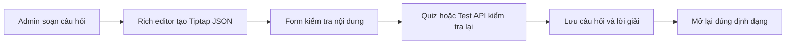

# Quiz, flashcard và test

## Tính năng này giải quyết gì?

Admin tạo nội dung luyện tập theo từng buổi học. Nội dung câu hỏi dùng Tiptap JSON để giữ định dạng văn bản, màu, công thức, ảnh và bảng thay vì chỉ lưu chuỗi thuần.

## Bức tranh tổng thể

Rich editor là điểm nhập nội dung ở front-end. Quiz và Test dùng chung flow soạn
câu hỏi; Test chỉ bổ sung thời gian làm bài ở cấp bộ đề. Form gửi JSON đã validate
qua API tương ứng; backend kiểm tra cấu trúc, lưu dữ liệu và trả lại cùng JSON để
lần mở sau khôi phục đúng nội dung.

## Sơ đồ luồng dễ hiểu

## Luồng code end-to-end

UI editor cập nhật giá trị React Hook Form, API client gửi payload câu hỏi,
controller/service Quiz hoặc Test validate và lưu cấu trúc JSON. Khi đọc lại, dữ
liệu đi ngược về editor để Tiptap render các node và mark tương ứng. Manager Test
tái sử dụng manager Quiz với adapter API riêng, nên hai tab giữ cùng interaction
mà không nhân đôi toàn bộ editor.

`TRUE_FALSE` và `MULTI_STATEMENT_TRUE_FALSE` là hai loại dữ liệu độc lập. Loại
cũ lưu một boolean; loại mới lưu danh sách rich-content statement và một mảng
ánh xạ `{ statementId, value }`. Quiz và Test đều dùng cùng contract bốn loại,
vì vậy select, TypeScript union, Prisma enum và backend validation phải thay đổi
đồng bộ.

## Front-end

- Bảng màu chữ dùng popover riêng, giữ selection của Tiptap khi thao tác toolbar. Màu có sẵn áp dụng ngay; màu tùy chỉnh chỉ là giá trị nháp cho đến khi bấm `OK`.
- Khi bấm đậm/nghiêng/gạch chân tại một con trỏ chưa chọn text, Tiptap chỉ đổi `stored marks` cho ký tự sắp nhập. Toolbar phải nghe transaction này để cập nhật trạng thái active ngay, không chờ document đổi sau lần gõ đầu tiên.
- Khi image node được chọn, cùng nhóm nút căn lề cập nhật
  `image.attrs.alignment` bằng transaction tại đúng vị trí của `NodeSelection`, rồi mới
  trả focus về editor. Không gọi `focus()` trước khi cập nhật vì selection của ảnh có thể
  bị thay bằng text selection. Ảnh hỗ trợ trái/giữa/phải, mặc định giữa để dữ liệu cũ giữ
  nguyên cách hiển thị; `textAlign` của paragraph không tác động tới block node ảnh.
- Popover nằm trong portal ngoài khung editor để không bị `overflow: hidden` cắt mất. Vị trí được tính từ nút mở và giới hạn theo viewport.
- Resize hàng bảng phải lưu tọa độ logic của hàng, rồi tìm lại DOM hiện tại trong mỗi lần kéo. Không giữ lâu tham chiếu `<tr>` vì transaction của ProseMirror có thể thay node DOM ngay giữa interaction.
- ProseMirror dùng `gap cursor` khi con trỏ đứng giữa các block như trước hoặc sau
  ảnh. Kiểu mặc định là một gạch ngang; editor ghi đè phần hiển thị thành caret dọc
  để nhất quán với vị trí sắp nhập chữ, nhưng vẫn giữ nguyên selection và hành vi
  tạo paragraph của ProseMirror.
- Khi upload, editor đọc `sourceWidth/sourceHeight` để dựng viewport theo đúng tỉ
  lệ ảnh gốc. `baseWidthPercent=60` giữ ảnh mới gọn trong editor, còn
  `widthPercent=100` biểu thị ảnh chưa bị người dùng resize. Kích thước khung cơ
  sở, mức resize và aspect ratio là ba khái niệm riêng.
- Câu Đúng/Sai nhiều mệnh đề dùng một field-array riêng. Mỗi row sở hữu nội
  dung rich text, ID ổn định và lựa chọn Đúng/Sai; không tái sử dụng state
  boolean của loại Đúng/Sai cũ.

## Back-end/API

API Quiz và Test nhận rich content theo schema của `M6.1`, không tin dữ liệu từ
UI và validate lại trước khi service lưu. Test set bắt buộc có `durationSeconds`;
UI nhập phút để thân thiện rồi chuyển sang giây tại API boundary.

Validator của loại nhiều mệnh đề kiểm tra tối thiểu 2 mệnh đề, ID không trùng,
nội dung không rỗng và `correctAnswerJson` ánh xạ đúng một lần cho mọi ID.

Mảng object trong DTO NestJS phải khai báo rõ lớp phần tử bằng
`@Type(() => ItemDto)` và `@ValidateNested({ each: true })`. Nếu chỉ ghi type
TypeScript như `QuizOption[]`, `ValidationPipe` bật implicit conversion có thể dựa
vào metadata `Array` chung chung và biến từng object thành array trước khi schema
nghiệp vụ nhận dữ liệu.

## Database

Câu hỏi, phương án, gợi ý và lời giải giữ cấu trúc JSON để bảo toàn rich content;
set và question item vẫn là các entity riêng. Test có tổng điểm mặc định 10. Khi
`test_questions.points` để trống, service tính `effectivePoints` chia đều và phân
bổ phần dư làm tròn theo thứ tự câu để tổng vẫn đúng 10.

Khi chấm câu nhiều mệnh đề, điểm hiệu lực của câu được chia đều cho số mệnh đề.
Mệnh đề đúng nhận phần điểm của mình, mệnh đề sai nhận 0; trạng thái đúng toàn
câu chỉ dùng để đánh dấu đã đúng hết, không biến cách tính thành all-or-nothing.

## Worker/AI/Integration

M6 là CRUD thủ công. Nội dung AI ở milestone sau phải đi qua cùng schema và màn review/sửa.

## Luồng lỗi thường gặp

- Tăng `z-index` không sửa được popover bị cắt nếu ancestor có `overflow: hidden`; cần portal ra ancestor không cắt nội dung.
- `instanceof HTMLTableCellElement` có thể không ổn khi DOM đến từ realm/view khác. Với interaction bảng, kiểm tra semantic `TD`/`TH`/`TR` phù hợp hơn.
- Gán style vào `<tr>` cũ không có tác dụng nếu ProseMirror vừa thay DOM. Cần resolve lại hàng hiện tại và ghi chiều cao qua transaction để UI và JSON cùng cập nhật.
- Nếu toolbar chỉ nghe `onUpdate` và `onSelectionUpdate`, định dạng tại con trỏ có thể đã bật trong editor nhưng nút vẫn trông như chưa chọn. `stored marks` thay đổi qua transaction riêng và cần kích hoạt render toolbar.
- Không coi typecheck là bằng chứng interaction đã chạy; thao tác pointer nhạy DOM cần runtime check với một drag thật.
- `GapCursor` là vị trí hợp lệ giữa hai block, không phải lỗi caret. Nếu sản phẩm
  muốn hiển thị giống trình soạn thảo văn bản, chỉ đổi pseudo-element
  `.ProseMirror-gapcursor::after`; không biến image block thành inline node và không
  sửa document chỉ để đổi hình con trỏ.
- Không dùng cùng `widthPercent` để vừa biểu thị phần trăm chiều rộng editor vừa
  biểu thị mức resize cho người dùng. Nếu ảnh mới hiển thị gọn ở 60% nhưng chưa
  được kéo, nhãn vẫn phải là 100%; cần một thuộc tính base riêng và fallback 100%
  cho node cũ để không làm thay đổi nội dung đã lưu.
- Nếu payload trên Network có đúng nhiều phương án nhưng API vẫn báo từng phương
  án không phải object, kiểm tra dữ liệu ngay sau `ValidationPipe`. TypeScript type
  chỉ tồn tại lúc compile; runtime cần item DTO và metadata chuyển đổi rõ ràng.
- Modal edit dùng resolver bất đồng bộ phải khởi tạo React Hook Form bằng dữ liệu
  entity ngay từ lần mount đầu. Nếu luôn mount với giá trị tạo mới rỗng rồi mới
  `reset()` trong effect, lượt validation cũ có thể hoàn tất muộn và gắn lỗi rỗng
  lên form dù rich editor đã hiển thị dữ liệu hợp lệ.
- Chỉ cập nhật tài liệu hoặc label không làm select xuất hiện thêm option. Một
  loại câu hỏi mới phải đi xuyên suốt Prisma enum -> client generate -> DTO/Zod
  validation -> API types -> form schema/default/payload -> card render -> test.
- Trong Tiptap JSON, text node không định dạng thường không có field `marks`.
  Read-only renderer phải dùng `(marks ?? []).reduce(..., text)` để luôn giữ
  `text` làm giá trị ban đầu; dùng `marks?.reduce(...)` sẽ trả về `undefined` và
  làm mất toàn bộ chữ thường, trong khi ảnh hoặc công thức vẫn có thể hiển thị.
- Một số getter của MathLive như `mathfield.macros` cần custom element đã được
  mount. Macro hoặc option khởi tạo phải truyền vào
  `new MathfieldElement(options)`; không đọc rồi spread getter phụ thuộc DOM
  trước khi append element, nếu không browser sẽ ném lỗi `Mathfield not mounted`.
- Khi gắn custom element vào React bằng DOM API, vùng mount imperative phải là
  một node rỗng riêng. Không gọi `replaceChildren()` trên container còn chứa
  loading/error node do React render, vì React vẫn giữ ownership của node đó và
  sẽ lỗi `removeChild` khi reconciliation hoặc unmount.
- Placeholder của MathLive nằm bên trong custom macro có thể hiển thị nhưng
  không nhận bàn phím như placeholder của cấu trúc native. Cấu trúc cần sửa trực
  tiếp như Vector hoặc công thức Hóa học phải dùng lệnh native có placeholder,
  ví dụ `#@_{#?}#?`, để người dùng gõ rồi dùng `Tab` chuyển giữa từng phần.
  Riêng mẫu Vector dùng `\vec{#?}` để hiện ô placeholder native có màu ngay dưới
  mũi tên; `F` chỉ là nội dung preview trên nút mẫu. Không chèn `F` thật rồi
  chọn atom bằng offset vì selection trong accent có thể bị vẽ sai, và thao tác
  chuột/bàn phím ảo dễ làm mất trạng thái thay thế. Khi người dùng chạm lại đúng
  glyph placeholder đang được chọn, giữ nguyên selection để MathLive không đẩy
  caret ra ngoài Vector trước khi nhận phím nhập.
- Preview KaTeX trong palette chỉ có nhiệm vụ hiển thị nên phải dùng
  `pointer-events: none`; nút semantic bên ngoài mới sở hữu thao tác click/tap.
  Kích thước nút phải theo intrinsic width của công thức và wrap theo hàng,
  không ép mọi công thức dài/ngắn vào các cột bằng nhau rồi để glyph tràn sang
  hit target bên cạnh.
- MathLive dùng `letterShapeStyle = "upright"` để chữ nhập trực tiếp luôn đứng.
  KaTeX preview/editor/viewer cần override cả `.mathnormal` và `.mathit` về
  `KaTeX_Main` với `font-style: normal`; nếu chỉ sửa vùng nhập thì công thức sau
  khi chèn vào Tiptap vẫn quay lại chữ nghiêng.

## File quan trọng

- `apps/web/features/admin/quiz/components/quiz-rich-content-editor.tsx`
- `apps/web/features/admin/quiz/components/quiz-rich-content-editor.css`
- `apps/web/features/admin/quiz/components/quiz-rich-content-viewer.tsx`
- `apps/web/features/admin/quiz/components/visual-math-input.tsx`
- `apps/web/features/admin/quiz/components/quiz-text-color-picker.tsx`
- `apps/web/features/admin/tests/`
- `apps/api/src/modules/quiz/`
- `apps/api/src/modules/tests/`

## Kiến thức cần nhớ

Editor dựa trên document model có thể tái tạo DOM bất cứ lúc nào. Interaction tùy biến nên định danh theo vị trí logic trong tài liệu, cập nhật qua transaction và chỉ dùng DOM như lớp hiển thị tạm thời.

## Task liên quan

- `M6.1`
- `M6.2`
- `M6.3`
- `M6.4`
