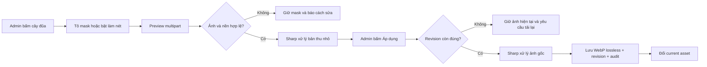

# Chỉnh nhẹ ảnh raster sách giáo khoa

## Tính năng này giải quyết gì?

Crop sách giáo khoa có thể hơi nhòe, nhiễu hoặc còn một chi tiết nhỏ trên nền.
M9.18 cho admin làm nét bảo thủ hoặc tô vùng cần xóa ngay tại figure, nhưng không
biến hệ thống thành editor ảnh đầy đủ và không dùng AI tự sáng tạo nội dung.
Mỗi lượt chỉ dùng một công cụ. Làm nét tự cập nhật khi chọn; xóa tự cập nhật sau
mỗi nét tô, undo hoặc redo.

## Bức tranh tổng thể

Ảnh học sinh đang xem là delivery asset riêng, không phải object OCR tạm thời.
Preview chỉ xử lý bản thu nhỏ trong bộ nhớ. Apply thành công mới tạo File và
StemFigureRevision mới; revision cũ vẫn còn và current asset chỉ đổi nguyên tử.

## Sơ đồ luồng dễ hiểu

## Luồng code end-to-end

1. `AdminStemFigureActionFrame` chỉ hiện icon khi asset là
   `TEXTBOOK_SOURCE`, `SUCCEEDED`, có delivery và không có pending revision.
2. Modal Canvas lưu các nét tô dạng stroke để undo/redo mà không giữ hàng chục
   bitmap lớn. Khi gửi API, Canvas mới xuất một PNG mask trong suốt.
3. Web gửi mutation guard, đúng một operation và optional mask tới preview/apply.
   Preview làm nét chạy ngay khi chọn tool; preview xóa chạy sau mỗi stroke với
   debounce ngắn, không gọi API ở từng pixel pointer-move.
4. API tự tải delivery asset hiện hành; client không được gửi object key làm
   authority. Mask được kiểm MIME, kích thước, coverage, component và tỷ lệ ảnh.
5. Với xóa chi tiết, backend lấy mẫu màu ở vòng ngoài vùng tô. Nền có variance
   cao bị từ chối; nền phẳng được fill. Với làm nét, preset chạy median 3x3 để
   loại điểm nhiễu rời, tăng contrast tuyến tính mức vừa để đưa nền mờ gần trắng
   về trắng, tăng saturation `1.06` rồi sharpen với ngưỡng riêng cho vùng
   phẳng/vùng biên. Mức saturation này làm màu đậm hơn nhẹ mà gần như không tác
   động nền trắng/nét đen. Cách này tạo khác biệt nhìn thấy được mà tránh threshold
   trắng có thể xóa nét mảnh hoặc làm quầng màu nổi rõ. Hai operation không chạy
   chung trong một request.
6. Mask canvas là dữ liệu đã clip theo kích thước raster. Component chạm mép vẫn
   hợp lệ nếu phần nằm trong ảnh nhỏ và vòng nền còn đủ mẫu; chỉ reject vì
   coverage/bounding box, thiếu mẫu nền hoặc variance cao, không reject riêng vì
   tọa độ chạm cạnh.
7. Apply encode WebP lossless, upload object mới và dùng transaction để tạo
   File/revision/audit, cập nhật Summary reference và current revision. Modal giữ
   nguyên sau apply, reset tool/preview/mask và dùng figure response làm working
   asset/guard; lượt kế tiếp vì vậy xâu chuỗi đúng revision vừa promote mà không
   cần đóng/mở editor.

## Front-end

- Canvas chỉ là lớp mask trong suốt đặt trên ảnh, nên không đọc pixel ảnh R2 và
  không bị phụ thuộc CORS để vẽ.
- Pointer Events dùng chung cho chuột, cảm ứng và bút.
- Zoom `100%` hiển thị tối đa đúng kích thước pixel tự nhiên của crop; không kéo
  ảnh nhỏ phủ đầy modal vì browser interpolation sẽ làm cả trước/sau cùng nhòe.
- Mọi thay đổi tool/mask làm preview cũ stale; chỉ preview fresh mới được apply.
- Editor được dynamic import để không tăng bundle ban đầu của Summary.

## Back-end/API

- Sharp/libvips decode, auto-rotate, resize preview, composite overlay, median
  denoise/contrast tuyến tính/saturation nhẹ/sharpen bảo thủ và encode WebP
  lossless.
- Pixel cap chặn decompression bomb/RAM quá lớn; mask cap chặn thao tác xóa rộng.
- Không lưu mask thô, signed URL hoặc ảnh vào log. Metric chỉ giữ duration,
  operation, pixel count, output bytes, coverage, variance và rejection reason.

## Database

Không có migration. Tính năng tái sử dụng `files`, `stem_figure_revisions` và
`audit_logs`. File metadata giữ revision nguồn, pipeline version, operation,
coverage và `textbookSourceObjectKey` để provenance vẫn là ảnh sách giáo khoa.

## Worker/AI/Integration

Không có worker và không gọi OpenAI/Gemini/Mathpix. Đây là pipeline local
deterministic; làm nét không thể khôi phục thông tin mà ảnh nguồn chưa có.

Preset được visual-check trên sáu crop Mathpix thật `5.23`, `5.24`, `5.26`,
`5.28`, `5.29`, `5.32`. Sharpness tăng khoảng `1.54x-1.64x`; đường liền/đứt,
mũi tên, điểm màu và ký hiệu nhỏ vẫn còn. Đây là kiểm cache/artifact local, không
phát sinh Mathpix paid call.

## Luồng lỗi thường gặp

- Revision stale: có người hoặc thao tác khác đã đổi ảnh; tải lại trước khi sửa.
- Mask rỗng hoặc quá lớn: thu nhỏ vùng tô; mask chạm mép vẫn được clip và xử lý
  phần hợp lệ trong ảnh.
- Nền phức tạp: dùng ảnh thay thế; v1 không content-aware inpainting.
- Ảnh vượt pixel cap: từ chối nhanh thay vì giữ request lâu hoặc giảm âm thầm.

## File quan trọng

- `apps/web/features/admin/ai-generation/components/admin-stem-figure-raster-editor-dialog.tsx`
- `apps/web/features/admin/ai-generation/hooks/use-stem-figure-raster-mask.ts`
- `apps/api/src/modules/stem-figures/services/stem-figure-raster-edit.service.ts`
- `apps/api/src/modules/stem-figures/utils/stem-figure-raster-edit.ts`
- `docs/decisions/ADR-0019-local-stem-figure-raster-cleanup.md`

## Kiến thức cần nhớ

- Quality nén cao không tạo lại chi tiết đã mất; lossless chỉ tránh mất thêm.
- Preview read-only và atomic promote giúp công cụ chỉnh ảnh không làm mất asset
  đang dùng khi validation/storage gặp lỗi.
- Xóa chi tiết deterministic an toàn hơn AI cho ký hiệu toán, nhưng chỉ phù hợp
  nền đơn giản và cần từ chối rõ khi vượt năng lực.

## Task liên quan

`M9.17`, `M9.18`.
