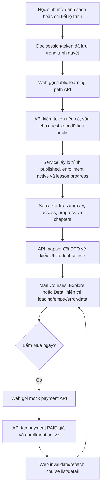

# Student Course Browsing

## Tính năng này giải quyết gì?

Học sinh xem lộ trình đã mua ở `/student/courses`, khám phá toàn bộ lộ trình published ở `/student/explore`, và mở chi tiết lộ trình theo slug ở `/student/courses/[slug]`. `M3.5` nối các màn này vào public learning path API thật thay vì dùng mock data cố định.

Payment thật, quyền vào nội dung bài học và CTA mua/học thử đầy đủ vẫn thuộc các milestone sau (`M7.x`, `M8.x`). Ở `M3.5`, UI chỉ cần browse/detail, trạng thái enrollment/trial và progress cơ bản nếu API trả.

Trong giai đoạn test UI trước payOS thật, nút `Mua ngay` ở chi tiết khóa học dùng endpoint mock `POST /student/payments/mock-success`. Endpoint này không gọi cổng thanh toán, nhưng vẫn tạo payment `PAID` giả và enrollment active 12 tháng để các màn course refetch rồi chuyển sang trạng thái đã mua.

## Sơ đồ luồng dễ hiểu



## Front-end

Luồng đọc dữ liệu student course đi qua:

```txt
shared/student-courses-api.ts
-> shared/hooks/use-student-courses-query.ts
-> screens/<screen>/index.tsx
-> local/shared components
```

`student-courses-api.ts` là boundary đổi public API DTO về type UI đang được các màn student dùng. Màn hình không tự biết shape backend chi tiết như `chapters`, `access` hoặc `progress`; màn chỉ nhận `StudentCourse` và `StudentCourseDetail`.

`useStudentCoursesQuery` đọc session/token từ auth store sau khi trình duyệt đã khôi phục session local. Nếu chưa có token hoặc người dùng chưa đăng nhập, hook vẫn gọi public API như guest để `/student/explore` xem được các lộ trình published.

`useStudentMockPurchaseMutation` dùng TanStack Mutation để gọi mock payment API. Khi mutation thành công, hook invalidate cache list/detail theo user hiện tại để course detail lấy lại `access.hasActiveEnrollment = true`; UI tự ẩn box giá và hiện trạng thái học.

Filter ở `/student/explore` vẫn là state client-side vì API hiện đã trả đủ dữ liệu published cho MVP browsing. Khi danh sách lớn hơn hoặc cần SEO public list, mới tách sang query server-side/pagination/filter sâu hơn.

## Back-end

Public learning path list/detail nằm trong `apps/api/src/modules/learning-paths`. `OptionalJwtAuthGuard` cho phép cùng endpoint phục vụ guest và authenticated student:

- Guest nhận dữ liệu public và `access.hasActiveEnrollment = false`.
- Student có enrollment active nhận `access.enrollment` và `progress`.
- Detail dùng selector riêng để trả `chapters -> lessons`, giúp màn chi tiết dựng accordion theo chương thật.

Progress hiện tính từ `lesson_progress` trên các lesson published:

- `COMPLETED` tăng `completedLessonCount`.
- `IN_PROGRESS` được ưu tiên làm lesson tiếp tục.
- Nếu chưa có lesson in-progress, lesson chưa completed đầu tiên là gợi ý tiếp theo.

Progress này chỉ phục vụ hiển thị browsing/CTA. Permission mở lesson thật vẫn phải được enforce ở API học bài sau này.

Mock buy-now nằm trong `apps/api/src/modules/payments`, tách khỏi `learning-paths` để không trộn nghiệp vụ thanh toán vào API browse course. Controller chỉ nhận `learningPathId` và user hiện tại; service kiểm tra lộ trình published, tự tính amount theo giá server, tạo payment `PAID` giả, rồi tạo enrollment `ACTIVE` 12 tháng. Nếu enrollment active đã tồn tại, API trả lại enrollment hiện có thay vì tạo trùng.

## Lỗi thường gặp

- Lỗi: màn detail chỉ có lesson phẳng nên UI không dựng được chương.
- Nguyên nhân: dùng cùng selector list cho detail.
- Cách tránh: detail public phải dùng selector có `chapters` và mỗi chapter chứa lesson public metadata theo thứ tự.

- Lỗi: `/student/courses` hiện trống dù seed có enrollment.
- Nguyên nhân: web gọi public API như guest vì đọc token quá sớm trước khi browser khôi phục session local.
- Cách tránh: query hook phải đợi trạng thái đã đọc session/token trong trình duyệt trước khi gọi API cho màn cần phân biệt enrollment.

- Lỗi: API guest vô tình lộ progress/enrollment.
- Nguyên nhân: serializer không tách viewer context theo role/token hợp lệ.
- Cách tránh: chỉ attach enrollment/progress khi optional auth xác thực được user `STUDENT`; guest hoặc role khác vẫn nhận response public an toàn.

- Lỗi: sidebar/profile hoặc filter lớp của học sinh hiện sai lớp so với database.
- Nguyên nhân: student shell hoặc filter Explore dùng `studentProfile.grade` từ mock UI trong `student-courses-data.ts` thay vì đọc profile thật từ `/me` hoặc `meta.priorityGrade` của learning path API.
- Cách tránh: khi student route đã bật auth thật, shell/profile phải lấy lớp từ current user API bằng access token; filter course phải chờ grade thật từ API và hiển thị trạng thái loading nếu chưa có. Mock chỉ dùng cho dữ liệu demo chưa nối API, không dùng cho thông tin định danh/profile của user đã đăng nhập.

- Lỗi: admin course đã lưu `thumbnailFileId` nhưng màn Khám phá vẫn hiện hình minh họa mặc định.
- Nguyên nhân: admin API resolve `thumbnailFile.url`, còn public learning path API chỉ trả `thumbnailFileId`; mapper web không có URL ảnh để đưa vào `ExploreCourseCard`.
- Cách tránh: selector/serializer public phải trả `thumbnailFile: { id, originalName, url } | null` với URL đã resolve qua FilesService; mapper student đổi URL đó thành `StudentCourse.thumbnailImageUrl` và card chỉ dùng fallback illustration khi không có URL.

- Lỗi: khóa chưa mua và không có buổi học thử nhưng màn chi tiết vẫn hiện `Vào học` ở buổi đầu.
- Nguyên nhân: mapper web fallback `continueLessonId` sang lesson đầu tiên khi API không trả progress/trial, khiến lesson row tưởng buổi đầu là bài đang học.
- Cách tránh: với khóa chưa mua, quyền mở lesson phải dựa trực tiếp vào `lesson.trialEnabled`; không fallback sang lesson đầu tiên. `continueLessonId` chỉ đến từ progress của enrollment active hoặc trial lesson do API xác nhận.

- Lỗi: API trả `0 chương · 0 bài học` nhưng màn chi tiết vẫn hiện `Chương 1`.
- Nguyên nhân: mapper web tự tạo một chapter mặc định khi response detail không có `chapters`, nên dữ liệu mock/fallback che mất trạng thái rỗng thật từ database.
- Cách tránh: khi màn đã nối API thật, mapper phải giữ đúng mảng rỗng từ backend; UI chịu trách nhiệm render empty state như `Khóa học này chưa có chương học nào` thay vì bịa entity giả.

- Lỗi: khóa học không có bài học nhưng progress card vẫn hiện `Bài học đầu tiên` và CTA `Vào học`.
- Nguyên nhân: `continueLessonTitle` fallback sang tên khóa học khi API không có lesson tiếp tục, còn progress card chỉ kiểm tra quyền học chứ chưa kiểm tra có lesson thật.
- Cách tránh: dữ liệu `continueLessonId/title` chỉ được lấy từ progress/trial/lesson thật; nếu không có lesson thật thì không render progress CTA, tránh tạo link `/student/lessons/` rỗng hoặc biến tên khóa học thành tên bài học.

- Lỗi: bài 2, bài 3 hiển thị icon `next` dù bài 1 chưa hoàn thành.
- Nguyên nhân: mapper coi mọi lesson chưa completed và không phải current là `next` cho khóa đã mua, làm UI dùng icon không khóa dù learner chưa đủ điều kiện học tiếp.
- Cách tránh: với course đã mua, chỉ lesson đã completed hoặc `continueLessonId` hiện tại được mở; các lesson còn lại phải là `locked` cho đến khi bài trước hoàn thành.

- Lỗi: chapter `DRAFT` không hiển thị ở màn chi tiết hoặc lesson trong chapter `DRAFT` vẫn có thể mở.
- Nguyên nhân: public detail selector lọc chapter theo `PUBLISHED`, hoặc mapper UI chỉ nhìn trạng thái lesson mà bỏ qua `chapter.status`.
- Cách tránh: detail API vẫn trả chapter chưa bị xóa mềm kể cả `DRAFT/HIDDEN`; mapper UI phải dùng `chapter.status` làm gate cấp chương. Nếu chapter không phải `PUBLISHED`, mọi lesson bên trong hiển thị trạng thái `locked`.

## File quan trọng

- `apps/web/features/student/shared/student-courses-api.ts`
- `apps/web/features/student/shared/hooks/use-student-courses-query.ts`
- `apps/web/components/student/layout/student-shell.tsx`
- `apps/web/features/student/courses/screens/purchased-courses-screen/index.tsx`
- `apps/web/features/student/courses/screens/student-course-detail-screen/index.tsx`
- `apps/web/features/student/explore/screens/explore-courses-screen/index.tsx`
- `apps/api/src/modules/learning-paths/controllers/public-learning-paths.controller.ts`
- `apps/api/src/modules/learning-paths/services/public-learning-paths.service.ts`
- `apps/api/src/modules/learning-paths/selectors/learning-path.selects.ts`
- `apps/api/src/modules/learning-paths/serializers/learning-path.serializers.ts`
- `apps/api/src/modules/payments/controllers/student-payments.controller.ts`
- `apps/api/src/modules/payments/services/mock-payments.service.ts`

## Task liên quan

- `M3.3`: Public/student learning path API có optional auth, ưu tiên grade, enrollment/trial state.
- `M3.5`: Student course browsing UI nối API thật.
- `M7.x`: Luồng học bài/progress sâu hơn.
- `M8.x`: Payment và enrollment production flow.
