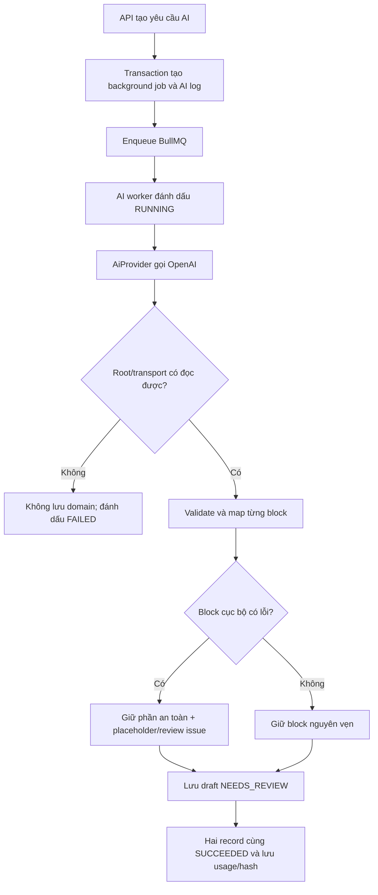

# AI structured output và durable jobs

## Chủ đề này dùng để làm gì?

Nền M9.1 giúp các tính năng tạo summary, quiz, flashcard, test và lời giải gọi
model theo một đường thống nhất. Mục tiêu quan trọng nhất không phải chỉ nhận
được JSON, mà là không cho dữ liệu AI sai shape đi vào database.

## Cách nó hoạt động trong repo

- `AiService` là cửa gọi chung; code domain không gọi OpenAI SDK trực tiếp.
- OpenAI nhận JSON Schema được sinh từ Zod để tạo structured output.
- Backend parse lại kết quả bằng Zod trước khi worker được phép lưu domain.
- Mỗi AI job có một `background_jobs` cho UI/vận hành và một `ai_generations`
  cho model, token, latency, version, hash và lỗi.

## Sơ đồ luồng dễ hiểu

## Luồng kỹ thuật

`AiGenerationProcessor` cố ý chia thành `generate()` rồi mới `persist()`.
Nếu provider refusal, trả rỗng hoặc Zod reject, lời gọi đầu ném lỗi và bước
`persist()` không thể chạy. Lỗi schema là non-retryable để tránh tạo nhiều lần
tốn phí; timeout/network còn lượt sẽ đưa trạng thái về `QUEUED` cho BullMQ.

OpenAI SDK không tự retry bên trong provider. Nhờ vậy một BullMQ attempt tương
ứng với một provider request, log retry và chi phí dễ hiểu hơn.

Từ M9.9, job còn chụp route snapshot lúc enqueue. OpenAI/Gemini model được
resolve theo feature; fallback chỉ chạy cho lỗi provider tạm thời. Mỗi attempt
có `provider_usage_events` riêng với cached/input/output token, price version,
tỷ giá và VND. Vì vậy `ai_generations` là summary theo generation, còn usage
event là sổ chi tiết dùng cho accounting/audit.

## Kỹ thuật chính

- Strict structured output: JSON Schema hướng model sinh đúng cấu trúc.
- Runtime validation: Zod là ranh giới tin cậy cuối cùng của ứng dụng.
- Durable lifecycle: trạng thái nằm trong Postgres, Redis chỉ làm hàng đợi.
- Idempotency: cùng key trả lại job hiện có thay vì gọi AI lần nữa.
- Active-job dedupe: M9.2 khóa theo lesson trong transaction, nên hai lần bấm
  gần nhau dùng cùng một summary job; job terminal vẫn cho phép regenerate.
- Deterministic hashing: object key được chuẩn hóa trước khi SHA-256 để cùng
  input/output luôn có cùng hash bất kể thứ tự key.
- Source freshness: API hash danh sách lesson chunks, worker tải lại và so hash
  trước khi gọi provider để không tóm tắt tài liệu đã bị thay đổi giữa chừng.
- Prompt preview round-trip: FE phải lấy `systemPrompt` và `userPrompt` hiệu lực
  từ response preview để hiển thị, không dùng giá trị form rỗng ghi đè request
  đã dựng. Nếu admin gửi lại nguyên prompt đã xem trước, shared builder nhận
  diện và tái sử dụng trực tiếp để base prompt không bị lồng thêm lần nữa.

## Luồng lỗi thường gặp

Một response preview có thể hoàn toàn đúng nhưng tab System vẫn trống nếu UI
chỉ lưu `userPrompt` vào form. Tình huống này còn làm JSON “Input đầy đủ” sai vì
giá trị rỗng của form ghi đè `openAiRequest.instructions`. Cách kiểm tra đúng là
đối chiếu cùng lúc ba nơi: `systemPrompt` trong response, textarea trên FE và
`instructions` trong JSON cuối. Sau đó phải kiểm thêm vòng gửi lại preview hoặc
generate để chắc chắn prompt hiệu lực không bị builder bọc lặp.

Phải tách ranh giới kỹ thuật và đánh giá biên tập. JSON Schema/Zod vẫn là ranh
giới bắt buộc vì JSON hỏng không thể persist/render an toàn. Ngược lại, các nhận
định như theory có lẫn ví dụ, paragraph quá dài, ví dụ lệch chủ đề hay lời giải
chưa hay đều có false positive; chúng chỉ nên thành warning trên bản nháp
`NEEDS_REVIEW`, không reject job và không tự gọi model lần hai tốn phí.

Semantic checker vẫn nên nhận diện nhãn theo cấu trúc thay vì cấm từ khóa mọi vị
trí. Chẳng hạn “vận dụng” có thể là nhãn `Vận dụng 1.` nhưng cũng là động từ hợp
lệ trong câu “vận dụng các tính chất”. Dù chỉ là warning, giảm false positive vẫn
giúp admin tập trung vào vấn đề thật.

Provider output và dữ liệu sau mapper là hai contract khác nhau nên phải được
test độc lập. Ví dụ provider trả `diagramSpec`, mapper đổi thành `visual` để UI
render; test chỉ parse output của provider sẽ không phát hiện schema lưu trữ quên
field `visual`. Test hồi quy đúng phải chạy đủ chuỗi provider parse → mapper →
persisted-output parse, đặc biệt với các field chỉ xuất hiện khi bài cần hình.

Schema pass cũng không chứng minh mapper sẽ chạy được. Một `diagramIntent` có thể
đủ field nhưng compiler vẫn ném lỗi vì thiếu số nhãn cần cho đúng archetype. Vì
vậy summary dùng hai boundary liên tiếp: recovery chạy thử chính compiler và
materialize kết quả renderer-ready đúng một lần; mapper có boundary cuối theo
từng block để đổi mọi exception cục bộ thành review issue + fallback nhỏ nhất.
Không được chỉ bắt một message cụ thể: test phải phủ các family compiler khác
nhau và cả lỗi ngoài dự kiến trong theory/example/note/application block.

## Handler summary đầu tiên

M9.2 là handler domain đầu tiên dùng nền M9.1. API chỉ nhận
`lesson_documents.id`, kiểm document active/`READY`/có chunks rồi lưu metadata
nhỏ vào job. Worker tải chunks theo đúng lesson, giới hạn context, gọi strict
schema, map sang block contract theo kiểu best-effort reference, gắn semantic warning rồi upsert một
`lesson_summaries` ở trạng thái `NEEDS_REVIEW`. Raw PDF và raw prompt không được
lưu trong durable job.

Contract v3 giữ heading/theory bám nguồn nhưng cố ý làm output biên tập đơn giản:
model chủ động sửa lỗi OCR/chính tả của heading, còn example không mang
`origin`, candidate ID hay `sourceAssessment`. Backend coi topic/candidate
classification là dữ liệu hỗ trợ input, không phải metadata phải trả lại. Hình minh họa dùng shared
`DIAGRAM_SPEC` đã validate và renderer SVG kiểm soát; không persist URL ảnh
OCR, raw SVG hoặc câu kiểu `xem hình bên`. Contract buộc `toScale=true`; mapper
kiểm point/viewBox, còn provider Zod gate đối chiếu marker vuông góc, song song,
bằng độ dài với tọa độ trong sai số `2%`. Các quan hệ marker này là invariant kỹ
thuật: nếu mâu thuẫn thì output bị reject trước persist, thay vì hạ thành warning
và render một tam giác suy biến. Trước khi lưu, mapper còn mở rộng viewBox thiếu biên và đổi LaTeX
trong nhãn SVG thành text thuần; renderer lặp lại bước auto-fit cho summary cũ.
Nội dung toán cũng phải sửa các control character do JSON hiểu nhầm, chẳng hạn
`\t` trong `\triangle`, trước khi đưa cho trình render công thức. Nếu không cần
hình thì block không lưu field visual.

Một `diagramSpec` parse được chưa có nghĩa là hình đúng. Schema chỉ nhìn thấy ID,
tọa độ và reference; nó không tự hiểu `H` là chân tường hay `B` là điểm thang chạm
tường. Vì vậy diagram cần ba hàng rào riêng: schema chặn cấu trúc mơ hồ như ID/nhãn
trùng hoặc point label ghép; mapper chuẩn hóa primitive suy biến; prompt bắt model
đối chiếu vai trò từng điểm với đề. Renderer cũng phải dùng hình học thật của
marker/segment để đặt cung góc và text, không tin một tọa độ nhãn cố định từ model.

Trước khi sinh realtime cả bài Hình học, chạy smoke test tiết kiệm bằng đúng một
provider request chỉ trả hai example + `diagramSpec`, không retry và có output cap.
Nếu model lặp primitive đến hết token thì dừng, không tăng token hoặc chạy cả bài.
`superRefine` của Zod chỉ kiểm được sau khi JSON đã hoàn chỉnh; nó không nhất thiết
biến thành ràng buộc mà provider tuân thủ trong JSON Schema, nên phải giới hạn độ
phức tạp output ngay trong JSON Schema. Với `diagramSpec`, không nên gửi một mảng
union `anyOf` cho mọi primitive: model có thể chọn nhánh CIRCLE/POLYGON hợp schema
nhưng sai ý. Tách thành các mảng giới hạn nhỏ như `segments`, `arcs`, `circles`,
`rightAngles`, `equalLengths`, rồi flatten về persisted union sau khi nhận output,
giúp provider thấy rõ số cạnh và loại hình phải sinh mà không đổi format lưu cũ.
Semantic audit vẫn phải kiểm tọa độ thật: marker bằng nhau không đủ nếu hai đoạn
lệch độ dài; cung có đúng bán kính cũng chưa đủ nếu endpoint không chạm điểm cần dựng.

Visual audit phải chụp chính component thật, không chỉ kiểm JSON/SVG node. Với
`vector-effect="non-scaling-stroke"`, `strokeWidth` là độ dày hiển thị nên phải
dùng giá trị pixel ổn định như `1.75–2`, không dùng `viewBox * 0.008` vì hình rộng
có thể chỉ còn nét dưới một pixel. Dấu góc vuông, cung góc và tick cạnh bằng nhau
nên lấy theo `min(tỉ lệ viewBox, tỉ lệ chiều dài hai arm/cạnh)` để tránh marker
phình to khi một diagram chứa nhiều hình tách rời.

Point trong structured diagram không đồng nghĩa với một chấm phải nhìn thấy. Nó
có thể chỉ là nút điều khiển để dựng polyline, ô bảng, cột biểu đồ hoặc neo text.
Nếu renderer vẽ mọi point, hình học sẽ thành sơ đồ nhiều nút đen và đồ thị cong
sẽ lộ toàn bộ điểm lấy mẫu. Contract nên có quyết định `pointStyle` rõ ràng, mặc
định `NONE` cho đỉnh hình học thường/điểm điều khiển; `FILLED`/`OPEN` chỉ dành cho
điểm độc lập hoặc đầu mút đóng/mở có ý nghĩa. Tâm đường tròn có tên là ngoại lệ:
nếu không có dấu tâm nhỏ thì chữ `O`/`I` không đủ chỉ ra tọa độ chính xác, nên
renderer cần nhận diện quan hệ `CIRCLE.center` và phục hồi marker cho dữ liệu cũ.
Nhãn đỉnh nên đặt sát giao của các cạnh; khoảng cách quá lớn làm người học khó
ghép tên với đúng đỉnh.

Điểm dựng của đồ thị là lớp semantic riêng: chấm phải đủ tương phản và phải được
chọn theo quy tắc của đồ thị, không tùy ý. Parabol dùng đỉnh cùng các cặp đối xứng
đúng hàm; đường thẳng dùng hai điểm phân biệt dễ đọc. Mỗi điểm dựng có tên duy nhất
(giữ tên nguồn trước, rồi dùng tên phụ chưa trùng), nhưng trên hình chỉ hiện tên
ngắn; tọa độ được đọc qua đường dóng nét đứt và nhãn trục. Nhãn số/tên điểm phải
tìm vùng trống trong một bán kính nhỏ quanh mục tiêu; đổi
hướng trước khi tăng khoảng cách và đặt trần dịch chuyển để chữ không trôi xa vạch.

Schema pass cũng không thay thế visual pass. Trước khi chấp nhận một lô diagram,
render đúng component của app ở cả theme cần kiểm, chụp riêng từng figure rồi xem
bằng mắt. Kiểm ít nhất: nhãn có đè/cách xa đối tượng không; outline text SVG có
phình theo viewBox không; trục có mũi tên dương, `O`, tick và đơn vị không; đường
cong có liên tục/đúng miền không; bảng có căn giữa không; ký hiệu độ dài/góc có
gọn và đúng quy ước SGK không. Tách ảnh đạt và ảnh lỗi thành hai thư mục độc lập
để một ảnh chưa duyệt không bị hiểu nhầm là mẫu chuẩn.

Visual pass cũng chưa đủ nếu chỉ đo bounding box. Hình có thể sạch va chạm nhưng
vẫn dạy sai: nhãn 25 nằm trong phần bằng 15 của sơ đồ thanh; lục giác đều bị gọi
là có hai trục đối xứng; hai góc đối của tứ giác nội tiếp bị gọi là cùng chắn một
cung. Vì vậy fixture hồi quy phải khóa cả `problem`/`caption` lẫn primitive và
marker. Khi chụp locator, cần ẩn mọi node không phải target hoặc ancestor/descendant
của target; chỉ ẩn `fixed`/`sticky` không đủ để ngăn control tuyệt đối lọt vào mép
ảnh trên mobile.

Tránh chồng chữ không nên sửa bằng offset cố định theo tám hướng cho mọi loại
nhãn. Nhãn điểm cần chọn vùng clearance lớn nhất trong bán kính nhỏ quanh đỉnh;
nhãn độ dài/r/h cần lấy pháp tuyến của segment neo; nhãn miền tròn nên dịch vào
phía trong miền; marker song song cần tìm vị trí trên đoạn đủ xa vertex của cung
góc. Các offset đều phải có trần theo diagram scale để text vẫn sát đối tượng.

Một semantic repair có thể an toàn hơn retry provider nếu dữ kiện đã đủ và phép
sửa là tất định. Với trục số, khi model đã cho trục ngang, O và ít nhất hai nhãn
số đúng một ánh xạ tuyến tính, adapter có thể suy ra hoành độ các tick theo mẫu
số và thêm segment ngắn. Không repair nếu thiếu ánh xạ, slope không dương, vượt
giới hạn primitive/point hoặc O không cùng mốc 0; các trường hợp đó phải fail.
Các segment tick chỉ mang nghĩa phân độ: nếu provider đưa chúng vào
`EQUAL_LENGTH`/`PARALLEL`, renderer phải bỏ marker đó thay vì vẽ thêm nét màu đè
lên trục. Ngoài semantic, tick còn cần giới hạn chiều dài theo cạnh ngắn viewBox
(mục tiêu khoảng 2%, không quá 3%) và nhận diện cả trục biểu đồ dựng bằng
`SEGMENT`; nếu chỉ nhận `LINE` hoặc lấy một số tọa độ quá lớn, hình dài/hẹp sẽ
phóng vạch nhỏ thành cột lớn trên mobile. Bảng rộng cũng cần font floor riêng,
không thể chỉ suy cỡ chữ từ chiều ngắn viewBox vì nội dung ô sẽ trở nên khó đọc.

Khi recovery bỏ một marker hình học không đạt semantic validation, hình còn lại
có thể vẫn sạch và đẹp nhưng đã mất một giả thiết của bài. Badge review vì thế
phải gọi đúng tên các đoạn/góc liên quan từ lỗi validator, chẳng hạn `AC` và
`A′C′`, thay vì dùng câu chung chung. Ngược lại, một nhãn chữ đẳng thức thừa đã
được bỏ mà marker đúng vẫn còn là sửa trình bày tất định và không cần tạo badge.

Thông báo review cần tách rõ hai tầng ngôn ngữ. `Vấn đề` và `Gợi ý sửa` là phần
cho quản trị viên nên chỉ dùng tiếng Việt dễ hiểu, có thể giữ tên điểm, cạnh và
ký hiệu toán học quen thuộc để xác định đúng đối tượng. Tên trường, đường dẫn dữ
liệu, mã validator và thuật ngữ như `diagramSpec`, `segmentIds`, `marker`,
`label`, `null` chỉ thuộc `Chi tiết kỹ thuật`. Lớp chuyển đổi này phải chạy cả
khi tạo cảnh báo mới lẫn khi đọc cảnh báo cũ, tránh buộc người dùng sinh lại nội
dung chỉ để có lời báo dễ hiểu hơn.

Điểm điều khiển đồ thị cũng cần phân loại theo mục đích. Đồ thị đường thẳng trong
bài “vẽ đồ thị” nên hiện ít nhất hai điểm dựng để học sinh thấy thao tác xác định
đường; điểm chỉ dùng lấy mẫu đường cong vẫn phải ẩn. Tương tự, marker song song
không phải trang trí bắt buộc: chỉ sinh khi nguồn thực sự yêu cầu đánh dấu, tránh
dấu hình mũi tên cạnh tranh với ngữ nghĩa hướng của tia/trục.

Khoảng cách nhãn cạnh phải dùng cùng text scale thích ứng với renderer. Dùng cạnh
dài nhất của viewBox để ước lượng khung chữ sẽ đẩy `3 cm`, `4 cm`, `r`, `h` quá xa
trong hình rộng hoặc hình chứa nhiều cụm dù chữ thực tế đã được co nhỏ.

Một lỗi renderer khó thấy là dùng `strokeWidth` text theo đơn vị tuyệt đối trong
viewBox trong khi hình co giãn. Outline vài đơn vị có thể trở thành mảng trắng/đen
che cả nhãn và cạnh. Độ dày outline phải tỉ lệ theo `diagramScale` hoặc được kiểm
soát bằng một cơ chế pixel ổn định, sau đó xác nhận lại trên screenshot thật.

## File quan trọng

- `apps/api/src/modules/ai/providers/openai.provider.ts`
- `apps/api/src/modules/ai/services/ai-generation-job.service.ts`
- `apps/api/src/modules/ai/services/ai-generation-lifecycle.service.ts`
- `apps/api/src/modules/ai/services/ai-provider-call.service.ts`
- `apps/api/src/modules/provider-operations/`
- `apps/api/src/workers/processors/ai-generation.processor.ts`
- `apps/api/src/workers/services/ai-generation-worker.service.ts`
- `apps/api/src/modules/ai/services/lesson-summary-context.service.ts`
- `apps/api/src/workers/services/lesson-summary-generation.service.ts`
- `apps/api/src/modules/learning-paths/services/lesson-summaries.service.ts`

## Khi nào cần nhớ lại?

Khi thêm một generation type mới, handler chỉ nên chuẩn bị prompt/schema trong
`generate`, rồi lưu dữ liệu domain trong `persist`. Không đảo thứ tự và không
gọi provider trực tiếp từ controller/service domain.

## Task liên quan

- `M9.1`
- `M9.2`
- Nền cho `M9.3-M9.7` và phần AI của `M15`
