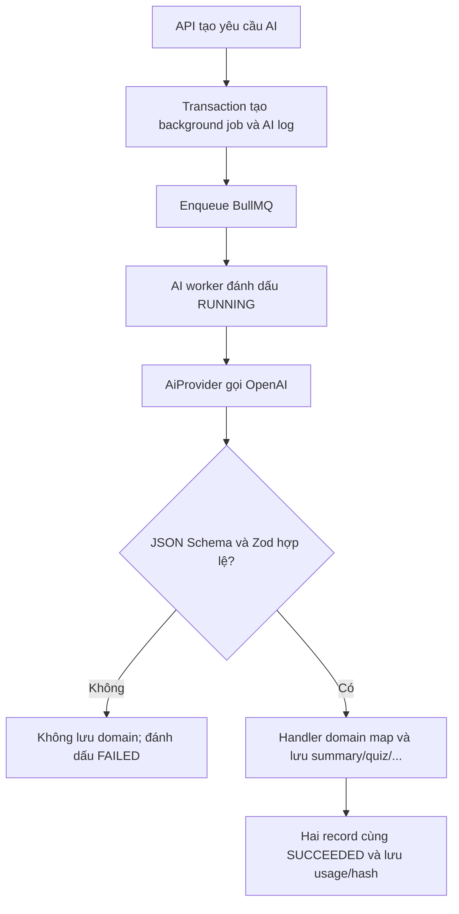

# AI structured output và durable jobs

## Chủ đề này dùng để làm gì?

Nền M9.1 giúp các tính năng tạo summary, quiz, flashcard, test và lời giải gọi
model theo một đường thống nhất. Mục tiêu quan trọng nhất không phải chỉ nhận
được JSON, mà là không cho dữ liệu AI sai shape đi vào database.

## Cách nó hoạt động trong repo

- `AiService` là cửa gọi chung; code domain không gọi OpenAI SDK trực tiếp.
- OpenAI nhận JSON Schema được sinh từ Zod để tạo structured output.
- Backend parse lại kết quả bằng Zod trước khi worker được phép lưu domain.
- Mỗi AI job có một `background_jobs` cho UI/vận hành và một `ai_generations`
  cho model, token, latency, version, hash và lỗi.

## Sơ đồ luồng dễ hiểu

## Luồng kỹ thuật

`AiGenerationProcessor` cố ý chia thành `generate()` rồi mới `persist()`.
Nếu provider refusal, trả rỗng hoặc Zod reject, lời gọi đầu ném lỗi và bước
`persist()` không thể chạy. Lỗi schema là non-retryable để tránh tạo nhiều lần
tốn phí; timeout/network còn lượt sẽ đưa trạng thái về `QUEUED` cho BullMQ.

OpenAI SDK không tự retry bên trong provider. Nhờ vậy một BullMQ attempt tương
ứng với một provider request, log retry và chi phí dễ hiểu hơn.

Từ M9.9, job còn chụp route snapshot lúc enqueue. OpenAI/Gemini model được
resolve theo feature; fallback chỉ chạy cho lỗi provider tạm thời. Mỗi attempt
có `provider_usage_events` riêng với cached/input/output token, price version,
tỷ giá và VND. Vì vậy `ai_generations` là summary theo generation, còn usage
event là sổ chi tiết dùng cho accounting/audit.

## Kỹ thuật chính

- Strict structured output: JSON Schema hướng model sinh đúng cấu trúc.
- Runtime validation: Zod là ranh giới tin cậy cuối cùng của ứng dụng.
- Durable lifecycle: trạng thái nằm trong Postgres, Redis chỉ làm hàng đợi.
- Idempotency: cùng key trả lại job hiện có thay vì gọi AI lần nữa.
- Active-job dedupe: M9.2 khóa theo lesson trong transaction, nên hai lần bấm
  gần nhau dùng cùng một summary job; job terminal vẫn cho phép regenerate.
- Deterministic hashing: object key được chuẩn hóa trước khi SHA-256 để cùng
  input/output luôn có cùng hash bất kể thứ tự key.
- Source freshness: API hash danh sách lesson chunks, worker tải lại và so hash
  trước khi gọi provider để không tóm tắt tài liệu đã bị thay đổi giữa chừng.

## Handler summary đầu tiên

M9.2 là handler domain đầu tiên dùng nền M9.1. API chỉ nhận
`lesson_documents.id`, kiểm document active/`READY`/có chunks rồi lưu metadata
nhỏ vào job. Worker tải chunks theo đúng lesson, giới hạn context, gọi strict
schema, chuyển kết quả sang Tiptap và upsert một `lesson_summaries` ở trạng thái
`NEEDS_REVIEW`. Raw PDF và raw prompt không được lưu trong durable job.

## File quan trọng

- `apps/api/src/modules/ai/providers/openai.provider.ts`
- `apps/api/src/modules/ai/services/ai-generation-job.service.ts`
- `apps/api/src/modules/ai/services/ai-generation-lifecycle.service.ts`
- `apps/api/src/modules/ai/services/ai-provider-call.service.ts`
- `apps/api/src/modules/provider-operations/`
- `apps/api/src/workers/processors/ai-generation.processor.ts`
- `apps/api/src/workers/services/ai-generation-worker.service.ts`
- `apps/api/src/modules/ai/services/lesson-summary-context.service.ts`
- `apps/api/src/workers/services/lesson-summary-generation.service.ts`
- `apps/api/src/modules/learning-paths/services/lesson-summaries.service.ts`

## Khi nào cần nhớ lại?

Khi thêm một generation type mới, handler chỉ nên chuẩn bị prompt/schema trong
`generate`, rồi lưu dữ liệu domain trong `persist`. Không đảo thứ tự và không
gọi provider trực tiếp từ controller/service domain.

## Task liên quan

- `M9.1`
- `M9.2`
- Nền cho `M9.3-M9.7` và phần AI của `M15`
