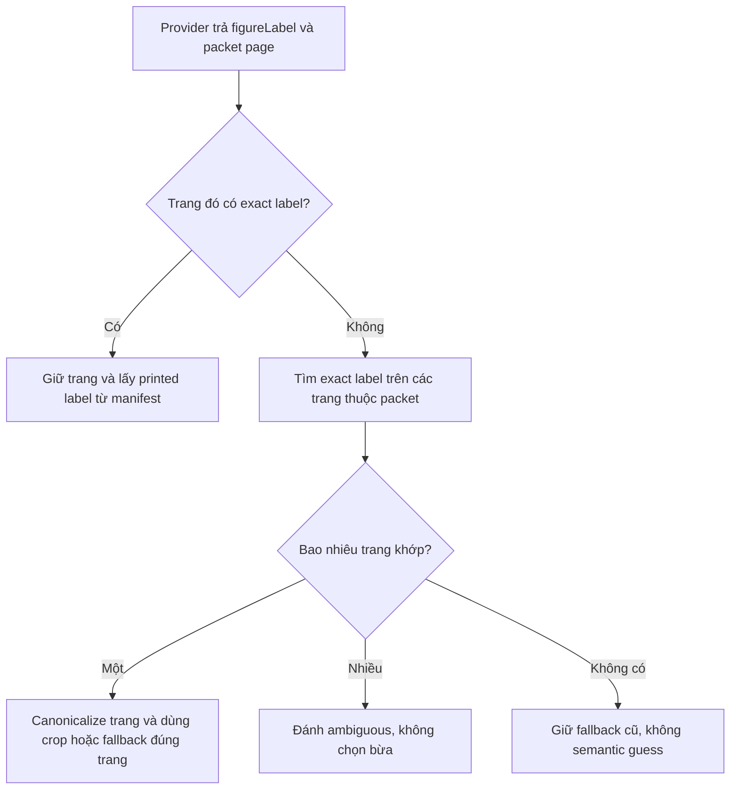
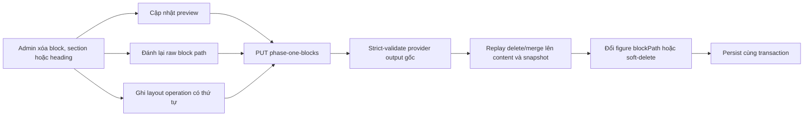

# AI structured output, TeX figure và durable jobs

## Chủ đề này dùng để làm gì?

Ghi lại ranh giới giữa một lần OpenAI tạo Summary, các job render TeX chạy lâu và
artifact SVG được promote sau khi compile + validator thành công.

## Luồng hiện tại

```txt
POST generate Summary
  -> background_jobs(AI_GENERATION) + ai_generations
  -> provider strict structured output
  -> Zod persistence gate
  -> lesson_summaries content version 3
  -> stem_figures + background_jobs(DIAGRAM_RENDERING)
  -> source policy
  -> isolated TeX Live/LuaLaTeX + dvisvgm
  -> local SVG validator/sanitizer
  -> atomic promote R2
```

API trả `background_jobs.id` làm `jobId`. Database là nguồn trạng thái durable;
BullMQ chỉ vận chuyển công việc. UI poll job/figure và có thể phục hồi sau reload.

Khi một Summary sinh ra nhiều figure, mapper gán vị trí theo thứ tự nội dung và
worker có thể enqueue đồng thời bằng `Promise.all`; thứ tự hoàn tất vì vậy không
phải contract. API/UI phải sắp xếp theo vị trí số
`section -> block -> figureIndex` để thứ tự hiển thị vẫn ổn định. Khi parent
Summary job terminal, frontend phải invalidate cả Summary lẫn danh sách figure
con. Nếu chỉ invalidate parent, TanStack Query vẫn giữ asset/status figure cũ cho
đến lần reload trang.

## Structured output boundary

- Provider schema giúp ép shape nhưng Zod vẫn là gate cuối trước khi persist.
- Khi một quyết định AI làm đổi loại input của paid call sau đó, provenance phải
  là field có invariant chứ không chỉ được suy từ metadata khác. Với Summary
  figure, `TEXTBOOK_SOURCE` bắt buộc có `sourceReferences`, còn
  `GENERATED_FROM_BRIEF` bắt buộc reference rỗng. Resolver, generation brief và
  provider boundary cùng chặn ảnh cho nhánh dựng mới; vì vậy một asset stale
  không thể biến thành OCR crop/PDF fallback gửi sang lượt TikZ.
- JSON Schema gửi provider chỉ dùng tập cú pháp Structured Outputs hỗ trợ. Quy
  tắc cần regex JavaScript nâng cao như lookaround phải để ở Zod gate phía
  backend; nếu đưa thẳng vào `pattern`, provider có thể từ chối toàn bộ request
  trước khi model bắt đầu sinh nội dung.
- Prompt/schema/model/config/source hash phải được snapshot để worker không dùng
  dữ liệu stale.
- Summary figure draft chỉ chứa source LaTeX, alt text và caption. AI không trả raw
  SVG, URL hoặc geometry JSON.
- Figure decision dùng hai tầng: subject profile quy định mức tối thiểu bắt buộc,
  còn AI chủ động bổ sung hình ngoài danh sách khi hình cần cho việc hiểu đúng.
  Danh sách hệ thống là mức sàn, không phải whitelist hay danh sách đóng.
- Sau Zod, semantic coverage gate chặn output thiếu figure thuộc mức sàn trước
  mapper/persistence. Figure AI tự thêm được giữ nguyên. Gate chỉ kiểm coverage,
  không dùng Vision, không chọn package và không gọi thêm provider.
- Mapper lưu `TEX_FIGURE` reference trong content và source/state ở bảng riêng.
- Schema nhận output mới và schema đọc dữ liệu vận hành đã lưu không nên bị buộc
  chung một cách máy móc. Với figure, caption/alt text là metadata của revision;
  render-plan chỉ gồm ngữ nghĩa cần resolve crop và dựng hình. Vì vậy một rule
  caption mới có thể từ chối output mới nhưng không được vô tình khóa nút sinh
  lại của một render-plan vẫn đủ dữ liệu hình học.
- Giai đoạn hiện tại chỉ Summary có figure; Quiz/Test/Flashcard/Explanation/Chat
  giữ text-only.

### Provider chọn sai trang nhưng đúng nhãn hình

`figureLabel` formal và trang provider trả không có cùng độ tin cậy. Model có
thể đọc đúng `Hình 4.16` nhưng gán nó sang trang kế tiếp. Backend vì
vậy không được chỉ kiểm nhãn trong trang model chọn rồi fallback nguyên
trang đó.



Exact lookup chỉ chạy trên cặp document/PDF page thực sự có trong
packet. OCR image manifest có thể chứa cả cuốn sách, nên bỏ giới hạn
này sẽ làm resolver lấy hình ngoài lesson. Raw provider output vẫn được
giữ cho audit; chỉ render plan và immutable reference snapshot dùng vị trí
canonical. Cách tách raw/effective này cho phép vừa debug được model, vừa
không truyền lỗi trang sang Stage 2 hoặc M9.17.

### Chuẩn hóa trình bày output AI ở front-end

Heuristic trình bày không được chạy mù trên toàn bộ Markdown. Khi FE cần tách các
ý `a)`, `b)` do provider trả cùng dòng, phải che vùng LaTeX và code trước, chỉ sửa
khoảng trắng ở plain text, yêu cầu có cặp marker tuần tự và giữ phép biến đổi
idempotent. Regression matrix phải có cả happy path lẫn counterexample: marker
thường/in đậm/viết hoa, khoảng trắng Unicode, newline sẵn có, bullet Markdown,
inline/display math, môi trường LaTeX, inline/fenced code, ký hiệu hàm `f(a)`,
marker đơn và thứ tự marker không hợp lệ. Mục tiêu là sửa layout mà không đổi ký
tự kiến thức ngoài whitespace.

### Shared schema phải đúng ở cả source và runtime build

`@learning-path/shared` export runtime từ `dist/index.js`, không đọc trực tiếp
`src`. Vì vậy, chỉ sửa Zod schema trong `packages/shared/src` mà không build lại
có thể tạo ra tình huống TypeScript/source đã có field mới nhưng API đang chạy
vẫn báo `Unrecognized key` theo JavaScript cũ.

Luồng dev hiện tại ngăn lỗi này bằng ba lớp:

```txt
pnpm dev
  -> Turbo build package phụ thuộc trước
  -> shared tsc --watch cập nhật dist
  -> API watcher thấy shared/dist thay đổi và restart runtime
```

Review issue do validator nội bộ sinh ra cũng phải được reconcile lại theo
schema hiện hành khi đọc/lưu Summary. Nếu validator mới đã chấp nhận block,
cảnh báo schema cũ phải bị loại bỏ; không giữ nó chỉ vì fingerprint nội
dung chưa đổi.

## Retry đúng loại lỗi

Có hai lớp retry độc lập:

1. Chỉ `TEX_COMPILE_FAILED` có diagnostic batch đầy đủ mới được tự gọi OpenAI
   repair, tối đa `maxRepairAttempts`. Request repair phải chứa toàn bộ structured
   compiler errors và raw compiler log của đúng lượt compile đó.
2. Source policy, semantic/SVG validator, provider, budget, timeout, network,
   storage và lỗi hạ tầng đều terminal đối với automatic retry. Admin vẫn có thể
   chủ động retry hạ tầng, sửa source, xóa, thay ảnh hoặc tạo revision mới qua
   lifecycle cũ.

Mỗi attempt lưu kind, source version/hash, compile log rút gọn, error
category/code, validator issues và duration. Hết repair budget là terminal, không
tạo vòng lặp.

## Security boundary

TeX do AI tạo là untrusted code:

- Compile trong container riêng, non-root, network internal-only, read-only +
  tmpfs, không mount dữ liệu ứng dụng.
- Tắt shell escape, giới hạn CPU/RAM/PID/timeout/source/output.
- Source policy chặn shell, external I/O/network, direct Lua và PDF object.
- Package cài cố định trong image; không cài động.
- SVG validator dùng allowlist, chặn script/event/foreignObject/external reference
  và giới hạn viewBox/node/path/bytes.
- Chỉ sanitized SVG hợp lệ mới thành preview.

## Admin review và storage

Validator chỉ kết luận an toàn/kỹ thuật, không kết luận hình đúng sư phạm. Không có
AI Vision. Worker promote asset hợp lệ atomically; admin kiểm bố cục/nội dung và
có thể sửa source, compile draft local rồi apply revision đã qua validator. Draft
preview nằm trong database; student chỉ nhận delivery asset của current revision
`SUCCEEDED`.

Một source TikZ biên dịch được vẫn có thể sai chất lượng. Khi đã gửi ảnh sách giáo
khoa, prompt nên coi ảnh là chuẩn trực quan thay vì chồng thêm nhiều công thức
đặt nhãn, góc, anchor hoặc khoảng cách. Các quy tắc vá lẻ dễ cạnh tranh với ảnh
nguồn và khiến model tối ưu theo câu chữ thay vì tái tạo hình. Prompt chung chỉ
cần khóa thứ tự ưu tiên, cấm thiếu/thừa nét, yêu cầu nhãn gần đúng đối tượng mà
không chạm nét và yêu cầu source biên dịch được; lỗi cụ thể được giữ làm regression
fixture, không nối tiếp thành một đoạn chỉ dẫn mới.

Prompt provider không phải nơi lưu audit metadata. Chỉ gửi dữ liệu và ràng buộc
mà model có thể dùng để quyết định output; prompt/schema version, tên manifest,
object key, provenance và lifecycle vẫn được snapshot ở backend để tái hiện và
điều tra. Nếu một invariant đã suy ra được từ payload, ví dụ số panel từ chính
mảng ảnh, không gửi thêm nhiều field diễn đạt lại cùng một ý. Preview dành cho
admin phải mô phỏng đúng request provider thực nhận và chỉ che phần binary/secret,
không bọc thêm metadata khiến người xem hiểu nhầm là đã gửi lên model.

Source vẽ và metadata trình bày phải có dirty state riêng. Thay đổi source làm
draft đã compile trở nên stale và bắt buộc compile lại; thay đổi alt text/caption
không làm SVG stale, không được xóa preview hoặc bắt compile lại. Khi chỉ sửa
metadata, apply cập nhật current revision và Summary reference trong cùng
transaction, không upload lại asset. Khi đã có draft hợp lệ, apply dùng metadata
mới nhất cùng revision đã compile.

Ảnh tham chiếu sách giáo khoa là provenance bất biến của logical figure, không
phải dữ liệu tạm của riêng revision AI. Revision tạo bằng mã code hoặc upload phải
kế thừa snapshot/hash này. Khi đọc dữ liệu cũ bị thiếu snapshot ở revision hiện
hành, API có thể phục hồi từ revision lịch sử gần nhất có snapshot; cả response
admin và mutation dùng crop phải resolve cùng một nguồn để tránh UI bật nút nhưng
backend lại từ chối.

Figure hiện light-only. UI dark đặt figure trên surface sáng, không tự đảo màu.

### Structural edit phải đồng bộ ba lớp dữ liệu

Summary AI có ba biểu diễn liên quan nhưng khác vai trò: preview đã map để render,
raw block Phase 1 để admin sửa, và provider output gốc để strict-validate lại khi
Lưu. Vì vậy xóa một block chỉ khỏi preview là chưa đủ; lần Lưu kế tiếp sẽ map raw
cũ và làm block xuất hiện lại. Tương tự, gộp section mà không đánh lại raw
`blockPath` sẽ khiến khung JSON ở vị trí mới báo nhầm là thiếu raw Phase 1.



Layout operation là overlay biên tập, không sửa méo provider schema. Backend giữ
provider output hợp lệ để audit/validate, rồi replay `DELETE_BLOCK`,
`DELETE_SECTION` hoặc `MERGE_SECTION` sau mapper. Operation phải được lưu cùng snapshot để các lần sửa
sau tiếp tục nhìn đúng layout hiện tại. Figure của block chỉ đổi vị trí giữ nguyên
revision/asset; figure thuộc block bị xóa dùng soft-delete để không còn reference
active nhưng vẫn giữ khả năng điều tra dữ liệu.

## Coverage lớp 3–12

Prompt và test phải coi lớp 3–12 là phạm vi bắt buộc. Package smoke trong Docker
cần bao phủ tối thiểu TikZ core/tiểu học, `tkz-euclide`, `pgfplots`,
`tkz-tab`, `tikz-3dplot`, `circuitikz`, `chemfig` và `mhchem` theo đúng
package thật đã cài trong image. Quang học dùng TikZ core; không quảng bá
`tkz-elements`/`tikz-optics` khi image chưa có.

Local fixtures không gọi provider. Live OpenAI test luôn opt-in, báo số request và
ước tính chi phí trước khi chạy.

## File quan trọng

- `apps/api/src/modules/ai/types/lesson-summary.types.ts`
- `apps/api/src/modules/ai/utils/lesson-summary-prompt.ts`
- `apps/api/src/workers/services/lesson-summary-generation.service.ts`
- `apps/api/src/modules/stem-figures/`
- `apps/api/src/modules/stem-figures/services/figure-reference-resolver.service.ts`
- `apps/api/src/modules/stem-figures/utils/figure-label-identity.ts`
- `apps/api/src/workers/processors/stem-figure-rendering.processor.ts`
- `apps/api/tex-renderer/server.mjs`
- `apps/api/Dockerfile.tex-renderer`
- `packages/shared/src/schemas/stem-figure.ts`
- `packages/shared/package.json`
- `apps/api/scripts/dev-with-metadata.mjs`
- `apps/api/src/modules/learning-paths/utils/lesson-summary-review.ts`
- `apps/api/src/modules/ai/utils/lesson-summary-phase-one-editor.ts`
- `apps/api/src/modules/learning-paths/services/lesson-summaries.service.ts`
- `apps/web/features/admin/ai-generation/utils/lesson-summary-phase-one-preview.ts`
- `apps/web/components/common/content/lesson-summary-example-content-normalizer.ts`
- `apps/web/tests/lesson-summary-example-content-normalizer.spec.ts`

## Khi nào cần nhớ lại?

Khi sửa Summary schema/prompt, worker retry, TeX sandbox, validator, admin review,
figure coverage gate, R2 publishing, student serializer hoặc provider cost guard.
