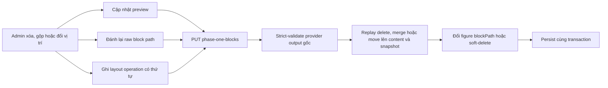

# AI structured output, TeX figure và durable jobs

## Chủ đề này dùng để làm gì?

Ghi lại ranh giới giữa một lần OpenAI tạo Summary, các job render TeX chạy lâu và
artifact SVG được promote sau khi compile + validator thành công.

## Luồng hiện tại

```txt
POST generate Summary
  -> background_jobs(AI_GENERATION) + ai_generations
  -> provider strict structured output
  -> Zod persistence gate
  -> lesson_summaries content version 3
  -> stem_figures + background_jobs(DIAGRAM_RENDERING)
  -> source policy
  -> isolated TeX Live/LuaLaTeX + dvisvgm
  -> local SVG validator/sanitizer
  -> atomic promote R2
```

API trả `background_jobs.id` làm `jobId`. Database là nguồn trạng thái durable;
BullMQ chỉ vận chuyển công việc. UI poll job/figure và có thể phục hồi sau reload.

Khi người dùng tạo lại sau một job `FAILED`, frontend phải chuyển cache của đúng
loại nội dung sang `QUEUED` ngay, xóa lỗi và bỏ `jobId` cũ trong lúc POST đang
chạy. Nếu API từ chối thì rollback snapshot; nếu API nhận job thì gắn `jobId`
mới, bắt đầu poll và refetch panel ở nền. Chỉ invalidate rồi chờ refetch sẽ giữ
badge lỗi cũ theo độ trễ mạng, còn poll nhầm `jobId` cũ có thể đưa UI trở lại lỗi
ngay lập tức.

Mọi worker cùng đọc một queue phải chạy cùng phiên bản prompt/schema/validator.
Sau khi đổi contract AI phải restart toàn bộ worker cũ; một worker dev còn sót
có thể nhận job mới, dựng hash bằng schema đã nạp trước đó và kết thúc bằng lỗi
stale trước cả khi provider được gọi.

Khi một Summary sinh ra nhiều figure, mapper gán vị trí theo thứ tự nội dung và
worker có thể enqueue đồng thời bằng `Promise.all`; thứ tự hoàn tất vì vậy không
phải contract. API/UI phải sắp xếp theo vị trí số
`section -> block -> figureIndex` để thứ tự hiển thị vẫn ổn định. Khi parent
Summary job terminal, frontend phải invalidate cả Summary lẫn danh sách figure
con. Nếu chỉ invalidate parent, TanStack Query vẫn giữ asset/status figure cũ cho
đến lần reload trang.

## Structured output boundary

- Provider schema giúp ép shape nhưng Zod vẫn là gate cuối trước khi persist.
- JSON đã parse trong JavaScript vẫn có thể chứa NUL `U+0000`, trong khi
  PostgreSQL từ chối ký tự này trong cả `jsonb` và `text`. Boundary dùng chung
  phải bỏ NUL đệ quy khỏi string/key trước Zod persistence gate; chỉ bỏ ký tự vô
  hình này, giữ nguyên newline, tab, LaTeX và Unicode hợp lệ. Zod vẫn chạy sau
  bước chuẩn hóa để một field bắt buộc chỉ chứa NUL không thể lách validation.
- Khi một quyết định AI làm đổi loại input của paid call sau đó, provenance phải
  là field có invariant chứ không chỉ được suy từ metadata khác. Với Summary
  figure, `TEXTBOOK_SOURCE` bắt buộc có `sourceReferences`, còn
  `GENERATED_FROM_BRIEF` bắt buộc reference rỗng. Resolver, generation brief và
  provider boundary cùng chặn ảnh cho nhánh dựng mới; vì vậy một asset stale
  không thể biến thành OCR crop/PDF fallback gửi sang lượt TikZ.
- JSON Schema gửi provider chỉ dùng tập cú pháp Structured Outputs hỗ trợ. Quy
  tắc cần regex JavaScript nâng cao như lookaround phải để ở Zod gate phía
  backend; nếu đưa thẳng vào `pattern`, provider có thể từ chối toàn bộ request
  trước khi model bắt đầu sinh nội dung.
- Prompt/schema/model/config/source hash phải được snapshot để worker không dùng
  dữ liệu stale.
- Prompt dài là một contract có cấu trúc, không phải chuỗi câu nối dòng. Mỗi môn
  phải có system prompt chuyên môn tự đủ; không tạo “policy toàn hệ thống” chứa
  core Toán rồi nối thêm nhánh Lý/Hóa. Cả role, output/safety prose và hợp đồng
  lượt gọi cũng được sao chép vào file từng môn thay vì import từ prompt common;
  dispatcher chỉ chọn subject/mode. Sự lặp này có chủ đích: đổi một môn không làm
  prompt môn khác thay đổi ngầm. Rule chống lộ đáp án thuộc riêng lượt hình đề,
  không thuộc mode lời giải để tránh vô hiệu hóa `clarifiedRelations`.
- Structured schema ép được kiểu và shape nhưng description của field vẫn là chỉ
  dẫn ngôn ngữ cho model, không phải phép kiểm tra tất định. Khi product chủ động
  giữ output nguyên văn và không dùng normalizer/validator hậu kỳ, invariant trình
  bày quan trọng phải xuất hiện nổi bật ở cả system prompt lẫn description của
  đúng field, nêu rõ các ngoại lệ đóng, có cặp phản ví dụ tổng quát SAI/ĐÚNG và
  yêu cầu tự kiểm tra trước khi trả output. Một công thức ngắn không được trở
  thành ngoại lệ ngầm chỉ vì model thấy nó vừa một dòng; mọi lần harden loại này
  phải tăng prompt/schema version để request draft cũ không được tái sử dụng.
- Summary Phase 1 figure plan chỉ chứa provenance và source reference; Phase 2
  chỉ trả source LaTeX. AI không trả caption hiển thị, alt text, raw SVG, URL hoặc
  geometry JSON; backend tự tạo alt text từ ngữ cảnh block.
- Figure decision dùng hai tầng: subject profile quy định mức tối thiểu bắt buộc,
  còn AI chủ động bổ sung hình ngoài danh sách khi hình cần cho việc hiểu đúng.
  Danh sách hệ thống là mức sàn, không phải whitelist hay danh sách đóng.
- Sau Zod, semantic coverage gate chặn output thiếu figure thuộc mức sàn trước
  mapper/persistence. Figure AI tự thêm được giữ nguyên. Gate chỉ kiểm coverage,
  không dùng Vision, không chọn package và không gọi thêm provider.
- Mapper lưu `TEX_FIGURE` reference trong content và source/state ở bảng riêng.
- Schema nhận output mới và schema đọc dữ liệu vận hành đã lưu không nên bị buộc
  chung một cách máy móc. Với figure, caption thủ công/legacy và alt text là
  metadata của revision; render-plan chỉ gồm ngữ nghĩa cần resolve crop và dựng
  hình. Provider schema không nhận caption, nhưng reader persisted vẫn phải đọc
  được plan/revision cũ để không khóa nút sinh lại.
- Giai đoạn hiện tại chỉ Summary có figure; Quiz/Test/Flashcard/Explanation/Chat
  giữ text-only.

### Provider chọn sai trang nhưng đúng nhãn hình

`figureLabel` formal và trang provider trả không có cùng độ tin cậy. Model có
thể đọc đúng `Hình 4.16` nhưng gán nó sang trang kế tiếp. Backend vì
vậy không được chỉ kiểm nhãn trong trang model chọn rồi fallback nguyên
trang đó.

```mermaid
flowchart TD
  A[Provider trả figureLabel và packet page] --> B{Trang đó có exact label?}
  B -- Có --> C[Giữ trang và lấy printed label từ manifest]
  B -- Không --> D[Tìm exact label trên các trang thuộc packet]
  D --> E{Bao nhiêu trang khớp?}
  E -- Một --> F[Canonicalize trang và dùng crop hoặc fallback đúng trang]
  E -- Nhiều --> G[Đánh ambiguous, không chọn bừa]
  E -- Không có --> H[Giữ fallback cũ, không semantic guess]
```



Exact lookup chỉ chạy trên cặp document/PDF page thực sự có trong
packet. OCR image manifest có thể chứa cả cuốn sách, nên bỏ giới hạn
này sẽ làm resolver lấy hình ngoài lesson. Raw provider output vẫn được
giữ cho audit; chỉ render plan và immutable reference snapshot dùng vị trí
canonical. Cách tách raw/effective này cho phép vừa debug được model, vừa
không truyền lỗi trang sang Stage 2 hoặc M9.17.

### PDF packet của Summary không phụ thuộc OCR

Summary gửi PDF bằng `input_file` với page images, nên lớp text ẩn, OCR artifact,
chunks và embedding không phải điều kiện đầu vào. Packet builder chỉ xác nhận file
là PDF đọc được, đúng lesson/page range và không vượt giới hạn trang/dung lượng;
PDF scan thuần đi cùng một code path, không bị chặn và không tạo warning riêng.
OCR/chunks vẫn phục vụ retrieval, Flashcard/Test và resolver ảnh, nhưng không được
dùng như gate ngầm của Summary.

### Chuẩn hóa trình bày output AI ở front-end

Heuristic trình bày không được chạy mù trên toàn bộ Markdown. Khi FE cần tách các
ý `a)`, `b)` do provider trả cùng dòng, phải che vùng LaTeX và code trước, chỉ sửa
khoảng trắng ở plain text, yêu cầu có cặp marker tuần tự và giữ phép biến đổi
idempotent. Regression matrix phải có cả happy path lẫn counterexample: marker
thường/in đậm/viết hoa, khoảng trắng Unicode, newline sẵn có, bullet Markdown,
inline/display math, môi trường LaTeX, inline/fenced code, ký hiệu hàm `f(a)`,
marker đơn và thứ tự marker không hợp lệ. Mục tiêu là sửa layout mà không đổi ký
tự kiến thức ngoài whitespace.

### Shared schema phải đúng ở cả source và runtime build

`@learning-path/shared` export runtime từ `dist/index.js`, không đọc trực tiếp
`src`. Vì vậy, chỉ sửa Zod schema trong `packages/shared/src` mà không build lại
có thể tạo ra tình huống TypeScript/source đã có field mới nhưng API đang chạy
vẫn báo `Unrecognized key` theo JavaScript cũ.

Luồng dev hiện tại ngăn lỗi này bằng ba lớp:

```txt
pnpm dev
  -> Turbo build package phụ thuộc trước
  -> shared tsc --watch cập nhật dist
  -> API watcher thấy shared/dist thay đổi và restart runtime
```

Review issue do validator nội bộ sinh ra cũng phải được reconcile lại theo
schema hiện hành khi đọc/lưu Summary. Nếu validator mới đã chấp nhận block,
cảnh báo schema cũ phải bị loại bỏ; không giữ nó chỉ vì fingerprint nội
dung chưa đổi.

## Retry đúng loại lỗi

Có ba nhánh xử lý lỗi độc lập:

1. Chỉ `TEX_COMPILE_FAILED` có diagnostic batch đầy đủ mới được tự gọi OpenAI
   repair, tối đa `maxRepairAttempts`. Request repair phải chứa toàn bộ structured
   compiler errors và raw compiler log của đúng lượt compile đó.
2. Lỗi transport tạm thời như provider/renderer mất kết nối, timeout, 408/429/5xx
   được BullMQ retry tối đa 3 attempt với exponential backoff. Đây là chạy lại
   job, không phải AI repair; mỗi provider attempt cần idempotency usage/
   reservation riêng để không gộp sai chi phí.
3. Source policy, semantic/SVG validator, budget, provider output xác định và lỗi
   nghiệp vụ là terminal. Admin vẫn có thể chủ động sửa source, xóa, thay ảnh hoặc
   tạo revision mới qua lifecycle hiện có.

Mỗi attempt lưu kind, source version/hash, compile log rút gọn, error
category/code, validator issues và duration. Hết repair budget là terminal, không
tạo vòng lặp.

## Security boundary

TeX do AI tạo là untrusted code:

- Compile trong container riêng, non-root, network internal-only, read-only +
  tmpfs, không mount dữ liệu ứng dụng.
- Tắt shell escape, giới hạn CPU/RAM/PID/timeout/source/output.
- Source policy chặn shell, external I/O/network, direct Lua và PDF object.
- Package cài cố định trong image; không cài động.
- SVG validator dùng allowlist, chặn script/event/foreignObject/external reference
  và giới hạn viewBox/node/path/bytes.
- Chỉ sanitized SVG hợp lệ mới thành preview.

Workspace tạm của source và cache runtime có vòng đời khác nhau. `HOME`, file
TeX, PDF trung gian và SVG của mỗi source phải tách riêng rồi xóa; riêng font-name
database của LuaTeX là artifact hạ tầng đắt tiền, phải tạo sẵn trong image và
dùng làm seed. Khi container boot, renderer copy seed một lần sang cache writable
trong tmpfs để luaotfload có thể thêm module cache lazy. Nếu đặt cache trong
`HOME` tạm, mỗi request sẽ rebuild font database và dễ timeout khi nhiều figure
chạy cùng lúc. Concurrency compile phải được giới hạn tại chính renderer vì các
BullMQ queue độc lập không biết tổng tải LuaLaTeX mà queue còn lại đang tạo ra.

## Admin review và storage

Validator chỉ kết luận an toàn/kỹ thuật, không kết luận hình đúng sư phạm. Không có
AI Vision. Worker promote asset hợp lệ atomically; admin kiểm bố cục/nội dung và
có thể sửa source, compile draft local rồi apply revision đã qua validator. Draft
preview nằm trong database; student chỉ nhận delivery asset của current revision
`SUCCEEDED`.

Một source TikZ biên dịch được vẫn có thể sai chất lượng. Khi đã gửi ảnh sách giáo
khoa, prompt vẫn coi ảnh là chuẩn trực quan và không áp khoảng cách số hoặc công
thức offset cố định cạnh tranh với bố cục nguồn. Tuy vậy, invariant liên thuộc
không gian vẫn dùng chung về ý nghĩa trong từng prompt môn: tên điểm neo từ đúng
coordinate, nhãn góc theo phân giác sát ngoài cung, nhãn đo neo trên đúng path và
đối tượng tương thích gần nhãn nhất phải là chủ sở hữu. Chuỗi fallback phải đổi
anchor/trượt/đổi phía trước khi tăng khoảng hở; leader line trong ảnh nguồn được
bảo toàn. Lỗi cụ thể chỉ là regression fixture, không trở thành khoảng cách vá
riêng cho một hình.

Một ngoại lệ chuẩn hóa không phụ thuộc fixture là tách notation ngoài hình khỏi
nhãn đối tượng trên canvas. Ví dụ `$(O)$` trong văn bản bên ngoài canvas chỉ gọi đường tròn
tâm `O`; canvas không được sao chép thêm node `$(O)$` bên cạnh điểm tâm đã mang
nhãn `$O$`. Khi mode được phép sửa toàn source, loại node tên đường tròn dư nhưng
giữ một coordinate/điểm và một nhãn tâm. Đây là bảo toàn semantic identity, không
phải validator thị giác hay lý do từ chối source đã biên dịch được.

Prompt provider không phải nơi lưu audit metadata. Chỉ gửi dữ liệu và ràng buộc
mà model có thể dùng để quyết định output; prompt/schema version, tên manifest,
object key, provenance và lifecycle vẫn được snapshot ở backend để tái hiện và
điều tra. Nếu một invariant đã suy ra được từ payload, ví dụ số panel từ chính
mảng ảnh, không gửi thêm nhiều field diễn đạt lại cùng một ý. Preview dành cho
admin phải mô phỏng đúng request provider thực nhận và chỉ che phần binary/secret,
không bọc thêm metadata khiến người xem hiểu nhầm là đã gửi lên model.

Source vẽ và metadata trình bày phải có dirty state riêng. Thay đổi source làm
draft đã compile trở nên stale và bắt buộc compile lại; thay đổi alt text/caption
không làm SVG stale, không được xóa preview hoặc bắt compile lại. Khi chỉ sửa
metadata, apply cập nhật current revision và Summary reference trong cùng
transaction, không upload lại asset. Khi đã có draft hợp lệ, apply dùng metadata
mới nhất cùng revision đã compile.

Ảnh tham chiếu sách giáo khoa là provenance bất biến của logical figure, không
phải dữ liệu tạm của riêng revision AI. Revision tạo bằng mã code hoặc upload phải
kế thừa snapshot/hash này. Khi đọc dữ liệu cũ bị thiếu snapshot ở revision hiện
hành, API có thể phục hồi từ revision lịch sử gần nhất có snapshot; cả response
admin và mutation dùng crop phải resolve cùng một nguồn để tránh UI bật nút nhưng
backend lại từ chối.

Figure hiện light-only. UI dark đặt figure trên surface sáng, không tự đảo màu.

Preview một mutation AI không nên tạo durable resource chỉ để lấy ID. Khi request
có thể được dựng từ resource cha và tọa độ logic, ví dụ Summary + `blockPath`,
hãy dùng endpoint preview chỉ đọc; endpoint submit mới tạo resource con và job
trong cùng luồng nghiệp vụ. `ensure` chỉ phù hợp với editor/upload thật sự cần ID
trước submit. Ranh giới này làm thao tác mở/đóng modal không để lại ghost record,
đồng thời dropdown cấu hình phải lấy theo route AI đích thay vì phụ thuộc vào
resource con đã tồn tại.

### Structural edit phải đồng bộ ba lớp dữ liệu

Summary AI có ba biểu diễn liên quan nhưng khác vai trò: preview đã map để render,
raw block Phase 1 để admin sửa, và provider output gốc để strict-validate lại khi
Lưu. Vì vậy xóa một block chỉ khỏi preview là chưa đủ; lần Lưu kế tiếp sẽ map raw
cũ và làm block xuất hiện lại. Tương tự, gộp hoặc kéo đổi vị trí mà không đánh
lại raw `blockPath` sẽ khiến khung JSON ở vị trí mới báo nhầm là thiếu raw Phase
1 hoặc làm figure vẫn trỏ vào tọa độ cũ.



Layout operation là overlay biên tập, không sửa méo provider schema. Backend giữ
provider output hợp lệ để audit/validate, rồi replay `DELETE_BLOCK`,
`DELETE_SECTION`, `MERGE_SECTION`, `MOVE_BLOCK` hoặc `MOVE_SECTION` sau mapper.
Operation phải được lưu cùng snapshot để các lần sửa sau tiếp tục nhìn đúng
layout hiện tại. Figure của block chỉ đổi vị trí giữ nguyên revision/asset; figure
thuộc block bị xóa dùng soft-delete để không còn reference active nhưng vẫn giữ
khả năng điều tra dữ liệu.

Soft-delete không tự giải phóng unique key trong PostgreSQL. Với unique vị trí
`(lesson_summary_id, block_path, figure_index)`, một figure đã xóa vẫn có thể giữ
tọa độ mà block khác sắp chuyển tới. Transaction structural edit vì vậy phải đưa
cả figure active lẫn tombstone bị ảnh hưởng sang `blockPath` tạm, sau đó mới gán
tọa độ cuối. Tombstone đi theo block khi reorder và được phép đại diện cho một
figure plan đã bị admin xóa, nên lần lưu sau không hiểu nhầm đây là dữ liệu mất.

## Coverage lớp 3–12

Prompt và test phải coi lớp 3–12 là phạm vi bắt buộc. Package smoke trong Docker
cần bao phủ tối thiểu TikZ core/tiểu học, `tkz-euclide`, `pgfplots`,
`tkz-tab`, `tikz-3dplot`, `circuitikz`, `chemfig` và `mhchem` theo đúng
package thật đã cài trong image. Quang học dùng TikZ core; không quảng bá
`tkz-elements`/`tikz-optics` khi image chưa có.

Local fixtures không gọi provider. Live OpenAI test luôn opt-in, báo số request và
ước tính chi phí trước khi chạy.

## File quan trọng

- `apps/api/src/modules/ai/utils/ai-output-validation.ts`
- `apps/api/src/modules/ai/types/lesson-summary.types.ts`
- `apps/api/src/modules/ai/utils/lesson-summary-prompt.ts`
- `apps/api/src/workers/services/lesson-summary-generation.service.ts`
- `apps/api/src/modules/stem-figures/`
- `apps/api/src/modules/stem-figures/services/figure-reference-resolver.service.ts`
- `apps/api/src/modules/stem-figures/utils/figure-label-identity.ts`
- `apps/api/src/workers/processors/stem-figure-rendering.processor.ts`
- `apps/api/tex-renderer/server.mjs`
- `apps/api/Dockerfile.tex-renderer`
- `packages/shared/src/schemas/stem-figure.ts`
- `packages/shared/package.json`
- `apps/api/scripts/dev-with-metadata.mjs`
- `apps/api/src/modules/learning-paths/utils/lesson-summary-review.ts`
- `apps/api/src/modules/ai/utils/lesson-summary-phase-one-editor.ts`
- `apps/api/src/modules/learning-paths/services/lesson-summaries.service.ts`
- `apps/web/features/admin/ai-generation/utils/lesson-summary-phase-one-preview.ts`
- `apps/web/components/common/content/lesson-summary-example-content-normalizer.ts`
- `apps/web/tests/lesson-summary-example-content-normalizer.spec.ts`

## Khi nào cần nhớ lại?

Khi sửa Summary schema/prompt, worker retry, TeX sandbox, validator, admin review,
figure coverage gate, R2 publishing, student serializer hoặc provider cost guard.
