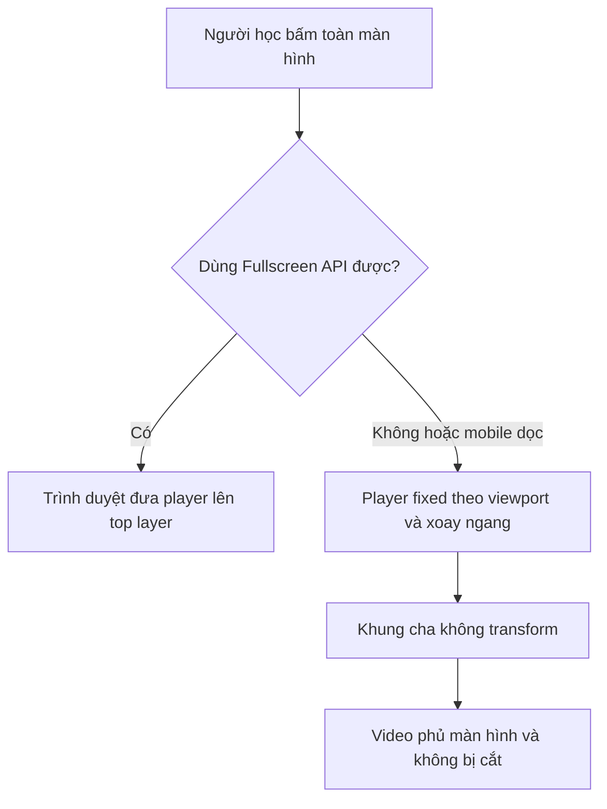

# Fullscreen media layout

## Chủ đề này dùng để làm gì?

Giữ video hoặc media fullscreen đúng viewport, kể cả khi giao diện mobile dùng chế độ fullscreen giả lập bằng CSS.

## Cách nó hoạt động trong repo

`CustomYoutubePlayer` ưu tiên Fullscreen API khi trình duyệt hỗ trợ. Trên điện thoại dọc, player có thể dùng `position: fixed` kết hợp xoay ngang để giữ trải nghiệm xem rộng.

Khung cha của player không được tạo containing block bằng `transform`, `filter` hoặc thuộc tính tương tự. Nếu có, phần tử `fixed` sẽ bám theo khung cha thay vì viewport và có thể bị `overflow: hidden` cắt mất.

## Sơ đồ luồng dễ hiểu

## Luồng kỹ thuật

- Màn bài học giữ video full-bleed trên mobile bằng negative margin và chiều rộng bù padding.
- Player fullscreen giả lập dùng `position: fixed` theo viewport.
- Tránh dùng `translateX` để breakout media nếu bên trong media có phần tử cần fullscreen giả lập.

## Kỹ thuật chính

- Full-bleed an toàn: `margin-inline` âm kết hợp `width: calc(100% + phần padding)`.
- Fullscreen native: dùng Fullscreen API và theo dõi `fullscreenchange`.
- Fullscreen mobile fallback: khóa scroll, đặt player fixed và tính kích thước theo viewport.

## File quan trọng

- `apps/web/components/shared/custom-youtube-player.tsx`
- `apps/web/features/student/lessons/screens/student-lesson-screen/components/lesson-video-panel.tsx`

## Khi nào cần nhớ lại?

Khi một video, modal hoặc overlay dùng `position: fixed` bị biến mất, lệch vị trí hay bị crop sau khi đặt bên trong layout có `transform` hoặc `overflow`.

## Task liên quan

- `M7.1`
- `M15.1`
