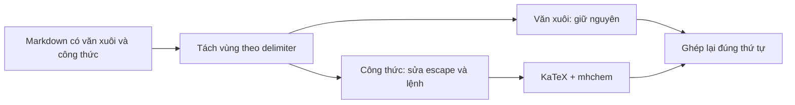

# Chuẩn hóa nội dung Toán, Hóa học và Vật lý

## Chủ đề này dùng để làm gì?

Nội dung học tập có thể trộn văn xuôi với LaTeX, công thức Hóa học `mhchem` và
đơn vị Vật lý. Lớp chuẩn hóa sửa những lỗi escape có thể dự đoán được từ AI,
nhưng không được phép thay đổi văn xuôi đúng do người dùng hoặc AI đã viết.

Invariant quan trọng nhất: **chỉ vùng nằm trong delimiter toán mới được đưa qua
normalizer LaTeX**. Phần còn lại phải được giữ nguyên từng ký tự.

## Cách nó hoạt động trong repo

Các delimiter được công nhận gồm `$...$`, `$$...$$`, `\(...\)` và `\[...\]`.
Tên lệnh như `phi`, `mu`, `tan`, `in` hoặc `log` có thể đồng thời là từ hoặc
tiền tố trong ngôn ngữ tự nhiên. Vì vậy việc chạy regex sửa lệnh trên toàn bộ
Markdown có thể làm `phi kim`, `muối`, `tan trong nước` thành `\phi kim`,
`\muối`, `\tan trong nước` dù dữ liệu gốc hoàn toàn đúng.

## Luồng kỹ thuật

1. Sửa delimiter display math bị đặt sai nếu có đủ dấu hiệu cấu trúc.
2. Tách riêng từng vùng toán bằng parser dùng chung.
3. Chỉ trong vùng toán mới sửa slash thiếu/lặp, ký tự escape bị decode và lệnh
   Toán/Hóa/Lý.
4. Ranh giới tên lệnh phải nhận biết Unicode, gồm chữ cái và combining mark,
   để `mu` không khớp nhầm phần đầu của `muối` hoặc dạng Unicode tổ hợp.
5. Bỏ whitespace đệm ngay trong mép delimiter trước khi đưa Markdown sang
   Mathpix; không xóa whitespace ngoài delimiter hoặc space command LaTeX hợp lệ.
6. Tiêu đề, mục lục và caption có công thức phải dùng renderer math-aware thay
   vì in trực tiếp chuỗi chứa `$...$`.
7. Ghép lại nội dung và giữ nguyên tuyệt đối mọi đoạn văn xuôi.

## Kỹ thuật chính

- Không gọi normalizer nhận một `latex fragment` bằng toàn bộ chuỗi Markdown.
- Dùng một boundary dùng chung để map callback chỉ trên math segment.
- Regression phải có cả hai chiều: văn xuôi trùng tên lệnh không đổi, còn cùng
  token đặt trong delimiter vẫn được sửa đúng.
- Ma trận cần bao phủ delimiter inline/display, Unicode NFC/NFD, slash lặp,
  khoảng trắng cạnh công thức, ký tự dollar escape, `\ce` và `\pu`.

## File quan trọng

- `packages/shared/src/schemas/latex-text.ts`
- `packages/shared/src/schemas/lesson-summary-text.ts`
- `apps/web/lib/learning-content-math.ts`
- `apps/web/components/shared/mathpix-markdown-renderer.tsx`
- `apps/api/src/modules/ai/utils/lesson-content-generation-mapper.ts`
- `apps/api/src/modules/quiz/utils/quiz-generation-math-normalizer.ts`

## Khi nào cần nhớ lại?

Khi thêm lệnh LaTeX mới, đổi parser Markdown, thêm renderer, hoặc viết heuristic
repair cho output AI. Mọi thay đổi phải chứng minh văn xuôi ngoài delimiter bất
biến trước khi được dùng chung cho Summary, Quiz, Flashcard hoặc Test.

## Task liên quan

`M6.x`, `M7.x`, `M9.2`, `M9.3`.
