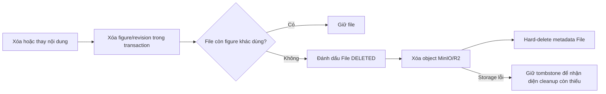

# Vòng đời file trong object storage

## Chủ đề này dùng để làm gì?

Giữ metadata trong Postgres và object thật trên MinIO/R2 cùng một vòng đời khi
xóa nội dung có ảnh, tránh file mồ côi tiếp tục chiếm storage.

## Cách nó hoạt động trong repo

`StemFigureRevision` và `QuizFigureRevision` trỏ tới `files`, còn row `files` trỏ
tới object bằng `objectKey`. Cascade Prisma chỉ xóa row figure/revision; database
không thể tự gửi lệnh xóa sang MinIO/R2.

## Sơ đồ luồng dễ hiểu

## Luồng kỹ thuật

Quiz set và Summary thu thập mọi `deliveryFileId` trước khi cascade. Sau khi các
revision bị xóa trong cùng transaction, service dùng quan hệ ngược để chỉ stage
file không còn `StemFigureRevision` hoặc `QuizFigureRevision` tham chiếu. Object
storage được xóa trước metadata file; vì vậy lỗi storage không làm mất `objectKey`
cần cho lần dọn sau.

Khi regenerate Summary, việc stage file cũ chỉ diễn ra sau khi nội dung mới đã
persist trong transaction. Provider hoặc validation thất bại trước đó không tác
động bản Summary và ảnh hiện hành.

## Kỹ thuật chính

- Dedupe file ID vì nhiều revision chỉnh caption có thể dùng chung một asset.
- Modal chỉnh sửa phải lấy preview từ query figure có thẩm quyền và ánh xạ từng
  vùng upload vào slot ổn định (`role` với Quiz, `figureIndex` với Summary). Không
  gọi upload/xóa khi người dùng mới chọn thao tác: giữ file và ý định xóa trong
  draft state của modal, chỉ gọi endpoint sau khi submit `Lưu`. Khi commit, thao
  tác xóa vẫn phải đi qua endpoint vòng đời của figure để metadata và object
  storage tiếp tục được dọn đúng quy tắc; `Hủy`/`X` chỉ bỏ draft local.
- Kiểm tra reference ngược để không xóa nhầm file đang được figure khác dùng.
- Dùng trạng thái `DELETED` như tombstone giữa transaction database và lệnh xóa
  object storage, hai hệ thống không có transaction chung.
- Hard-delete row `files` chỉ sau khi provider storage xác nhận lệnh xóa object.

## File quan trọng

- `apps/api/src/modules/files/services/stored-file-cleanup.service.ts`
- `apps/api/src/modules/quiz/services/quiz.service.ts`
- `apps/api/src/modules/learning-paths/services/lesson-summaries.service.ts`
- `apps/api/src/workers/services/lesson-summary-generation.service.ts`

## Khi nào cần nhớ lại?

Khi thêm action xóa/thay avatar, tài liệu, ảnh editor, figure hoặc bất kỳ entity
nào sở hữu file. Không được coi cascade database là đã xóa object storage.

## Task liên quan

`M4.1`, `M6.2`, `M9.2`, `M9.3`.
