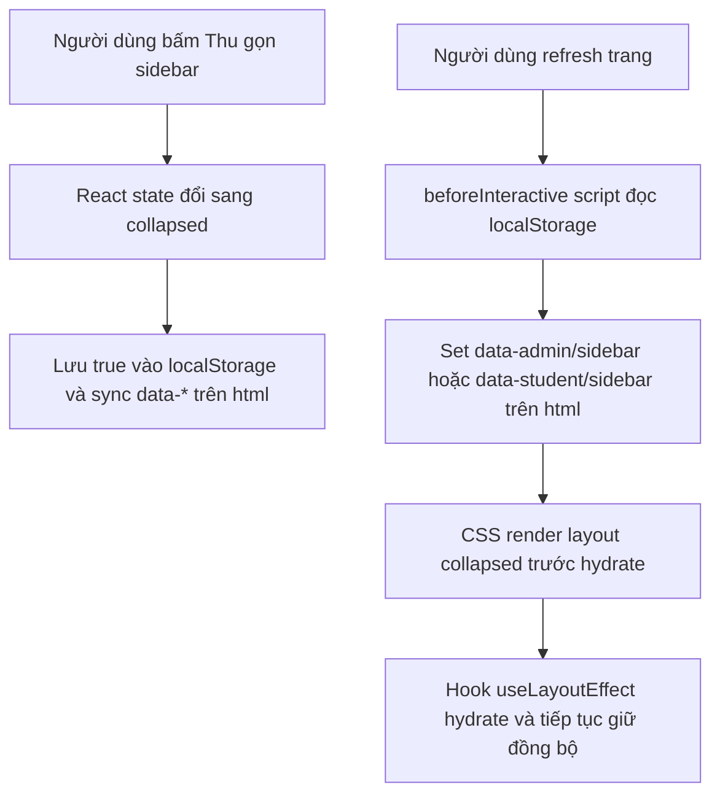

# UI State Persistence

## Chủ đề này dùng để làm gì?

Một số trạng thái UI là sở thích thao tác của người dùng, không phải dữ liệu nghiệp vụ từ API. Ví dụ: sidebar đang thu gọn hay mở rộng, theme sáng/tối, tab đang chọn, panel phụ đang mở.

Nếu chỉ giữ các trạng thái này bằng React `useState`, chúng sẽ mất khi refresh vì app được mount lại từ đầu. Trạng thái cần sống qua reload phải được lưu vào browser storage hoặc cookie tùy nhu cầu.

## Cách nó hoạt động trong repo

Với trạng thái chỉ cần nhớ trên chính trình duyệt hiện tại, repo dùng `localStorage` qua hook nhỏ ở shared web layer. Riêng trạng thái ảnh hưởng layout ngay từ frame đầu, ví dụ sidebar collapsed, root layout còn có inline init script trong `<head>` đọc storage và set `data-*` lên thẻ `<html>` trước khi React hydrate.

Điểm quan trọng: `useLayoutEffect` giúp giảm flicker sau khi client hydrate, nhưng với Next/SSR nó vẫn không bảo đảm HTML đầu tiên đã đúng layout. Nếu cần tránh cảm giác "mở ra rồi mới thu lại", phải có pre-hydration script giống theme provider.

Sidebar admin và student dùng pattern này để nhớ thao tác `Thu gọn/Mở rộng` sau refresh:

- Admin dùng key `classhero.admin.sidebar.collapsed`.
- Student dùng key `classhero.student.sidebar.collapsed`.
- Hai route admin list/detail dùng cùng key admin để trạng thái nhất quán khi chuyển giữa các màn admin.

## Sơ đồ luồng dễ hiểu



## Luồng kỹ thuật

1. Root layout chạy inline init script trong `<head>`, đọc key storage và set `data-admin-sidebar-collapsed` hoặc `data-student-sidebar-collapsed` lên `<html>`.
2. CSS đọc `data-*` này để render layout collapsed ngay cả trước khi React hydrate.
3. Component hoặc hook feature gọi `usePersistentBooleanState(storageKey, defaultValue, datasetKey)`.
4. Sau khi client hydrate, hook dùng `useLayoutEffect` đọc lại `window.localStorage` và đồng bộ React state.
5. Khi user toggle, setter vừa cập nhật React state, vừa ghi `true/false` vào storage, vừa sync `data-*` trên `<html>`.

## Kỹ thuật chính

- Dùng `localStorage` cho sở thích UI local theo trình duyệt.
- Dùng inline init script trong `<head>` cho state ảnh hưởng layout first paint.
- Dùng `data-*` trên `<html>` làm cầu nối giữa pre-hydration CSS và React state sau hydrate.
- Dùng `useLayoutEffect` trong hook để cập nhật trước paint của chu kỳ hydrate nhiều nhất có thể.
- Bọc đọc/ghi storage trong `try/catch` để app không vỡ nếu browser chặn storage.
- Đặt hook generic trong `apps/web/lib` vì admin và student cùng dùng.
- Không dùng API/database cho trạng thái nhỏ chưa cần đồng bộ nhiều thiết bị.

## File quan trọng

```txt
apps/web/lib/use-persistent-boolean-state.ts
apps/web/lib/sidebar-collapse-state.ts
apps/web/app/layout.tsx
apps/web/features/admin/courses/hooks/use-admin-courses-manager.ts
apps/web/features/admin/courses/hooks/use-admin-course-detail-manager.ts
apps/web/components/student/layout/student-shell.tsx
```

## Khi nào cần nhớ lại?

- Sidebar/filter/tab/panel bị reset sau khi refresh.
- Một màn có state local và owner kỳ vọng "tôi chọn rồi thì refresh vẫn giữ".
- Cần phân biệt state UI local với dữ liệu nghiệp vụ phải lưu server.

## Task liên quan

- `M3.4`: Admin learning path/chapter/lesson UI.
- `M3.5`, `M7.7`: Student course browsing/dashboard shell.
