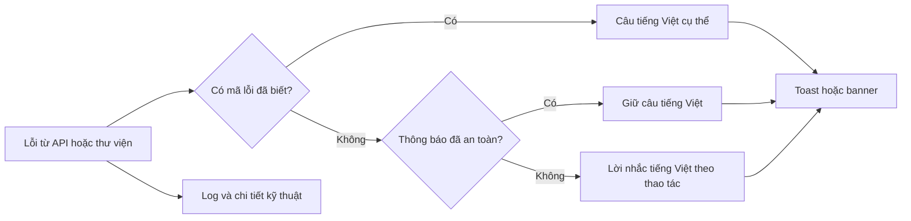

# Thông báo lỗi an toàn cho người dùng

## Chủ đề này dùng để làm gì?

API, thư viện kiểm tra dữ liệu và provider cần giữ thông tin kỹ thuật để lập trình
viên chẩn đoán. Người dùng lại cần biết thao tác nào chưa thành công và nên làm gì
tiếp theo. Nếu giao diện đưa thẳng `error.message` vào toast, một câu tiếng Việt có
thể bị nối với tên trường hoặc lỗi tiếng Anh khó hiểu.

## Cách nó hoạt động trong repo

Web dùng `apps/web/lib/user-facing-error.ts` làm ranh giới trước khi đưa lỗi động
vào toast, banner hoặc lỗi biểu mẫu. Lỗi có mã được ưu tiên ánh xạ sang câu cụ thể;
thông báo tiếng Việt sạch được giữ nguyên; câu kỹ thuật hoặc câu tiếng Anh chưa
biết được thay bằng lời nhắc tiếng Việt theo ngữ cảnh.

## Sơ đồ luồng dễ hiểu

## Luồng kỹ thuật

- `getUserFacingErrorMessage` đọc mã và nội dung lỗi nhưng không tin mặc định vào
  chuỗi do server hoặc thư viện trả về.
- `sanitizeUserFacingMessage` nhận diện dấu hiệu kỹ thuật, tách phần mở đầu tiếng
  Việt an toàn khi có thể và dùng fallback khi toàn bộ câu không phù hợp.
- Các thao tác có ngữ nghĩa riêng, như đổi tên điểm trên hình, ánh xạ lỗi schema
  sang hướng dẫn cụ thể trước khi qua lớp bảo vệ chung.
- Log và khung dữ liệu quản trị vẫn được giữ nguyên để không mất khả năng chẩn đoán.

## Kỹ thuật chính

- Không truyền trực tiếp `error.message` vào component phản hồi người dùng.
- Fallback phải nói đúng thao tác, ví dụ “Chưa lưu được bản chép lời”, thay vì một
  câu chung không giúp người dùng xử lý.
- Kiểm thử phải có cả câu lỗi kỹ thuật đã biết và câu tiếng Anh chưa biết để tránh
  chỉ sửa từng chuỗi phát sinh.

## File quan trọng

- `apps/web/lib/user-facing-error.ts`
- `apps/web/tests/user-facing-error.test.ts`
- `apps/web/features/admin/ai-generation/utils/lesson-summary-diagram-edit.ts`

## Khi nào cần nhớ lại?

Khi thêm mutation, toast, banner lỗi, tích hợp provider hoặc schema mới có khả năng
trả chuỗi động ra giao diện.

## Task liên quan

- Corrective thông báo UI ngày 2026-08-11
- `M9.8`, `M9.13-M9.15`
